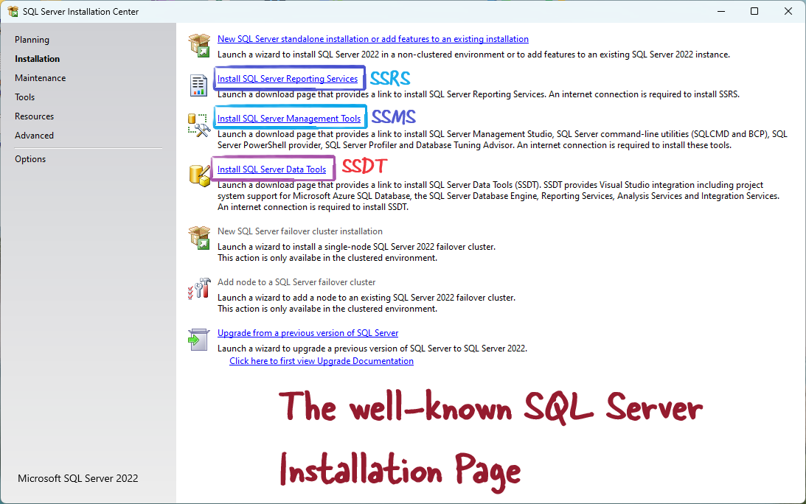

# [SQL Server Integration Services](https://learn.microsoft.com/en-us/sql/integration-services/sql-server-integration-services?view=sql-server-ver16)

To put simply SSIS is the ETL tool for MSSQL Server. Before Azure Data Factory this was the ETL tool for Microosft ecosystem.

Common activity with this tool is extracting data from XML, Csvs, .txt files and load into MSSQL Server.

# How to install SSIS

SSIS is installed as an option during MSSQL installation. There is no separate installation of this. 




# Project 1

Overview:

Load  data into MSSQL table from flat file
Rename the file with current datetime
Move file to processed folder
Zip the renamed file
Delete moved file

The setup:

## Create the required Database in MSSQL

```sql
-- Create the database
CREATE DATABASE InsuranceDB;
GO

-- Use the newly created database
USE InsuranceDB;
GO

-- Create the table
CREATE TABLE PolicyIssuance (
    policy_number INT PRIMARY KEY,
    policyholder_name NVARCHAR(100),
    insured_name NVARCHAR(100),
    policy_type NVARCHAR(50),
    effective_date DATE,
    expiration_date DATE,
    premium_amount DECIMAL(10, 2),
    beneficiary_name NVARCHAR(100),
    beneficiary_contact NVARCHAR(50),
    agent_name NVARCHAR(100),
    agent_contact NVARCHAR(50),
    coverage_details NVARCHAR(255),
    endorsements_riders NVARCHAR(255),
    underwriter_name NVARCHAR(100)
);
GO

-- Verify the table creation
SELECT * FROM PolicyIssuance;
GO

```