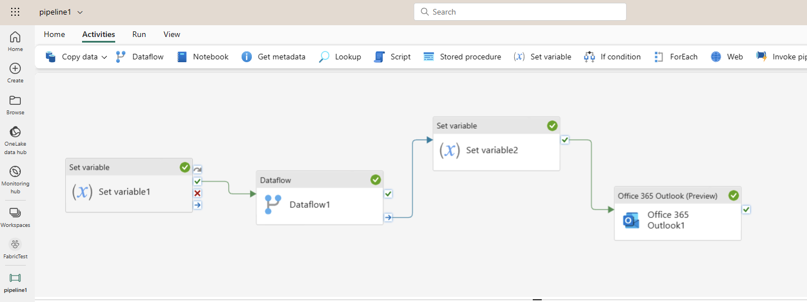
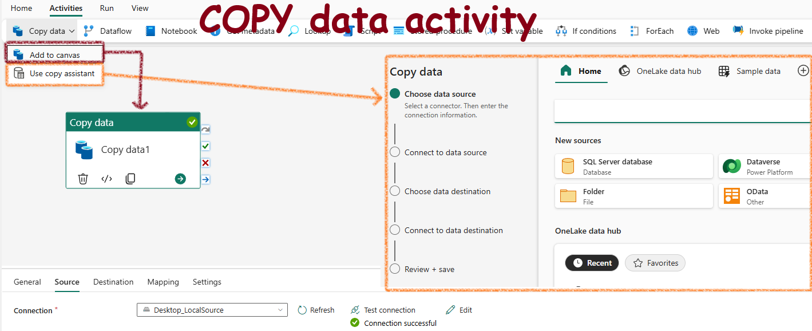
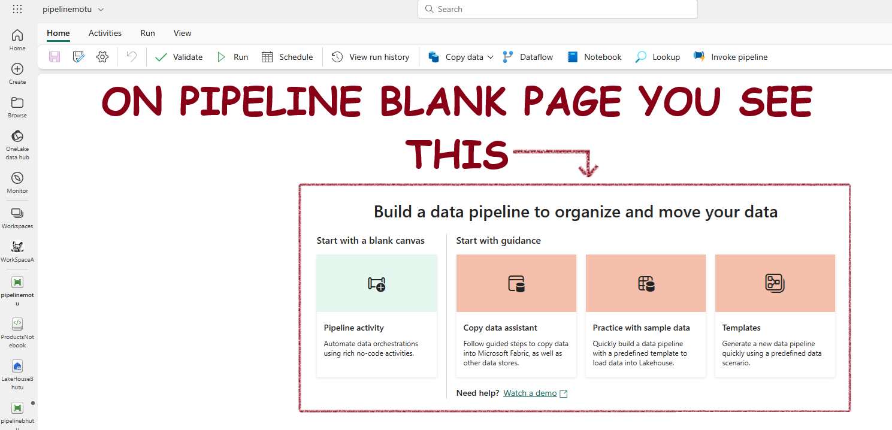
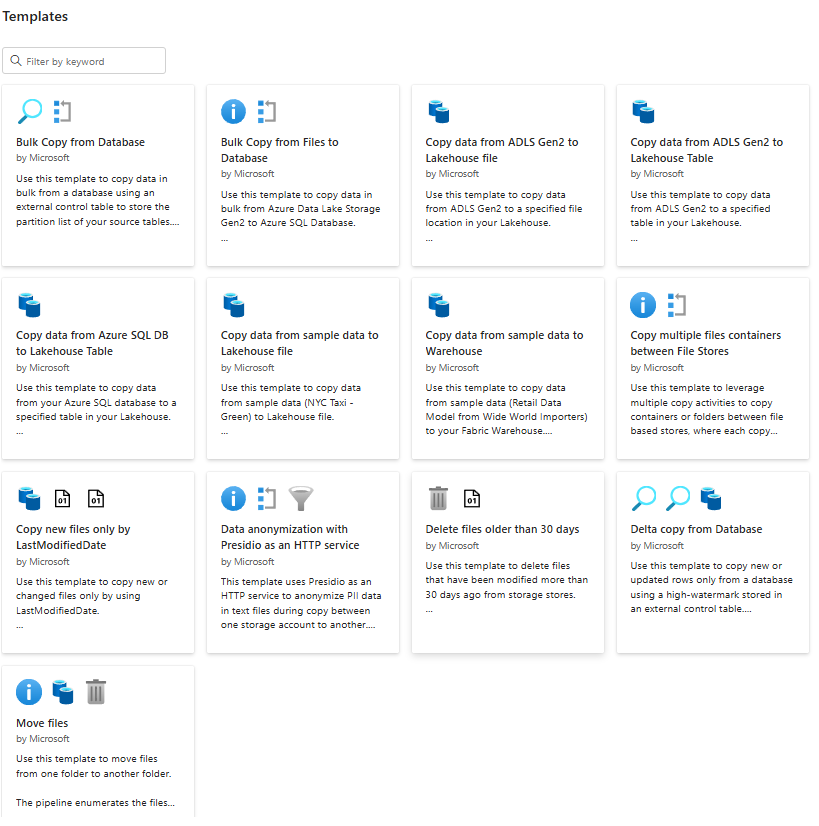
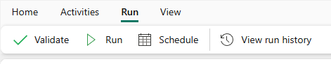

- [Data Factory in Microsoft Fabric](#data-factory-in-microsoft-fabric)
  - [Background](#background)
  - [Pipelines in Microsoft Fabric](#pipelines-in-microsoft-fabric)
    - [**Understand Pipelines**](#understand-pipelines)
    - [**Core Pipeline Concepts**](#core-pipeline-concepts)
      - [**Activities**: Executable tasks in a sequence. Two types:](#activities-executable-tasks-in-a-sequence-two-types)
      - [**Parameters**](#parameters)
      - [**Pipeline Runs**](#pipeline-runs)
  - [Canvas for desinign piplines](#canvas-for-desinign-piplines)
  - [The Copy Data Activity](#the-copy-data-activity)
    - [The Copy Data Tool](#the-copy-data-tool)
  - [Pipeline Templates](#pipeline-templates)
  - [Run and monitor pipelines](#run-and-monitor-pipelines)
  - [Dataflows](#dataflows)
    - [When you choose DataFlows](#when-you-choose-dataflows)
  - [Pipeline Copy Vs DataFlows Vs Spark](#pipeline-copy-vs-dataflows-vs-spark)

# Data Factory in Microsoft Fabric

## Background

ADF is a very important commponent of Fabric. It is 100% the same old ADF in the new Fabric Platform.

## Pipelines in Microsoft Fabric

### **Understand Pipelines**  
- A Pipeline is like a workflow for ingesting and transforming data.
- Using the GUI we can build complex pipelines with very less coding.

### **Core Pipeline Concepts**  
#### **Activities**: Executable tasks in a sequence. Two types:
  - **Data Transformation**: Transfers and transforms data (e.g., Copy Data, Data Flow, Notebook, Stored Procedure).
  - **Control Flow**: Implements loops, conditional branching, and manages variables.

#### **Parameters**
Enable specific values for each run, increasing reusability.

#### **Pipeline Runs**
Executed on-demand or scheduled. Unique run ID for tracking and reviewing each execution.

## Canvas for desinign piplines

Fabric offers a Canvas where you can build complex pipeliens without much coding:

## The Copy Data Activity

The **Copy Data** is the most important activity in data pipelines. Some pipelines only contain one Copy Data activity, thats all!

**When to use?**

Use the Copy Data activity to move data without transformations or to import raw data. For transformations or merging data, use a Data Flow (Gen2) activity with Power Query to define and include multiple transformation steps in a pipeline.

### The Copy Data Tool

## Pipeline Templates

To create a pipeline based on a template on the start page choose Templates

You will see templates like this:

## Run and monitor pipelines

You can run a pipeline, schedule it and view the run history from the GUI

## Dataflows

A way to import and transform data with Power Query Online.

### When you choose DataFlows

You need to connect to and transform data to be loaded into a Fabric lakehouse. You aren't comfortable using Spark notebooks, so decide to use Dataflows Gen2. How would you complete this task? 

Answer:
Create a Dataflow Gen2 to transform data > add your lakehouse as the data destination.

You can either use Dataflows by iteself or add dataflows in pipelines.

## Pipeline Copy Vs DataFlows Vs Spark

| Property                | Pipeline Copy Activity | Dataflow Gen 2 | Spark |
|-------------------------|------------------------|-----------------|-------|
| Use Case                | Data lake and data warehouse migration, data ingestion, lightweight transformation | Data ingestion, data transformation, data wrangling, data profiling | Data ingestion, data transformation, data processing, data profiling |
 Code Written            | No code, low code | No code, low code | Code |
| Data Volume             | Low to high | Low to high | Low to high |
| Development Interface   | Wizard, canvas | Power Query | Notebook, Spark job definition |
| Sources                 | 30+ connectors | 150+ connectors | Hundreds of Spark libraries |
| Destinations            | 18+ connectors (Lakehouse, Azure SQL database, Azure Data explorer, Azure Synapse analytics) | Hundreds of Spark libraries |
| Transformation Complexity | Low: lightweight (type conversion, column mapping, merge/split files, flatten hierarchy) | Low to high: 300+ transformation functions | Low to high: support for native Spark and open-source libraries |
