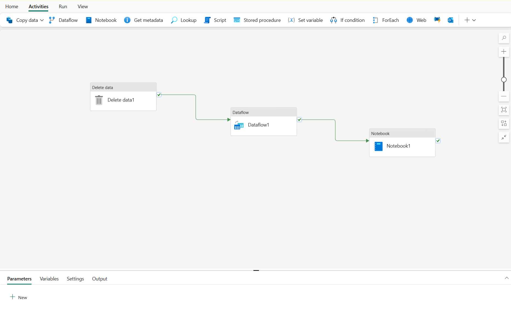
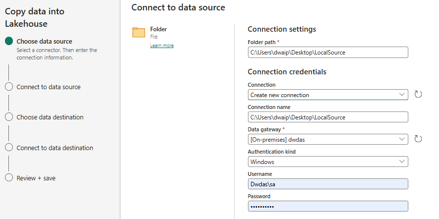

## Background

Azure data factory is same old in Fabric.

## Pipelines in Microsoft Fabric

### **Understand Pipelines**  
- Pipelines encapsulate activities for data movement and processing.
- Graphical interface allows building complex pipelines with minimal coding.

### **Core Pipeline Concepts**  
#### **Activities**: Executable tasks in a sequence. Two types:
  - **Data Transformation**: Transfers and transforms data (e.g., Copy Data, Data Flow, Notebook, Stored Procedure).
  - **Control Flow**: Implements loops, conditional branching, and manages variables.

#### **Parameters**
Enable specific values for each run, increasing reusability.

#### **Pipeline Runs**
Executed on-demand or scheduled. Unique run ID for tracking and reviewing each execution.

## Canvas for desinign piplines

Fabric offers a Canvas where you can build complex pipeliens without much coding:

## The Copy Data Activity

The **Copy Data** is the most important activity in data pipelines. Some pipelines only contain one Copy Data activity, thats all!

### The Copy Data Tool

