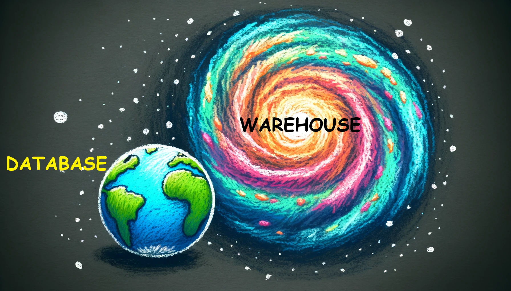
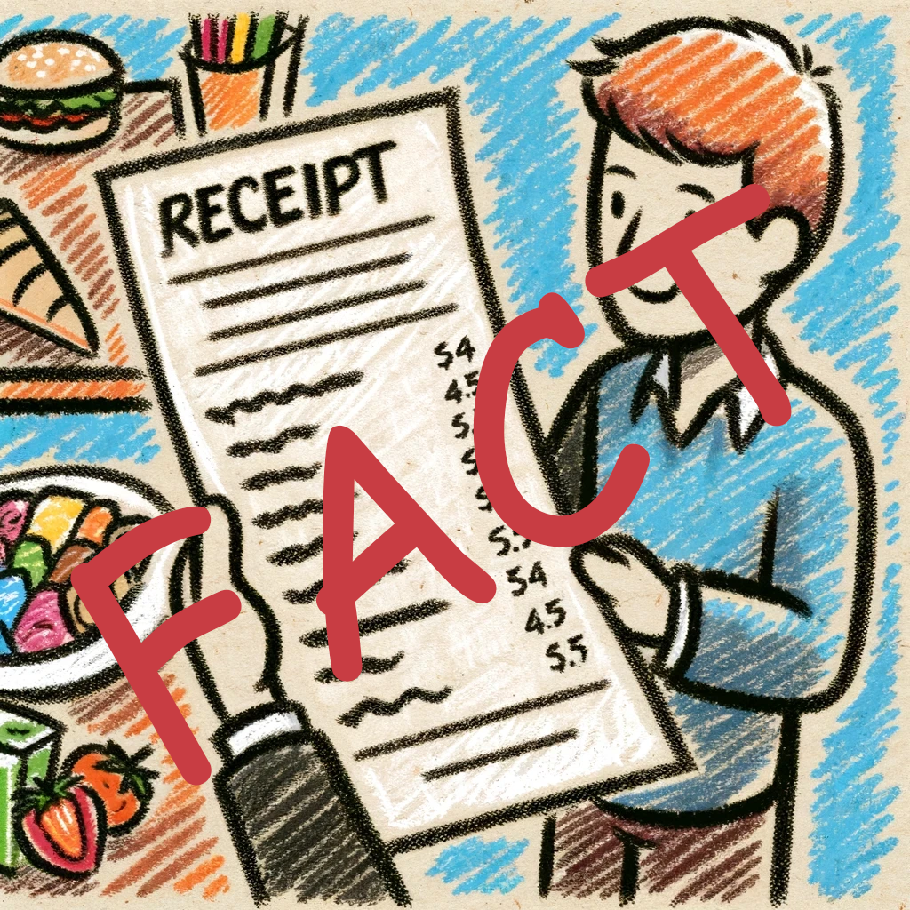
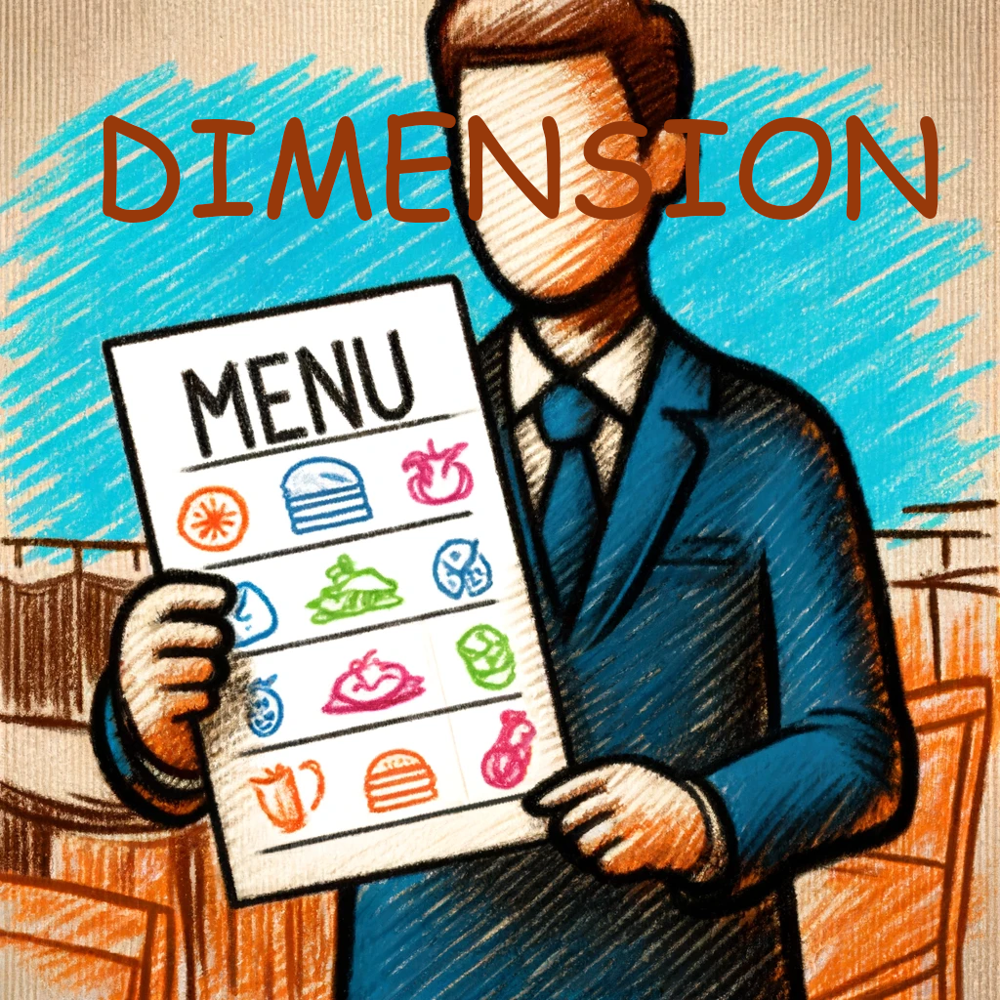

# Data Warehouse in Microsoft Fabric

## Background

If earth is a database then Sun is a warehouse. Fabric's warehouse is unique - **built on the Lakehouse**(Delta format). You can use Full T-SQL.

## Fact and Dimension Table Concepts

**Fact tables** have the numbers you want to look at, like a receipt. They have a lot of rows and are the main source of data for analysis. Think of them as the "what" you are measuring.

**Dimension tables** have details about those numbers, like a restaurant menu. They have fewer rows and give context to the data in the fact tables.

