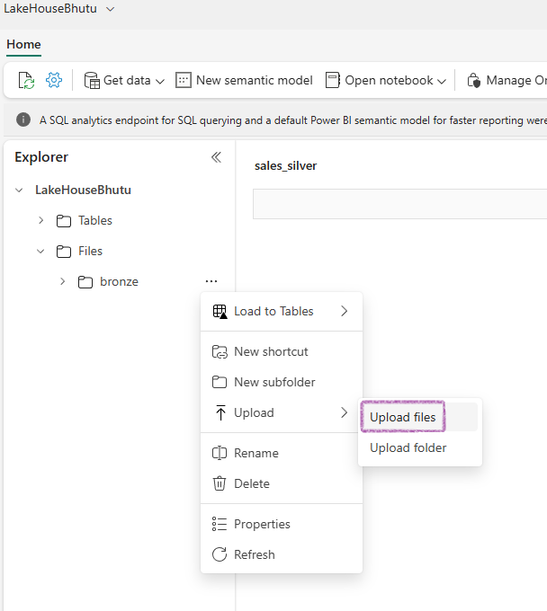

- [Background](#background)
- [The entire project in just 8 pyspark lines](#the-entire-project-in-just-8-pyspark-lines)
  - [THE code](#the-code)
  - [The explanation](#the-explanation)
- [Appendix](#appendix)
  - [Connect to Azure blob storage with Spark from Fabric](#connect-to-azure-blob-storage-with-spark-from-fabric)
  - [Connect to Azure SQL Database with a Service Principal](#connect-to-azure-sql-database-with-a-service-principal)
  - [Write data into a Lakehouse File](#write-data-into-a-lakehouse-file)
  - [Write data into a Lakehouse Delta Table](#write-data-into-a-lakehouse-delta-table)
    - [Optimize\[Fewer files\] - V-Order \& optimizeWrite](#optimizefewer-files---v-order--optimizewrite)
  - [Summary](#summary)

## Background

1. [**ADF Data Pipelines**](https://learn.microsoft.com/en-us/fabric/data-warehouse/ingest-data-pipelines): With Azure Data Factory pipelines, you can handle both ingestion and transformation. Use the **Copy data activity** for ingestion(**no transformation**) and a **Notebook activity** or Dataflow activity for transformation. You might wonder why not just use a notebook for everything if you need a notebook activity—it's a good question!
  

2. [**Dataflow (PowerQuery)**](https://learn.microsoft.com/en-us/fabric/data-factory/dataflows-gen2-overview): Dataflows can handle both ingestion and transformation. They support ingestion from thousands of sources and use Power Query for transformation.
   

3. **Manual Upload**: You can always manually upload your files into a folder.
  

Additionally, there's an important T-SQL command called [**COPY INTO**](https://learn.microsoft.com/en-us/sql/t-sql/statements/copy-into-transact-sql?view=fabric&preserve-view=true). This command copies data into tables and supports Parquet and CSV formats from Azure Data Lake Storage Gen2. However, it only copies data into tables and not into Lakehouse folders from external systems.


## The entire project in just 8 pyspark lines

### THE code

Here is the core code for the project. I've intentionally kept it short to highlight the key concept.

```python
# Enable V-Order for Parquet files to improve data skipping and query performance.
# V-Order helps in reducing the amount of data read during queries by organizing the data for better compression and faster access.
spark.conf.set("spark.sql.parquet.vorder.enabled", "true")  

# Enable automatic Delta optimized write to enhance write performance.
# This setting allows Delta Lake to optimize the way data is written, improving speed and efficiency.
spark.conf.set("spark.microsoft.delta.optimizeWrite.enabled", "true")

# wasbs path = cont_name@act_name.blob.core.windows.net/folder_path
# Read parquet data from Azure Blob Storage path
df = spark.read.parquet(f'wasbs://nyctlc@azureopendatastorage.blob.core.windows.net/yellow')

# Right click ...(RawData) folder -> Copy ABFS Path.
# ABFS_Path/yellow_taxi(New sub folder name)
# Write the first 1000 rows as a Parquet file
df.limit(1000).write.mode("overwrite").parquet(f"abfss://WorkSpaceA@onelake.dfs.fabric.microsoft.com/LakeHouseBhutu.Lakehouse/Files/RawData/yellow_taxi")

# Now read back from the folder where we copied the parquets files
raw_df = spark.read.parquet(fabric_put_path)   

# Filter rows where column 'trip_distance' is greater than 0 and column 'fare_amount' is greater than 0
cleaned_df = raw_df.filter(raw_df.tripDistance > 0)
# Now write the cleaned df into Delta Table in Lakehouse
cleaned_df.write.format("delta").mode("append").saveAsTable("delta_yellow_taxi")

# Display results
display(cleaned_df.limit(10))

```

### The explanation

I have included screenshots of the working code in the notebook and added some comments to help you understand it.


## Appendix

The code above is quite short. In the real world, it wouldn't be this simple. To better understand the concepts, review the following sections that provide more detailed explanations.

### Connect to Azure blob storage with Spark from Fabric

```python
# Azure Blob Storage access info
blob_account_name = "azureopendatastorage"
blob_container_name = "nyctlc"
blob_relative_path = "yellow"
blob_sas_token = "sv=2022-11-02&ss=bfqt&srt=c&sp=rwdlacupiytfx&se=2023-09-08T23:50:02Z&st=2023-09-08T15:50:02Z&spr=https&sig=abcdefg123456" 

# Construct the path for connection
wasbs_path = f'wasbs://{blob_container_name}@{blob_account_name}.blob.core.windows.net/{blob_relative_path}?{blob_sas_token}'

# Read parquet data from Azure Blob Storage path
blob_df = spark.read.parquet(wasbs_path)

# Show the Azure Blob DataFrame
blob_df.show()
```

### Connect to Azure SQL Database with a Service Principal

```python
# Placeholders for Azure SQL Database connection info
server_name = "your_server_name.database.windows.net"
port_number = 1433  # Default port number for SQL Server
database_name = "your_database_name"
table_name = "YourTableName" # Database table
client_id = "YOUR_CLIENT_ID"  # Service principal client ID
client_secret = "YOUR_CLIENT_SECRET"  # Service principal client secret
tenant_id = "YOUR_TENANT_ID"  # Azure Active Directory tenant ID


# Build the Azure SQL Database JDBC URL with Service Principal (Active Directory Integrated)
jdbc_url = f"jdbc:sqlserver://{server_name}:{port_number};database={database_name};encrypt=true;trustServerCertificate=false;hostNameInCertificate=*.database.windows.net;loginTimeout=30;Authentication=ActiveDirectoryIntegrated"

# Properties for the JDBC connection
properties = {
    "user": client_id, 
    "password": client_secret,  
    "driver": "com.microsoft.sqlserver.jdbc.SQLServerDriver",
    "tenantId": tenant_id  
}

# Read entire table from Azure SQL Database using AAD Integrated authentication
sql_df = spark.read.jdbc(url=jdbc_url, table=table_name, properties=properties)

# Show the Azure SQL DataFrame
sql_df.show()
```

### Write data into a Lakehouse File

```python
# Write DataFrame to Parquet file format
parquet_output_path = "dbfs:/FileStore/your_folder/your_file_name"
df.write.mode("overwrite").parquet(parquet_output_path)
print(f"DataFrame has been written to Parquet file: {parquet_output_path}")

# Write DataFrame to Delta table
delta_table_name = "your_delta_table_name"
df.write.format("delta").mode("overwrite").saveAsTable(delta_table_name)
print(f"DataFrame has been written to Delta table: {delta_table_name}")
```

### Write data into a Lakehouse Delta Table

```python
# Use format and save to load as a Delta table
table_name = "nyctaxi_raw"
filtered_df.write.mode("overwrite").format("delta").save(f"Tables/{table_name}")

# Confirm load as Delta table
print(f"Spark DataFrame saved to Delta table: {table_name}")
```

#### Optimize[Fewer files] - V-Order & optimizeWrite

V-Order and OptimizeWrite sorts data and creates fewer, larger Parquet files. Hence, the deta table is optimized. V-Order is enabled by default in Microsoft Fabric and in Apache Spark.

Here is how you can configure them in Pyspark:

```python
# Enable V-Order 
spark.conf.set("spark.sql.parquet.vorder.enabled", "true")

# Enable automatic Delta optimized write
spark.conf.set("spark.microsoft.delta.optimizeWrite.enabled", "true")
```

### Summary

Read, write and saveAsTable are the three important pyspark commands to learn.

1. `spark.read.parquet("path of external parquets")`
2. `df.limit(1000).write.mode("overwrite").parquet("path of lakehouse folder")`
3. `cleaned_df.write.format("delta").mode("append").saveAsTable("theDeltatableName")`
