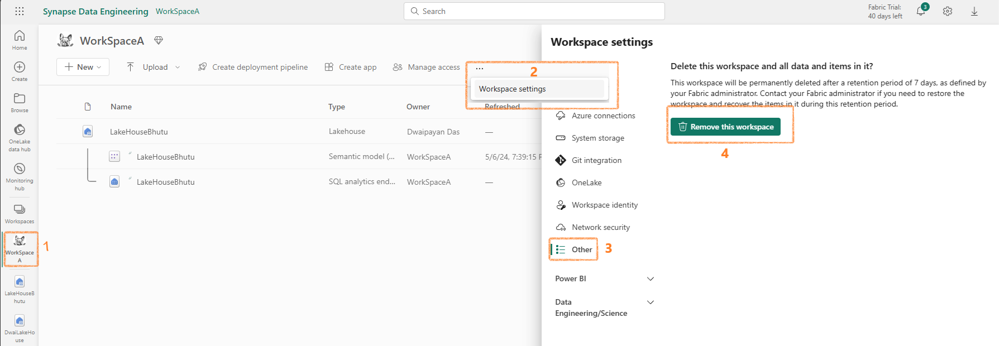
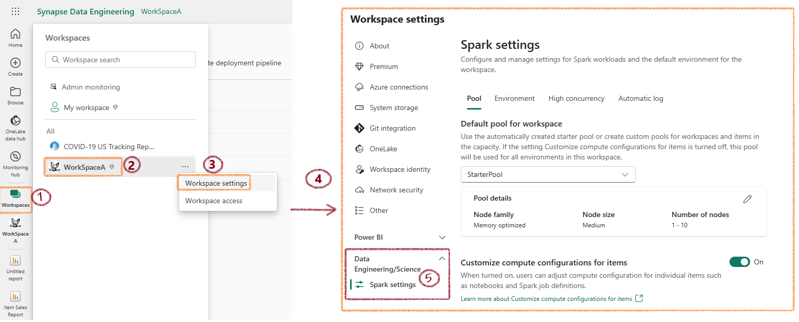

### Delete a Fabric Workspace

In the Workspace settings pane, select Other > Remove this workspace.

### Find your Fabric home region

To find your Fabric home region, follow these steps:

Sign in to Fabric.

Open the Help pane and choose About Microsoft Fabric.

Look for the value next to Your data is stored in. The location shown is the default region where your data is stored. You may also be using capacities in different regions for your workspaces.

### Configure Spark

In Microsoft Fabric, each workspace is assigned a Spark cluster. An administrator can manage settings for the Spark cluster in the Data Engineering/Science section of the workspace settings.

