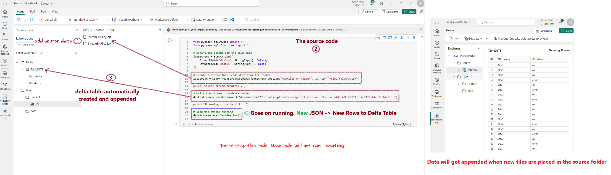

## Microsoft Fabric - Delta Tables - Spark Streaming

Delta Lake supports streaming data, allowing Delta tables to serve as both sinks and sources. In this example, I will demonstrate how to use a Delta Lake table in Microsoft Fabric for Spark streaming.

### Steps:

1. Make a few copies of the sample source JSON file.
2. Place one file inside the `Files` folder. Create a subfolder for aesthetics, such as `Files/FolderA/`. Place the JSON file inside this subfolder.

3. In a notebook, run the following code:

```python
from pyspark.sql.types import *
from pyspark.sql.functions import *

# Define the schema for the JSON data
jsonSchema = StructType([
    StructField("device", StringType(), False),
    StructField("status", StringType(), False)
])

# Create a stream that reads data from JSON files in the folder
iotstream = spark.readStream.schema(jsonSchema).option("maxFilesPerTrigger", 1).json("Files/FolderA/SSF")

print("Source stream created...")

# Write the stream to a Delta table. The table will be created automatically
deltastream = iotstream.writeStream.format("delta").option("checkpointLocation", "Files/FolderA/ChkPT").start("Tables/TableDLTS")

print("Streaming to delta sink...")

# Keep the stream running. Note: This will need to be stopped manually as it will continue to add new rows.
deltastream.awaitTermination()
```



4. Now, add more json files and see the Delta table grow!

### How It Works

The source code continuously runs, first creating rows in the Delta Lake table from the JSON files present in the source folder. As new files are added, the code continues to append new rows to the Delta table.