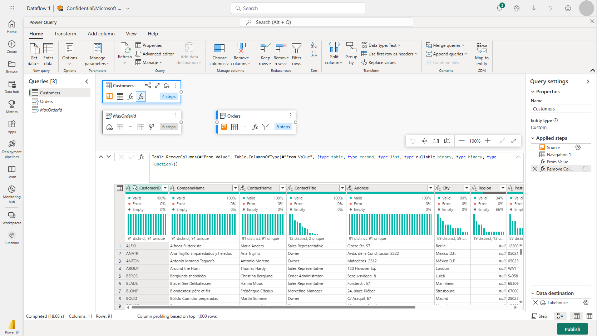
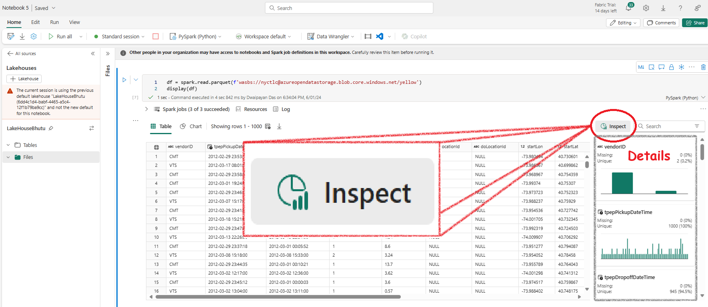

- [Microsoft Fabric What?!](#microsoft-fabric-what)
- [Let's learn some basics about LakeHouse](#lets-learn-some-basics-about-lakehouse)
  - [Pre-requisites for a LakeHouse](#pre-requisites-for-a-lakehouse)
  - [Shortcuts in Lakehouse](#shortcuts-in-lakehouse)
  - [Ways to ingest data into Lakehouse](#ways-to-ingest-data-into-lakehouse)
  - [Ways to transform data in Fabric Lakehouse](#ways-to-transform-data-in-fabric-lakehouse)
  - [Ways to Visualize](#ways-to-visualize)
- [Let's create a Fabric Lakehouse](#lets-create-a-fabric-lakehouse)
  - [Create a LakeHouse Workspace](#create-a-lakehouse-workspace)
  - [Create a LakeHouse](#create-a-lakehouse)
  - [Upload a simple excel to the LakeHouse](#upload-a-simple-excel-to-the-lakehouse)
  - [Load the excel data into a table](#load-the-excel-data-into-a-table)
  - [Query the excel file table using SQL](#query-the-excel-file-table-using-sql)
    - [Write a normal SQL query using Editor](#write-a-normal-sql-query-using-editor)
    - [Write a Visual Query](#write-a-visual-query)
    - [Create a Report](#create-a-report)
  - [Connect external data using shortcuts](#connect-external-data-using-shortcuts)
- [Apache Spark In Microsoft Fabric](#apache-spark-in-microsoft-fabric)
  - [Run a Spark Notebook](#run-a-spark-notebook)
  - [Run a simple Pyspark code in Notebook](#run-a-simple-pyspark-code-in-notebook)
  - [Create a Spark job definition](#create-a-spark-job-definition)
- [Delta Lake in Microsoft Fabric](#delta-lake-in-microsoft-fabric)
  - [Creting a table from DataFrame](#creting-a-table-from-dataframe)
    - [Using **df.write**](#using-dfwrite)
    - [Using the **DeltaTableBuilder** API](#using-the-deltatablebuilder-api)
    - [Using **Spark SQL**](#using-spark-sql)

## Microsoft Fabric What?!



One-stop low-to-no-code platform.


To understand Fabric, first understand OneLake.

OneLake is Fabric's Database.

**Each** fabric tenant gets **OneOneLake** by default. 

OneLake ~ **OneDrive**.

**OneLake** is cover over **ADLS**.

Either importa data in OneLake  or Create Shortcuts to external data.

Default storage us Delta.

## Let's learn some basics about LakeHouse

Lake house is Data Lake and Warehouse.


The base of Fabric is Data lakehouse.

Features of Lakehouse:

Lakehous is Data Lake + Warehouse. Flexibility of storing data in lake and SQL query like warehouse!

### Pre-requisites for a LakeHouse
Before you can create a lakehouse, you create a workspace in the Microsoft Fabric platform.

You create and configure a new lakehouse in the Data Engineering workload. Each L produces three named items in the Fabric-enabled workspace:

Lakehouse is the lakehouse storage and metadata, where you interact with files, folders, and table data.
Semantic model (default) is an automatically created data model based on the tables in the lakehouse. Power BI reports can be built from the semantic model.
SQL Endpoint is a read-only SQL endpoint through which you can connect and query data with Transact-SQL.


You can work with the data in the lakehouse in two modes:

Lakehouse enables you to add and interact with tables, files, and folders in the lakehouse.
SQL analytics endpoint enables you to use SQL to query the tables in the lakehouse and manage its relational data model.



### Shortcuts in Lakehouse

Shortcuts enable you to integrate data into your lakehouse while keeping it stored in external storage.

Shortcuts can be created in both lakehouses and KQL databases, and appear as a folder in the lake. Spark, SQL, Real-Time Analytics, and Analysis Services can access data via shortcuts when querying data.

Shortcuts have limited data source connectors, so when you can't use shortcuts, you can ingest data directly into your lakehouse.

Source data permissions and credentials are all managed by OneLake.

### Ways to ingest data into Lakehouse

Upload: Upload local files or folders to the lakehouse. You can then explore and process the file data, and load the results into tables.

Dataflows (Gen2): Import and transform data from a range of sources using Power Query Online, and load it directly into a table in the lakehouse.

Notebooks: Use notebooks in Fabric to ingest and transform data, and load it into tables or files in the lakehouse.

Data Factory pipelines: Copy data and orchestrate data processing activities, loading the results into tables or files in the lakehouse.

### Ways to transform data in Fabric Lakehouse

Apache Spark: Pyspark, SparkSQL, Notebooks, Spark job definitions
SQL analytic endpoint: Transact SQL
Dataflows (Gen2): Power Query
Data pipelines: 

### Ways to Visualize

Create an end-to-end solution using Power BI and Fabric Lakehouse.


## Let's create a Fabric Lakehouse

### Create a LakeHouse Workspace

1. Go to https://app.fabric.microsoft.com. Select Synapse Data Engineering


### Create a LakeHouse

2. Click on Create then Lakehouse. Give it any name.


3. Fabric will create everything automatically and you will have your Lakehouse


### Upload a simple excel to the LakeHouse

1. Download and save sample excel file from here https://raw.githubusercontent.com/MicrosoftLearning/dp-data/main/sales.csv


2. Go to Explorer, create a Data subfolder under Files, then upload the downloaded csv in it


### Load the excel data into a table

Now, if you want to use SQL you need to import the excel into a table. It is pretty simple.

Just click on the elipses next to the excel file and select **Load to Tables**


Once loaded you can see your table in tabular format


### Query the excel file table using SQL

#### Write a normal SQL query using Editor


#### Write a Visual Query


#### Create a Report

1. At the bottom of the SQL Endpoint page, click on the **Model** tab to view the data model schema for the semantic model.
2. Navigate to the **Reporting** tab in the menu ribbon and select **New report** to open a new browser tab for report design.


3. In the Data pane, expand the **sales** table and select **Item** and **Quantity**. This will add a table visualization to your report.
4. Hide the **Data** and **Filters** panes to create more space. Change the visualization to a **Clustered bar chart** and resize it.
5. Save the report by selecting **Save** from the **File** menu and name it <span style="color:blue;">**Item Sales Report**</span>.


6. Close the report tab and return to the SQL endpoint page. In the hub menu, select your workspace to verify it contains your lakehouse, the SQL analytics endpoint, a default semantic model, and the <span style="color:blue;">**Item Sales Report**</span>.

### Connect external data using shortcuts

It is easy to import data into Fabric. But, what if the data wants to stay outside? Then we create shortcuts to that external data in Lakehouse. It appears like a folder.

Lets create a shortcut to dataverse.

1. Click on the cli


Note: The region of Dataverse and Fabric should be same.


## Apache Spark In Microsoft Fabric

Spark <span style="color:blue;">**divides and conquers**</span>: It splits a large job across computers. SparkContext does the splitting etc.  Spark can use many languages, but in Industry PySpark and Spark SQL are most used.

In Fabric. One Workspace gets One Spark Cluster.

### Run a Spark Notebook


### Run a simple Pyspark code in Notebook

Here, the spark session is already created. All you have to do is create dataframe and start coding!


### Create a Spark job definition

1. **Access the Spark Job Definition Page.**
   

2. **Create a PySpark Job Definition:**
   - Develop a main definition file named `anyname.py`. The file should include the following code:

     ```python
     from pyspark.sql import SparkSession

     # This code executes only when the .py file is run directly.
     if __name__ == "__main__":
         # Initialize a Spark session specifically for this job.
         spark = SparkSession.builder.appName("Sales Aggregation").getOrCreate()
         # Read data from a CSV file into a DataFrame.
         df = spark.read.csv('Files/data/sales.csv', header=True, inferSchema=True)
         # Write the DataFrame to a Delta table, overwriting existing data.
         df.write.mode('overwrite').format('delta').save('Files/data/delta')
     ```

3. **Upload and Schedule the File:**
   

## Delta Lake in Microsoft Fabric

Delta lake is just Data Lake with a *SQL Cover*.

In Fabric, any table imported from .csv/excel etc. automatically becomes a Delta Lake table.


For these tables, you'll find .parquet files and delta log folders when you view the files.


Since every table is automatically a Delta Lake table, this is a very useful feature. There's no need to convert files into Delta tables separately.

### Creting a table from DataFrame

#### Using <span style="color: blue;">**df.write**</span>

The easiest way to create a Delta Lake table is by saving a DataFrame in the Delta format:


<span style="color: SteelBlue;">**df**</span>.<span style="color: DarkOrchid;">**write**</span>.<span style="color: green;">**format**("<span style="color: red;">**delta**</span>")</span>.<span style="color: blue;">**saveAsTable**</span>("***tableName***")

**Managed Table:** These tables are managed by Spark runtime. Here, you only need to mention the table name. If you delete the table, all logs are automatically deleted.

**External Table:** If you provide the location of the log files, it becomes external table:


<span style="color: SteelBlue;">**df**</span>.<span style="color: DarkOrchid;">**write**</span>.<span style="color: green;">**format**("delta")</span>.<span style="color: blue;">**saveAsTable**</span>("***tableName***", path="***Files/folderX***")

Deleting an external table from the Lakehouse metastore <span style="color: red;"><strong>does not</strong></span> delete the associated data files.

#### Using the **DeltaTableBuilder** API

In python here is how you can use DeltaTableBuilder API to create table. This is a managed table:

```python
from delta.tables import *

DeltaTable.create(spark) \
  .tableName("Planet") \
  .addColumn("Size", "INT") \
  .addColumn("Name", "STRING") \
  .execute()
```

#### Using **Spark SQL**

**Managed Table** (Note: No location for data specified)

You can create a managed table using Spark SQL with the following command:

```sql
CREATE TABLE salesorders
(
    Orderid INT NOT NULL,
    OrderDate TIMESTAMP NOT NULL,
    CustomerName STRING,
    SalesTotal FLOAT NOT NULL
)
USING DELTA;
```

**External Table** (Note: Includes location for log and data files)

To create an external table, specify the location of its data:

```sql
CREATE TABLE MyExternalTable
USING DELTA
LOCATION 'Files/mydata';
```

This approach allows you to define where the table's data and log files are stored.