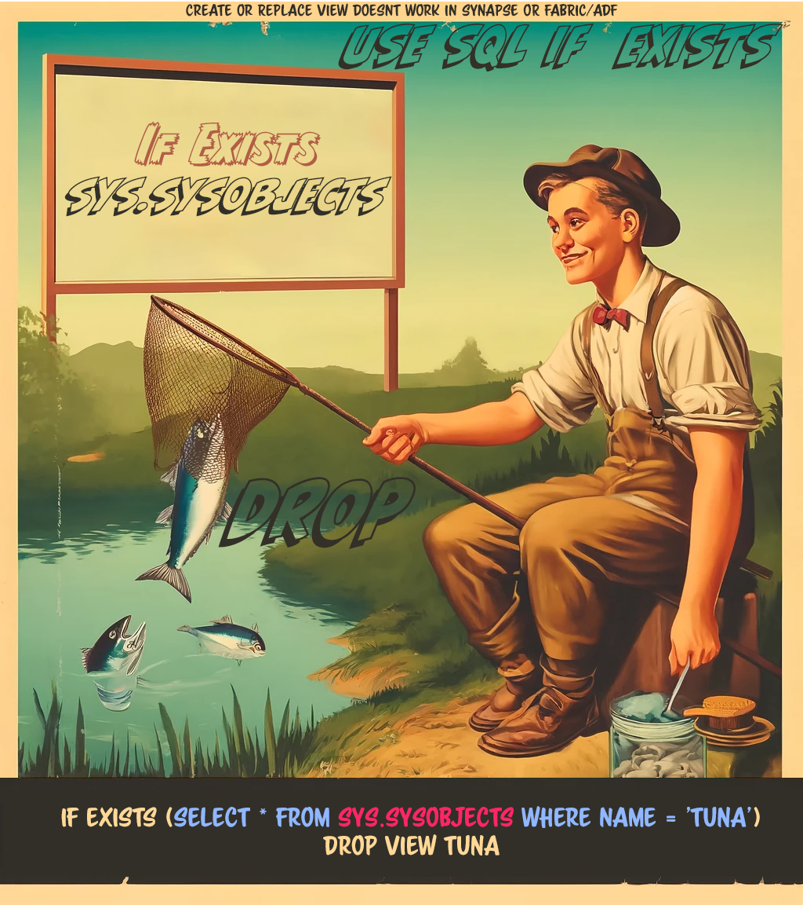

- [Describe Formatted *TableName* ](#describe-formatted-tablename-)
- [DataFrame from csv](#dataframe-from-csv)
- [Write Delta Table](#write-delta-table)

### <span style="color: DeepSkyBlue; font-family: Segoe UI, sans-serif;">Describe Formatted *TableName* </span>


### <span style="color: Coral; font-family: Segoe UI, sans-serif;">DataFrame from csv</span>


### Write Delta Table


# SQL

CREATE OR REPLACE VIEW <VIEWNAME> doesn't work in Fabric/AzureSynapse/ADF etc. Instead use this:
```SQL
If Exists (Select * From sys.sysobjects where name = 'apple')
    DROP TABLE dbo.apple;
GO
```



