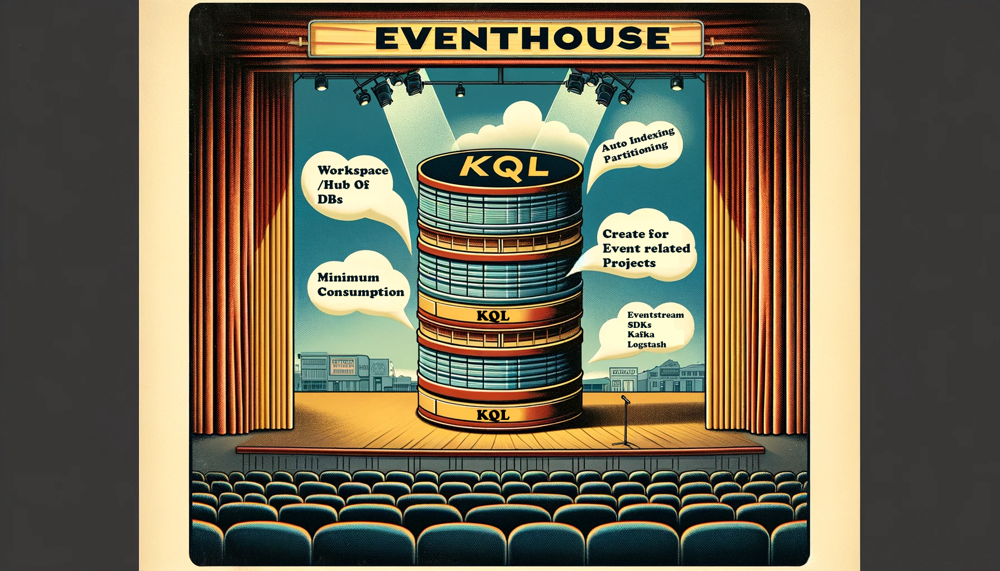
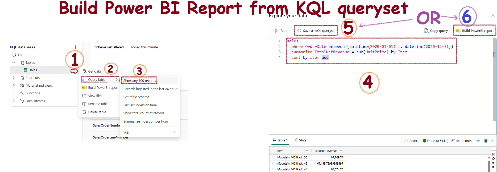

## Background


## Core elements of Real-Time Intelligence in Microsoft Fabric


## Eventhouse


- Central workspace/hub - has multiple KQL databases
- Use an Eventhouse for event-based scenarios
- Automatically index and partition data based on ingestion time
- When you create an EventHouse, it initializes a KQL database with the same name inside it
- KQL databses can be standalone or part of an EventHouse

## KQL Database


A **KQL (Kusto Query Language) Database** handles large volumes of structured, semi-structured, and unstructured data for real-time analytics and ad-hoc querying. It is part of the Azure Data Explorer service.

- **Data Storage:** The data in a KQL database is stored in Azure Data Explorer. It uses a columnar storage format, which is optimized for high-performance analytical queries.

**KQL Database Objects**
- **Tables**: Contains columns and rows of data with a defined schema. Commands: `.create table`, `.show table`, `.ingest`.
- **Functions**: Encapsulate subquery expressions for reuse. Commands: `.create function`, `.show functions`.
- **Materialized Views**: Stores precomputed query results for faster access. Commands: `.create materialized-view`, `.show materialized-views`.
- **Datastreams**: Representations of connected KQL event streams.

**Quick Commands**
- **Create Table**: `.create table`
- **Show Table Schema**: `.show table`
- **Ingest Data**: `.ingest`
- **Create Function**: `.create function`
- **Show Functions**: `.show functions`
- **Create Materialized View**: `.create materialized-view`
- **Show Materialized Views**: `.show materialized-views`


### KQL Database vs. Standard SQL Database

| Feature                     | KQL Database                                     | Standard SQL Database                           |
|-----------------------------|--------------------------------------------------|-------------------------------------------------|
| **Query Language**          | Kusto Query Language (KQL)                       | Structured Query Language (SQL)                 |
| **Storage Format**          | Columnar                                         | Row-based                                       |
| **Optimized For**           | Real-time analytics, log and time-series data    | Transactional data, relational data             |
| **Data Structure**          | Tables, columns, materialized views, functions   | Tables, columns, views, stored procedures       |
| **Scalability**             | Highly scalable and distributed                  | Varies by implementation (SQL Server, MySQL, etc.) |
| **Indexing**                | Automatically indexed for fast query performance | Manual and automatic indexing                   |
| **Data Ingestion**          | Supports batch and streaming ingestion           | Primarily batch ingestion                       |
| **Use Cases**               | Log analytics, telemetry data, IoT data          | OLTP, data warehousing, reporting               |
| **Storage Location**        | Azure Data Explorer service in the cloud         | Varies (on-premises, cloud-based)               |
| **Performance**             | Optimized for read-heavy and analytical workloads| Balanced for read and write operations          |
| **Schema**                  | Flexible schema with support for semi-structured data | Rigid schema with well-defined data types       |

### KQL - It's So Easy to Learn

**Select Where:**
```kql
sales
| where Country == 'Peru'
```

**Select Where with Multiple Clauses:**
```kql
sales
| where Name == 'Tom'
| where Place == 'USA'
```

**More Complex Example:**

    

### KQL Vs SQL

The table below shows the syntax difference between common commands. SQL syntax is simple, KQL is simpler!

| <span style="color: blue;">Category</span>                    | <span style="color: green;">SQL Query</span>                               | <span style="color: red;">Kusto Query</span>                                         |
|-----------------------------|----------------------------------------------|---------------------------------------------------|
| Select data from table      | SELECT * FROM Mango                          | Mango                                            |
|                             | SELECT name, resultCode FROM Mango           | Mango \| project name, resultCode                 |
|                             | SELECT TOP 100 * FROM Mango                  | Mango \| take 100                                 |
| Null evaluation             | SELECT * FROM Mango WHERE resultCode IS NOT NULL | Mango \| where isnotnull(resultCode)              |
| Comparison operators (date) | SELECT * FROM Mango WHERE timestamp > getdate()-1 | Mango \| where timestamp > ago(1d)                |
|                             | SELECT * FROM Mango WHERE timestamp BETWEEN ... AND ... | Mango \| where timestamp between (datetime(2020-01-01) .. datetime(2020-12-31)) |
| Comparison operators (string) | SELECT * FROM Mango WHERE type = "Apple"   | Mango \| where type == "Apple"                    |
|                             | SELECT * FROM Mango WHERE type like "%Apple%" | Mango \| where type has "Apple"                   |
|                             | SELECT * FROM Mango WHERE type like "Apple%" | Mango \| where type startswith "Apple" \| or \| Mango \| where type matches regex "^Apple.*" |
| Comparison (boolean)        | SELECT * FROM Mango WHERE !(success)         | Mango \| where success == False                   |
| Grouping, Aggregation       | SELECT name, AVG(duration) FROM Mango GROUP BY name | Mango \| summarize avg(duration) by name          |
| Distinct                    | SELECT DISTINCT name, type FROM Mango        | Mango \| summarize by name, type                  |
|                             | SELECT name, COUNT(DISTINCT type) FROM Mango GROUP BY name | Mango \| summarize by name, type \| summarize count() by name \| or \| Mango \| summarize dcount(type) by name |
| Column aliases, Extending   | SELECT operationName as Name, AVG(duration) as AvgD FROM Mango GROUP BY name | Mango \| summarize AvgD = avg(duration) by Name=operationName |
|                             | SELECT conference, CONCAT(sessionid, ' ', session_title) AS session FROM ConferenceSessions | ConferenceSessions \| extend session=strcat(sessionid, " ", session_title) \| project conference, session |
| Ordering                    | SELECT name, timestamp FROM Mango ORDER BY timestamp ASC | Mango \| project name, timestamp \| sort by timestamp asc nulls last |
| Top n by measure            | SELECT TOP 100 name, COUNT(*) as Count FROM Mango GROUP BY name ORDER BY Count DESC | Mango \| summarize Count = count() by name \| top 100 by Count desc |
| Union                       | SELECT * FROM Mango UNION SELECT * FROM Apple | union Mango, Apple                              |
|                             | SELECT * FROM Mango WHERE timestamp > ... UNION SELECT * FROM Apple WHERE timestamp > ... | Mango \| where timestamp > ago(1d) \| union (Apple \| where timestamp > ago(1d)) |
| Join                        | SELECT * FROM Mango LEFT OUTER JOIN Apple ON Mango.operation_Id = Apple.operation_Id | Mango \| join kind = leftouter (Apple) on $left.operation_Id == $right.operation_Id |
| Nested queries              | SELECT * FROM Mango WHERE resultCode = (SELECT TOP 1 resultCode FROM Mango WHERE resultId = 7 ORDER BY timestamp DESC) | Mango \| where resultCode == toscalar(Mango \| where resultId == 7 \| top 1 by timestamp desc \| project resultCode) |
| Having                      | SELECT COUNT(*) FROM Mango GROUP BY name HAVING COUNT(*) > 3 | Mango \| summarize Count = count() by name \| where Count > 3 |

## KQL Queryset
- Tool for running, viewing, and manipulating KQL database queries.
- Save, export, and share queries.
- Uses Kusto Query Language (KQL) and supports T-SQL.
- Allows complex query creation and execution.

## Real-Time Dashboards
- Customizable control panels for displaying specific data.
- Tiles for different data views, organized on various pages.
- Export KQL queries into visual tiles.
- Enhances data exploration and visualization.

## Eventstream
- Handles live data without coding.
- Automates data collection, transformation, and distribution.
- Processes real-time data for immediate insights.

## Let's Get Started

- **Open Real-Time Intelligence:** Select it from the bottom left-hand corner of the screen:

    

- **Start Screen:** Here is how it looks:

    

- **Create an Eventhouse:** Eventhouses are groups of databases. When you create an Eventhouse, Fabric creates a KQL Database with the same name inside it:

    

- **KQL Database Structure:** This is the standard structure:

  

**Data Ingestion:** Importing data from files like .csv is a childs play using the GUI, which creates a fully structured database with the correct columns.


 
### Create a Power BI Report from KQL Queryset

1. Click the three dots next to the table.
2. Select "Show any 100 records" to open the KQL editor.
3. Create your custom KQL query.
4. Save the query or create the Power BI report directly from the editor.

    


