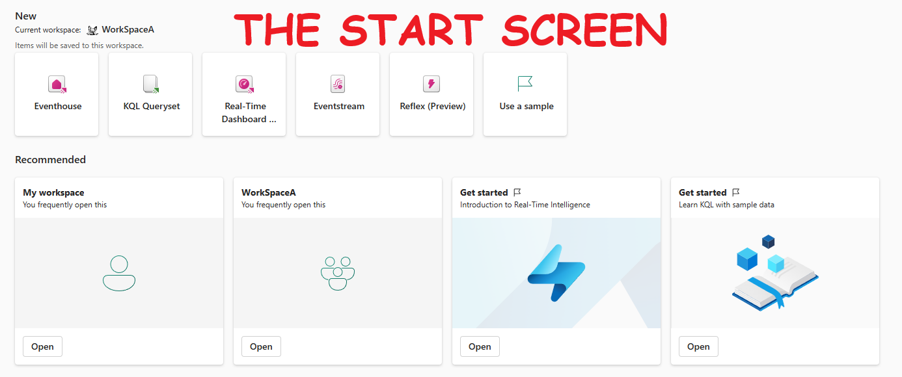

## Background


## Core elements of Real-Time Intelligence in Microsoft Fabric


## Eventhouse


- Central workspace/hub - has multiple KQL databases
- Use an Eventhouse for event-based scenarios
- Automatically index and partition data based on ingestion time
- When you create an EventHouse, it initializes a KQL database with the same name inside it
- KQL databses can be standalone or part of an EventHouse

## KQL Database


A **KQL (Kusto Query Language) Database** handles large volumes of structured, semi-structured, and unstructured data for real-time analytics and ad-hoc querying. It is part of the Azure Data Explorer service.

- **Data Storage:** The data in a KQL database is stored in Azure Data Explorer. It uses a columnar storage format, which is optimized for high-performance analytical queries.

**KQL Database Objects**
- **Tables**: Contains columns and rows of data with a defined schema. Commands: `.create table`, `.show table`, `.ingest`.
- **Functions**: Encapsulate subquery expressions for reuse. Commands: `.create function`, `.show functions`.
- **Materialized Views**: Stores precomputed query results for faster access. Commands: `.create materialized-view`, `.show materialized-views`.
- **Datastreams**: Representations of connected KQL event streams.

**Quick Commands**
- **Create Table**: `.create table`
- **Show Table Schema**: `.show table`
- **Ingest Data**: `.ingest`
- **Create Function**: `.create function`
- **Show Functions**: `.show functions`
- **Create Materialized View**: `.create materialized-view`
- **Show Materialized Views**: `.show materialized-views`


### KQL Database vs. Standard SQL Database

| Feature                     | KQL Database                                     | Standard SQL Database                           |
|-----------------------------|--------------------------------------------------|-------------------------------------------------|
| **Query Language**          | Kusto Query Language (KQL)                       | Structured Query Language (SQL)                 |
| **Storage Format**          | Columnar                                         | Row-based                                       |
| **Optimized For**           | Real-time analytics, log and time-series data    | Transactional data, relational data             |
| **Data Structure**          | Tables, columns, materialized views, functions   | Tables, columns, views, stored procedures       |
| **Scalability**             | Highly scalable and distributed                  | Varies by implementation (SQL Server, MySQL, etc.) |
| **Indexing**                | Automatically indexed for fast query performance | Manual and automatic indexing                   |
| **Data Ingestion**          | Supports batch and streaming ingestion           | Primarily batch ingestion                       |
| **Use Cases**               | Log analytics, telemetry data, IoT data          | OLTP, data warehousing, reporting               |
| **Storage Location**        | Azure Data Explorer service in the cloud         | Varies (on-premises, cloud-based)               |
| **Performance**             | Optimized for read-heavy and analytical workloads| Balanced for read and write operations          |
| **Schema**                  | Flexible schema with support for semi-structured data | Rigid schema with well-defined data types       |

### KQL - It's So Easy to Learn

**Select Where:**
```kql
sales
| where Country == 'Peru'
```

**Select Where with Multiple Clauses:**
```kql
sales
| where Name == 'Tom'
| where Place == 'USA'
```

**More Complex Example:**

    

### KQL Vs SQL

#### Basic Queries

| **Operation**          | **SQL**                                                                                               | **KQL**                                                                                                           |
|------------------------|-------------------------------------------------------------------------------------------------------|-------------------------------------------------------------------------------------------------------------------|
| **Select Query**       | `SELECT Name, Age FROM Employees WHERE Age > 30;`                                                     | `Employees \| where Age > 30 \| project Name, Age`                                                                |
| **Count**              | `SELECT COUNT(*) FROM Orders WHERE Status = 'Shipped';`                                               | `Orders \| where Status == "Shipped" \| summarize count()`                                                        |
| **Group By**           | `SELECT Department, AVG(Salary) AS AverageSalary FROM Employees GROUP BY Department;`                 | `Employees \| summarize AverageSalary=avg(Salary) by Department`                                                  |
| **Join**               | `SELECT e.Name, d.DepartmentName FROM Employees e JOIN Departments d ON e.DepartmentID = d.ID;`       | `Employees \| join kind=inner (Departments) on $left.DepartmentID == $right.ID \| project Name, DepartmentName`   |

#### Advanced Queries

| **Operation**          | **SQL**                                                                                               | **KQL**                                                                                                           |
|------------------------|-------------------------------------------------------------------------------------------------------|-------------------------------------------------------------------------------------------------------------------|
| **Order By**           | `SELECT Name, Age FROM Employees WHERE Age > 30 ORDER BY Age DESC;`                                    | `Employees \| where Age > 30 \| sort by Age desc \| project Name, Age`                                            |
| **Limit**              | `SELECT Name, Age FROM Employees WHERE Age > 30 ORDER BY Age DESC LIMIT 10;`                           | `Employees \| where Age > 30 \| sort by Age desc \| project Name, Age \| take 10`                                  |
| **Subquery**           | `SELECT Name FROM (SELECT * FROM Employees WHERE Age > 30) AS SubQuery WHERE DepartmentID = 5;`        | `let SubQuery = Employees \| where Age > 30; SubQuery \| where DepartmentID == 5 \| project Name`                  |
| **String Functions**   | `SELECT Name FROM Employees WHERE UPPER(FirstName) = 'JOHN';`                                         | `Employees \| where tolower(FirstName) == 'john' \| project Name`                                                 |
| **Date Functions**     | `SELECT Name FROM Employees WHERE YEAR(HireDate) = 2020;`                                             | `Employees \| where datetime_part('year', HireDate) == 2020 \| project Name`                                       |


## KQL Queryset
- Tool for running, viewing, and manipulating KQL database queries.
- Save, export, and share queries.
- Uses Kusto Query Language (KQL) and supports T-SQL.
- Allows complex query creation and execution.

## Real-Time Dashboards
- Customizable control panels for displaying specific data.
- Tiles for different data views, organized on various pages.
- Export KQL queries into visual tiles.
- Enhances data exploration and visualization.

## Eventstream
- Handles live data without coding.
- Automates data collection, transformation, and distribution.
- Processes real-time data for immediate insights.

## Let's Get Started

- **Open Real-Time Intelligence:** Select it from the bottom left-hand corner of the screen:

    

- **Start Screen:** Here is how it looks:

    

- **Create an Eventhouse:** Eventhouses are groups of databases. When you create an Eventhouse, Fabric creates a KQL Database with the same name inside it:

    

- **KQL Database Structure:** This is the standard structure:

  

**Data Ingestion:** Importing data from files like .csv is a childs play using the GUI, which creates a fully structured database with the correct columns.


 
### Create a Power BI Report from KQL Queryset

1. Click the three dots next to the table.
2. Select "Show any 100 records" to open the KQL editor.
3. Create your custom KQL query.
4. Save the query or create the Power BI report directly from the editor.

    


