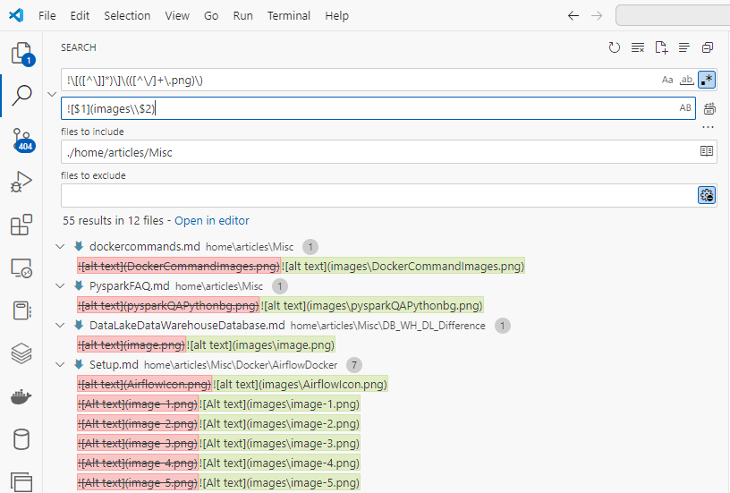
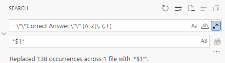

1. Replace all .png files with images\.png

!\[([^\]]*)\]\(([^\/]+\.png)\)

2. Replace constructs like

- **Correct Answer:** B. extend is used to create a new column or modify an existing column.

With

*extend is used to create a new column or modify an existing column.*

Search: - \*\*Correct Answer:\*\* [A-Z]\. (.+)
Replace: *$1*

Quick datasets:

df = pd.read_csv("https://raw.githubusercontent.com/plotly/datasets/master/titanic.csv")
display(df)

## Intelisence not working in VS

