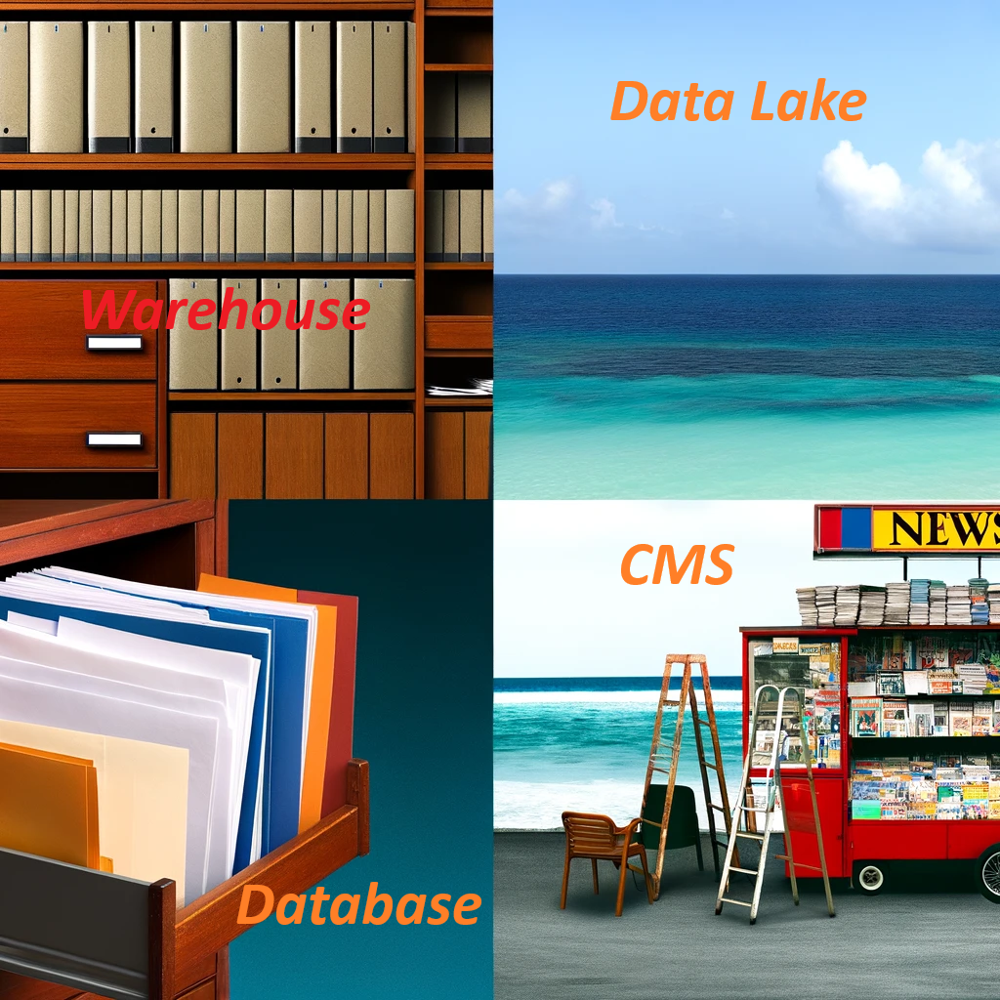

## Database Vs Datawarehouse Vs DataLake Vs ECM/CMS

Hi everyone, when it comes to storing data, we have several options available to us, including databases, data warehouses, data lakes, and CMS systems. You might be wondering what sets each of these apart. There's a lot of information out there, and it can get pretty overwhelming. That's why I've summarized the main differences in a straightforward table for you. This way, you can quickly grasp what makes each option unique. I hope you find it helpful!

| Feature      | Database                                  | Data Lake                                                    | Data Warehouse                                        | CMS (e.g., OpenText)                                                 |
|:-------------|:------------------------------------------|:-------------------------------------------------------------|:------------------------------------------------------|:---------------------------------------------------------------------|
| Primary Use  | Data management for operational processes | Storing vast amounts of raw data                             | Consolidated data analysis and reporting              | Content management and distribution                                  |
| Data Type    | Structured data                           | Structured, unstructured, semi-structured                    | Structured and semi-structured                        | Documents, digital assets, web content                               |
| Structure    | Structured schema                         | Schema-less (schema on read)                                 | Structured schema                                     | Highly structured with metadata for content management               |
| Users        | Developers, business applications         | Data scientists, big data analysts                           | Business analysts, decision makers                    | Content managers, marketers, corporate communications                |
| Processing   | Transactional processing (OLTP)           | Massive parallel processing, adaptable to various data types | Analytical processing (OLAP)                          | Content delivery, digital asset management                           |
| Optimization | Optimized for fast, real-time data access | Optimized for storing large volumes of data in native format | Optimized for complex queries and data analysis       | Optimized for content delivery and accessibility                     |
| Flexibility  | Limited by fixed schema                   | High due to schema on read and diverse data types            | Moderate, with some flexibility in schema adjustments | High flexibility in managing and distributing content                |
| Use Case     | Customer information for web applications | Storing raw, unprocessed social media data                   | Analyzing customer data to drive business decisions   | Managing a company's website, digital assets, and internal documents |

Now, let me give you some relatable examples to help you remember the differences:

| Feature       | Database                     | Data Lake                                  | Data Warehouse                               | CMS (e.g., OpenText)                           |
|---------------|------------------------------|--------------------------------------------|---------------------------------------------|------------------------------------------------|
| **Analogy**       | A well-organized filing cabinet | A vast lake where all forms of water (data) flow | A curated library with books (data) neatly arranged | A digital newsstand showcasing various content formats |
| **In Real Life**  | Your smartphone contacts      | Your phone’s entire photo and video gallery, regardless of format | A meticulously organized photo album with captions and tags | Your curated collection of eBooks, digital magazines, and articles |
| **Key Function**  | Quick access & update of specific data | Store everything without worrying about format or structure | Analyze and report on data that's been cleaned and structured | Manage, store, and distribute digital content efficiently |
| **Quick Example** | Bank transactions database   | Storing all company emails, videos, and social media interactions | A business report analyzing customer behavior over the last year | Managing a company’s website and digital assets like marketing brochures |
