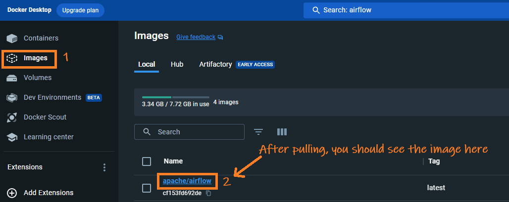

## Table of Contents

- [Setting Up Apache Airflow with Docker on Windows](#setting-up-apache-airflow-with-docker-on-windows)
  - [Method 1 - With Bind Mounts in Docker on Windows](#method-1---with-bind-mounts-in-docker-on-windows)
    - [Prerequisites](#prerequisites)
    - [Create Required Folders](#create-required-folders)
    - [Download the Docker Compose File](#download-the-docker-compose-file)
      - [Note on `docker-compose.yaml`](#note-on-docker-composeyaml)
    - [Initialize and Run Airflow](#initialize-and-run-airflow)
    - [Verify the Installation](#verify-the-installation)
  - [Method 2 - Using a Docker volume for data persistence](#method-2---using-a-docker-volume-for-data-persistence)
    - [Prerequisites](#prerequisites-1)
    - [Download Airflow Docker Image](#download-airflow-docker-image)
    - [Create a Docker Volume](#create-a-docker-volume)
    - [Initialize Airflow Database](#initialize-airflow-database)
    - [Start the Airflow Webserver](#start-the-airflow-webserver)
    - [Additional Tips](#additional-tips)
    - [Cleaning Up](#cleaning-up)
  - [What is docker-compose.yaml](#what-is-docker-composeyaml)
    - [Key Components in the `docker-compose.yaml` for Airflow:](#key-components-in-the-docker-composeyaml-for-airflow)
    - [How It Works:](#how-it-works)
    - [Why Use docker-compose.yaml:](#why-use-docker-composeyaml)
    - [Conclusion:](#conclusion)


# Setting Up Apache Airflow with Docker on Windows

In this article, I'll show two approaches to setting up Apache Airflow using Docker on Windows. Method 1 is more suitable for production environments and Method 2 is ideal for development settings.

## Method 1 - With Bind Mounts in Docker on Windows

<p style="color: #006600; font-family: 'Trebuchet MS', Helvetica, sans-serif; background-color: #e6ffe6; padding: 15px; border-left: 5px solid #00cc66;">
This section describes the installation of the latest version of Apache Airflow in Docker on Windows using bind mounts for data persistence and easy management.
</p>

### <span style="color: #7e0041;">Prerequisites</span>
- Ensure [Docker Desktop](https://www.docker.com/products/docker-desktop/) is installed on your Windows machine.

### <span style="color: #3333cc;">Create Required Folders</span>
- Create a base directory, anywhere, for Airflow, e.g., `C:\Airflow_Das`.
- Within this directory, create three subdirectories: `dags`, `plugins`, and `logs`.

### <span style="color: #b35900;">Download the Docker Compose File</span>

- To get our `docker-compose.yaml`, open the [link](https://airflow.apache.org/docs/apache-airflow/2.7.2/docker-compose.yaml) in a web browser, right-click, and choose **Save As** and download it directly into your `Airflow_Das` directory. Ensure you remove the `.txt` extension if it's added automatically.

    

#### Note on `docker-compose.yaml`
- This file is crucial for our setup. For each version of Apache Airflow we may have a different yaml file.
- To get the file for your version you may search [Apache Airflow site](https://airflow.apache.org) for `docker-compose.yaml`.
- At the time of writing this article, the latest version of the file could be found [here](https://airflow.apache.org/docs/apache-airflow/2.7.2/docker-compose.yaml).


### <span style="color: #804000;">Initialize and Run Airflow</span>
- Open PowerShell(with admin priv) and **cd** to `Airflow_Das`
- Execute:
   ```powershell
   docker-compose up airflow-init
   ```
   
- Follow it with:
   ```powershell
   docker-compose up
   ```
   
   You can see the logs cascading down your PowerShell window. Wait a few seconds and then you can safely close the window.

### <span style="color: #333399;">Verify the Installation</span>
- On Docker Desktop, look for a container named `Airflow_Das`, containing seven subcontainers.

    

- Open `localhost:8080` in a web browser.
- Log in with the username and password: `airflow`.
  

<p style="color: #cc3300; font-family: 'Trebuchet MS', Helvetica, sans-serif; background-color: #ffcccc; padding: 15px; border-left: 5px solid #ff6666;">
Now, your Apache Airflow container is set up and ready to process DAGs. This Docker-based installation ensures your workflows are executed in an isolated and controlled environment.
</p>

---
## Method 2 - Using a Docker volume for data persistence

<p style="color: #004d99; font-family: 'Trebuchet MS', Helvetica, sans-serif; background-color: #e6f7ff; padding: 15px; border-left: 5px solid #3399ff;">
Follow the steps below to set up Apache Airflow in a Docker container on Windows, using a Docker volume for data persistence. This setup is good for development and testing purposes.
</p>

### <span style="color: #9e0059;">Prerequisites</span>
Ensure Docker Desktop is installed and active on your Windows machine.

### <span style="color: #003366;">Download Airflow Docker Image</span>
Run the following command in your command prompt or power shell to pull the latest Airflow Docker image:
```bash
docker pull apache/airflow:latest
```


### <span style="color: #cc0066;">Create a Docker Volume</span>
Execute this command to create a Docker volume named `airflow-volume` for data persistence:
```bash
docker volume create airflow-volume
```

### <span style="color: #006600;">Initialize Airflow Database</span>
Initialize the Airflow database using the following command:
```bash
docker run --rm -v airflow-volume:/opt/airflow apache/airflow:latest db init
```

### <span style="color: #333399;">Start the Airflow Webserver</span>
To start the Airflow webserver, use this command:

```bash
docker run -d --name airflow -p 8080:8080 -e AIRFLOW_UID=50000 -v airflow-volume:/opt/airflow apache/airflow:latest webserver
```
Access the Airflow UI at(UID/Pwd: airflow) [http://localhost:8080](http://localhost:8080).

### <span style="color: #333399;">Additional Tips</span>
- **<span style="color: #b35900;">Checking Logs:</span>** Use `docker logs airflow` to view logs.
- **<span style="color: #b35900;">Stopping the Container:</span>** Execute `docker stop airflow` to stop the server.
- **<span style="color: #b35900;">Restarting Airflow:</span>** After stopping, run `docker start airflow` to resume.
- **<span style="color: #b35900;">Data Safety:</span>** Information within `airflow-volume` is preserved across container restarts.

### <span style="color: #804000;">Cleaning Up</span>
- **<span style="color: #cc3300;">Remove Container:</span>** `docker rm -f airflow` erases the Airflow container.
- **<span style="color: #cc3300;">Delete Volume:</span>** Use `docker volume rm airflow-volume` to remove the volume. **Warning:** This deletes all your saved data!

<p style="color: #004d99; font-family: 'Lucida Grande', 'Lucida Sans Unicode', Geneva, Verdana, sans-serif; background-color: #e6f7ff; padding: 15px; border-left: 5px solid #66cdaa;">
<strong>Conclusion:</strong> The method I described here is good for development purpose but, for production environment, we will stick to Method 1</p>

## What is docker-compose.yaml

The `docker-compose.yaml` file for setting up Apache Airflow is a configuration file used by Docker Compose, a tool for defining and running multi-container Docker applications. This YAML file describes all the services (containers), networks, and volumes needed to run Airflow using Docker. It simplifies the deployment of a multi-container Docker application, in this case, Airflow, with all its dependencies, into a single command.

### Key Components in the `docker-compose.yaml` for Airflow:
1. **Services**: These are the different containers that make up the application. For Airflow, typical services include:
   - **airflow-webserver**: The web UI to interact with Airflow.
   - **airflow-scheduler**: The scheduler to trigger workflow executions.
   - **airflow-worker**: The worker that executes the tasks given by the scheduler.
   - **airflow-init**: A service that initializes the setup.
   - **postgres**: The database server used by Airflow to store metadata.
   - **redis**: An optional component acting as a message broker, used in conjunction with CeleryExecutor.

2. **Volumes**: These are used to persist data generated by and used by Docker containers. In Airflow's setup, they are often used to make sure your DAGs and logs are saved outside the containers, so they persist after containers are stopped or restarted.

3. **Networks**: Docker Compose sets up a default network for containers to communicate with each other. Each service in the `docker-compose.yaml` can connect to this network.

4. **Environment Variables**: The file can specify environment variables for each service. For Airflow, you often define default usernames, passwords, executor types, and other Airflow configurations.

5. **Dependencies**: You can define dependencies in the setup, ensuring services are started in a particular order. For example, the Airflow webserver might depend on the Postgres database being up and running.

### How It Works:
- **Starting Airflow**: Running `docker-compose up` reads the `docker-compose.yaml` file, sets up the required network, volumes, and starts all the services in the defined order.
- **Maintaining State**: The volumes ensure that the state of your application (DAGs, logs) is maintained between restarts of the containers.

### Why Use docker-compose.yaml:
- **Simplicity**: Brings up the entire Airflow environment with a single command.
- **Consistency**: Ensures that the Airflow environment is consistent across different setups (development, staging, production).
- **Isolation**: Each component of Airflow runs in a separate container, ensuring isolation and reducing conflicts between components.

### Conclusion:
The `docker-compose.yaml` file for Airflow is crucial for the setup. Finding the right version of the file can be tricky. Searching the Apache official site may help.

---

© D Das  
📧 [das.d@hotmail.com](mailto:das.d@hotmail.com) | [ddasdocs@gmail.com](mailto:ddasdocs@gmail.com)