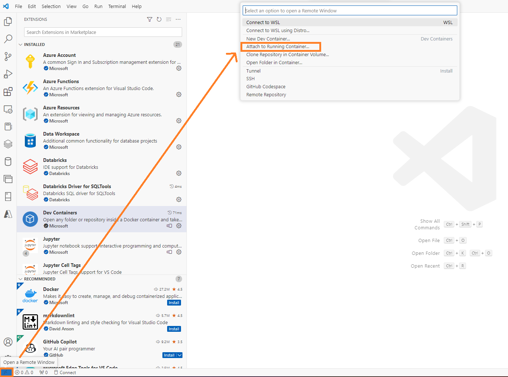
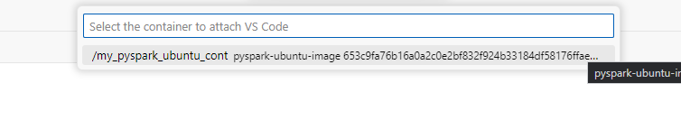

- [Connect to docker container from VS Code](#connect-to-docker-container-from-vs-code)
  - [Install Jupyter notebook support extension in the conatiner](#install-jupyter-notebook-support-extension-in-the-conatiner)
  - [Errors](#errors)


# <span style="color: teal;">Connect to docker container from VS Code</span>

1. In **Visual Studio Code** press **Ctrl+Shift+X**, search  **Dev Containers** and **install**.


1. Click the **Open Remote Window** button in the bottom-left corner of VS Code and select **Attach to Running Container** from the command palette that appears.



1. Pick your active container from the presented list.


5. A new VS Code window will open, connected to your container.

## <span style="color: teal;">Install Jupyter notebook support extension in the conatiner</span>

To use Jupyter Notebook in a container with all features like on your local machine, you need to **install** the VS Code extension **in the container**. It's simple. When you attach the running container using the VS Code Dev Container extension and try to create a Jupyter Notebook, you'll be asked to install the extension in the container. You can also search for the extension in VS Code and install it in the container, but the prompted method is easier.


Once set up, you can manage Python scripts, Jupyter notebooks, and leverage Spark for data operations and machine learning within VS Code.

**For Python (.py) files:**
- Open and execute the `.py` file directly in VS Code.

**For Jupyter Notebooks (.ipynb):**
- Ensure you select the correct kernel when executing a notebook.
- If prompted, install the `ipykernel` package. To do this before you're prompted, run `pip install ipykernel` in the VS Code terminal.


Your draft for the article looks good. Here are a few edits for clarity and readability:

## Errors

When trying to attach to a Docker container using the VSCode Dev extension, you may encounter an error during the **Installing VS Code Server step**:


**Reason:** Insufficient permissions for VSCode to create a folder **.vscode-server** inside the root folder. It cannot create this folder: **/.vscode-server**.

For example, when it runs this command:

```sh
mkdir -p /root/.vscode-remote-containers/bin/611f9bfce64f25108829dd295f54a6894e87339d_1718430101675
```

It fails.

Note: Bitnami Spark is a non-root container by default. However, this can be modified adding `user: root` the Docker Compose file.

**Resolution:** The fastest resolution is to modify the Docker Compose file and add `user: root` to every container. This will fix all the permission issues, and you will be able to attach to a running container using the VSCode Dev Containers extension!

Here is an example of the modified Docker Compose file:

```yaml
version: '3.7'
services:
  spark-master:
    image: bitnami/spark:latest
    user: root
    ...

  spark-worker-1:
    image: bitnami/spark:latest
    user: root
    ...

  spark-worker-2:
    image: bitnami/spark:latest
    user: root
    ...
```

Here is a screenshot of my actual change:


