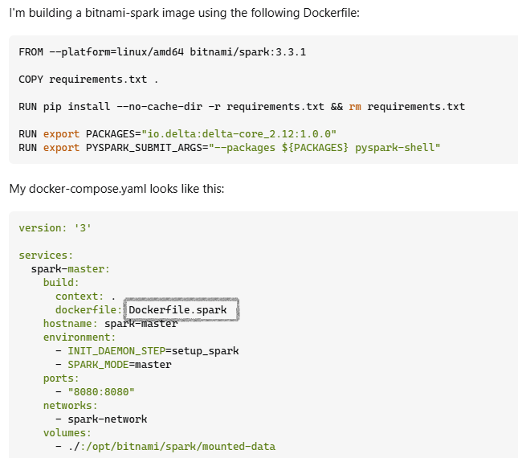

- [Understanding Dockerfile and Docker Compose: A Simple Guide](#understanding-dockerfile-and-docker-compose-a-simple-guide)
  - [What is a Dockerfile?](#what-is-a-dockerfile)
    - [Example Dockerfile](#example-dockerfile)
  - [Key Instructions in a Dockerfile](#key-instructions-in-a-dockerfile)
  - [What is a Docker Compose File?](#what-is-a-docker-compose-file)
    - [Example Docker Compose File](#example-docker-compose-file)
  - [Key Sections in a Docker Compose File](#key-sections-in-a-docker-compose-file)
- [How Dockerfile and Docker Compose Work Together](#how-dockerfile-and-docker-compose-work-together)
- [Example Usage](#example-usage)
  - [Dockerfile](#dockerfile)
  - [Docker Compose File](#docker-compose-file)
- [Conclusion](#conclusion)
- [When to Use a Dockerfile](#when-to-use-a-dockerfile)
- [When to Use Docker Compose](#when-to-use-docker-compose)




### Understanding Dockerfile and Docker Compose: A Simple Guide

When working with Docker, you might come across terms like Dockerfile and Docker Compose. Let's break them down in simple terms.

#### What is a Dockerfile?

A Dockerfile is a script with instructions on how to build a Docker image. It helps automate the creation of a Docker image by specifying the base image, installing software, setting environment variables, and more. Each instruction in the Dockerfile adds a layer to the image, making the build process faster by using cached layers.

##### Example Dockerfile

```Dockerfile
# Use an official Python runtime as a parent image
FROM python:3.8-slim

# Set the working directory in the container
WORKDIR /app

# Copy the current directory contents into the container at /app
COPY . /app

# Install any needed packages specified in requirements.txt
RUN pip install --no-cache-dir -r requirements.txt

# Make port 80 available to the world outside this container
EXPOSE 80

# Define environment variable
ENV NAME World

# Run app.py when the container launches
CMD ["python", "app.py"]
```

#### Key Instructions in a Dockerfile

- `FROM`: Sets the base image.
- `WORKDIR`: Sets the working directory in the container.
- `COPY`: Copies files from your computer to the container.
- `RUN`: Runs commands in the container (like installing software).
- `EXPOSE`: Exposes a port to allow connections.
- `ENV`: Sets environment variables.
- `CMD`: Specifies the command to run when the container starts.

#### What is a Docker Compose File?

A Docker Compose file, usually named `docker-compose.yml`, is a YAML file that helps you run multiple Docker containers as a single service. It makes it easy to manage multiple containers, their networks, and volumes.

##### Example Docker Compose File

```yaml
version: '3'
services:
  web:
    image: my-web-app:latest
    build: .
    ports:
      - "5000:5000"
    volumes:
      - .:/code
    depends_on:
      - redis
  redis:
    image: "redis:alpine"
```

#### Key Sections in a Docker Compose File

- `version`: Specifies the version of Docker Compose.
- `services`: Defines the services (containers) to run.
  - `web`: A service named "web".
    - `image`: The Docker image to use.
    - `build`: Instructions to build the image.
    - `ports`: Maps host ports to container ports.
    - `volumes`: Mounts host directories as volumes in the container.
    - `depends_on`: Specifies dependencies between services.
  - `redis`: Another service named "redis".

### How Dockerfile and Docker Compose Work Together

- **Dockerfile**: Defines the image configuration for a single service.
- **Docker Compose**: Defines and manages multiple services, networks, and volumes.

### Example Usage

#### Dockerfile

1. Create a `Dockerfile` to define your application image:

    ```Dockerfile
    FROM node:14
    WORKDIR /usr/src/app
    COPY package*.json ./
    RUN npm install
    COPY . .
    EXPOSE 8080
    CMD ["node", "server.js"]
    ```

2. Build the Docker image:

    ```sh
    docker build -t my-node-app .
    ```

#### Docker Compose File

1. Create a `docker-compose.yml` to define and run multiple services:

    ```yaml
    version: '3'
    services:
      app:
        build: .
        ports:
          - "8080:8080"
      db:
        image: postgres
        environment:
          POSTGRES_PASSWORD: example
    ```

2. Start the services using Docker Compose:

    ```sh
    docker-compose up
    ```

### Conclusion

- **Dockerfile**: A script to automate the creation of Docker images, defining the environment and software.
- **Docker Compose File**: A YAML file to define and manage multiple Docker containers, networks, and volumes for a complete application.

### When to Use a Dockerfile

- **Single Service**: Use when you need to build a Docker image for one application or service.
- **Customization**: Use when you need to customize an image by installing software, setting environment variables, or copying files.

### When to Use Docker Compose

- **Multiple Services**: Use when your application has multiple services that need to run together, like a web server and a database.
- **Orchestration**: Use to manage and configure multiple containers, networks, and volumes easily.
- **Dependency Management**: Use to define dependencies between services, ensuring they start in the right order.
