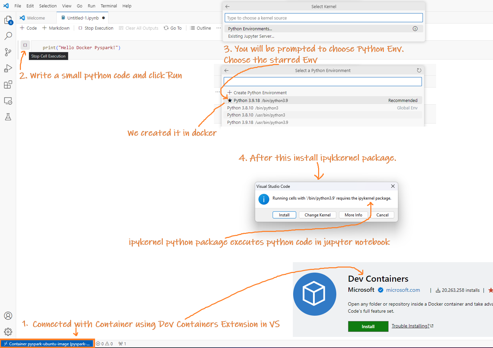

## Work with the docker container from a Visual Studio Code

1. Install the Visual Studio Code **Dev Containers** Extension by searching for "Dev Containers" in the Extensions view (Ctrl+Shift+X) and clicking 'Install'.
   

2. Click the "Open Remote Window" button in the bottom-left corner of VS Code.

3. Select "Attach to Running Container" from the command palette that appears.

   

4. Pick your active container from the presented list.

   

5. A new VS Code window will open, connected to your container.

## Enable Jupyter notebook support extension

Integrate Jupyter notebook support in VS Code while connected to the container by enabling or installing the Jupyter notebook support extension.

Once set up, you can manage Python scripts, Jupyter notebooks, and leverage Spark for data operations and machine learning within VS Code.

**For Python (.py) files:**
- Open and execute the `.py` file directly in VS Code.

**For Jupyter Notebooks (.ipynb):**
- Ensure you select the correct kernel when executing a notebook.
- If prompted, install the `ipykernel` package. To do this before you're prompted, run `pip install ipykernel` in the VS Code terminal.

