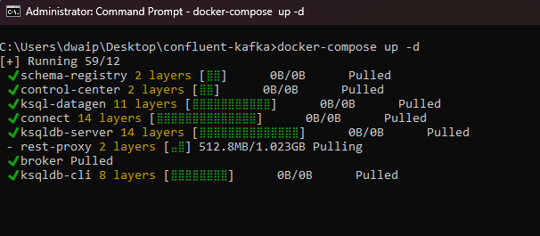
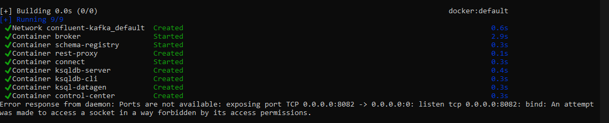
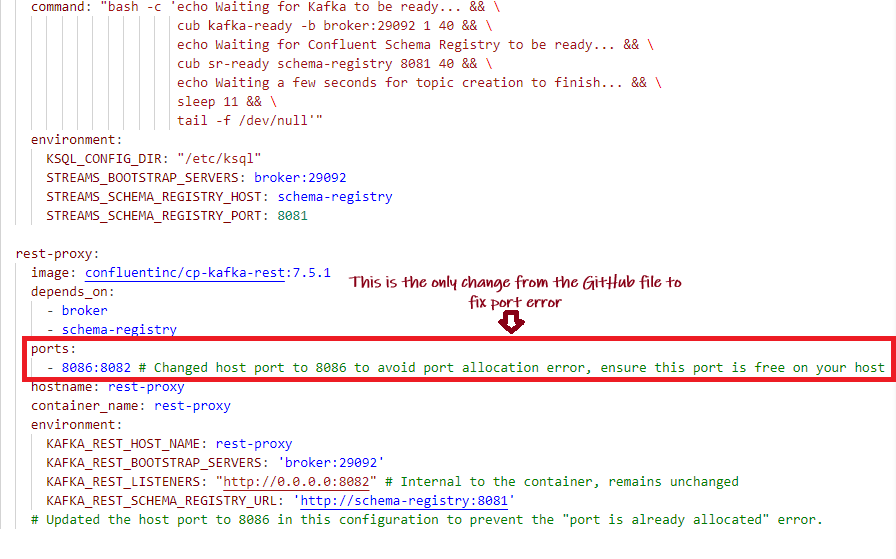

## <span style="color: DimGray;">Table of Contents</span>

- [Setting Up a Local Kafka Development Environment with Docker Compose ](#setting-up-a-local-kafka-development-environment-with-docker-compose-)
  - [Prerequisites](#prerequisites)
  - [Download the Docker Compose file](#download-the-docker-compose-file)
  - [Steps to Launch the Kafka Environment](#steps-to-launch-the-kafka-environment)
  - [Appendix](#appendix)
    - [Connecting to Kafka Containers](#connecting-to-kafka-containers)
    - [Troubleshooting Broker Connection Issues](#troubleshooting-broker-connection-issues)
    - [Error: no matching manifest for linux/arm64/v8](#error-no-matching-manifest-for-linuxarm64v8)
    - [Resolving Port Conflicts for Kafka Rest Proxy in Docker](#resolving-port-conflicts-for-kafka-rest-proxy-in-docker)
    - [About the docker-compose.yml](#about-the-docker-composeyml)
    - [Fully commented docker-compose.yml](#fully-commented-docker-composeyml)
  - [Conclusion](#conclusion)
  - [Further reading](#further-reading)


# <span style="color: DodgerBlue;">Setting Up a Local Kafka Development Environment with Docker Compose </span>


<p style="color: #006600; font-family: 'Trebuchet MS', Helvetica, sans-serif; background-color: #e6ffe6; padding: 15px; border-left: 5px solid #00cc66;">
In this guide, I'll walk through setting up a local Kafka development environment using Docker Compose. The provided `docker-compose` file sets up all the necessary components, including Kafka broker, Schema Registry, Kafka Connect, Control Center, ksqlDB, and a REST Proxy. I have tested the installation in both Windows and Mac machines with M1 chip.
</p>

## <span style="color: BlueViolet;">Prerequisites</span>
- Docker and Docker Compose installed on your local machine.

## <span style="color: ForestGreen;">Download the Docker Compose file</span>

To get started with setting up Confluent Platform, you'll need the `docker-compose.yml` file. This file contains all the necessary configurations to run Confluent Platform services using Docker.

Here's what you need to do:

1. Click this [link](https://github.com/confluentinc/cp-all-in-one/blob/7.5.1-post/cp-all-in-one-kraft/docker-compose.yml) to access KRaft version of the `docker-compose.yml` file on GitHub.

Note: When choosing between KRaft and ZooKeeper as the metadata service for your Apache Kafka cluster, **KRaft** is the **recommended** option.

2. Copy the content of the file and paste it in a text file and rename it to docker-compose.yml(remove the .txt ext)


   
**Remember**: The container group wil l be named after the folder containing the docker-compose. I.e. If it is inside London/docker-compose.yml then the container group in docker will be London.

## <span style="color: Teal;">Steps to Launch the Kafka Environment</span>

1. Open command prompt/terminal and CD to the folder containing the `docker-compose.yml`

2. Run the following command to start all services:

```bash
docker-compose up -d
```



4. The Docker Compose will start all the necessary services in the background. Once finished, go to the docker desktop window and see the services


5. You can access the Control Center at http://localhost:9021 once the container is operational.
6. To create topics and proceed further you can refer to the  this quickstart [guide](https://docs.confluent.io/platform/current/platform-quickstart.html#cp-quickstart-step-1).

## <span style="color: DarkRed;">Appendix</span>


### <span style="color: Blue;">Connecting to Kafka Containers</span>

The container group created using the docker-compose become part of  `confluent-kafka_default` network group, restricting access from external containers or local machines not in this network. This means, you won't be able to connect to the broker from outside containers or local machine. To connect to Kafka from an external container, add it to the `confluent-kafka_default` network:

```bash
docker network connect confluent-kafka_default [external-container-name-or-id]
```

After adding, connect to the Kafka broker at `broker:29092`. Example for Spark:

```python
from pyspark.sql import SparkSession

spark = SparkSession.builder \
    .appName("Streaming from Kafka") \
    .config("spark.streaming.stopGracefullyOnShutdown", True) \
    .config('spark.jars.packages', 'org.apache.spark:spark-sql-kafka-0-10_2.12:3.3.0') \
    .getOrCreate()

streaming_df = spark.readStream \
    .format("kafka") \
    .option("kafka.bootstrap.servers", "broker:29092) \
    .option("subscribe", "sometopic") \
    .option("startingOffsets", "earliest") \
    .load()
```

### <span style="color: Green;">Troubleshooting Broker Connection Issues</span>

Inspect the Kafka broker container using `docker inspect [broker-container-id]`. For detailed network information:

```bash
docker network inspect [network-name]
```

To find the broker's IP address:

```bash
docker inspect -f '{{range .NetworkSettings.Networks}}{{.IPAddress}}{{end}}' [container-name-or-id]
```

Test connectivity to the broker:

```bash
nc -vz -w 5 [broker-ip] [listener-port]
```

### <span style="color: DimGray;">Error: no matching manifest for linux/arm64/v8</span>

We might run into an error like no matching manifest for linux/arm65/v8 this error error indicates that the Docker images specified in the `docker-compose.yml` file do not have a version compatible with the architecture of our Mac's processor. This error is less likely if you use the KRaft version. I have tested the KRaft versin on both Windows and Mac M1, they both showed no error in architecture or compatibility.

### <span style="color: DimGray;">Resolving Port Conflicts for Kafka Rest Proxy in Docker</span> 

When deploying Kafka Rest Proxy using Docker Compose, port conflicts are a common issue that can prevent the service from starting successfully. 



Here is a typical example of this error:

```bash
Cannot start Docker Compose application. Reason: compose [start] exit status 1. Container broker Starting Container broker Started Container schema-registry Starting Container schema-registry Started Container rest-proxy Starting Container connect Starting Container connect Started Error response from daemon: Ports are not available: exposing port TCP 0.0.0.0:8082 -> 0.0.0.0:0: listen tcp 0.0.0.0:8082: bind: An attempt was made to access a socket in a way forbidden by its access permissions.
```

**Long story short:** Use this  [modified docker-compose.yml](docker-compose.yml) which uses port **8086** instead of **8082**

**Detailed investigation**:

1. **Identify Port Usage**: Use `netstat` or `lsof` to check if the intended port is already in use.

   - For Windows: `netstat -ano | findstr :<PORT>`
   - For Linux/Mac: `sudo lsof -i :<PORT>` or `sudo netstat -tulnp | grep :<PORT>`

      

2. **Modify Docker Compose File**: If the port is in use, select an unused port and update the `docker-compose.yml` file. Change the host port mapping for the `rest-proxy` service:

   ```yaml
   ports:
     - <UNUSED_PORT>:8082 # Change <UNUSED_PORT> to an available port on your host
   ```

   e.g:

    

3. **Restart Docker Compose**: Apply the changes by running:

   ```bash
   docker-compose down
   docker-compose up -d
   ```

4. **Update Applications**: Ensure all applications that interact with Kafka Rest Proxy are updated to use the new port.

### <span style="color: DimGray;">About the docker-compose.yml</span> 

Here is an explanation of the differnet services in the docker-compose.yml

- **broker**: A Kafka broker service with custom environment configurations for topics, listeners, ports, IDs, etc.
- **schema-registry**: This service provides a serving layer for your metadata. It is configured to communicate with the Kafka broker and expose port 8081.
- **connect**: Kafka Connect with dependencies on the broker and schema-registry, configured to run connectors.
- **control-center**: Confluent's web-based tool for managing and monitoring the Kafka ecosystem.
- **ksqldb-server**: The server for ksqlDB, streaming SQL engine that enables real-time data processing against Apache Kafka.
- **ksqldb-cli**: A command-line interface for interacting with ksqlDB Server.
- **ksql-datagen**: A tool for generating sample data for Kafka topics and provides a source of continuously flowing data.
- **rest-proxy**: Provides a RESTful interface to Kafka clusters.

### <span style="color: Navy;">Fully commented docker-compose.yml</span>

If you want to know each step of the docker compose file. I have placed a fully commented [docker-compose.yml](docker-compose-commented.yml)

## <span style="color: PaleVioletRed;">Conclusion</span>

You now have a fully functional local Kafka development environment that includes a broker, Schema Registry, Kafka Connect, Control Center, ksqlDB, and a REST Proxy. The KRaft version of the docker compose has been tested in both WIndows and Mac M1 machines.

## <span style="color: Teal;">Further reading</span>

[Confluent Documentation. Quick Start. Docker Container](https://docs.confluent.io/platform/current/platform-quickstart.html#cp-quickstart-step-1)

[Confluent Documentation. Quick Start using CLI](https://developer.confluent.io/quickstart/kafka-local/?_gl=1*1hbigt8*_ga*MzYyMDI3ODc1LjE2OTkyODY3MTE.*_ga_D2D3EGKSGD*MTY5OTMzMTY0Ni41LjEuMTY5OTM0MDk0MS40MC4wLjA.)


