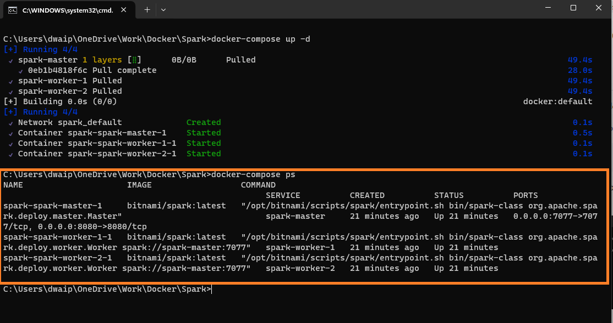

## Table of contents
- [Setting Up a Spark Cluster with Docker - End-to-End Tutorial](#setting-up-a-spark-cluster-with-docker---end-to-end-tutorial)
  - [Prerequisites](#prerequisites)
  - [Step 1: Setting Up Docker Compose File](#step-1-setting-up-docker-compose-file)
    - [Create a `docker-compose.yaml` file:](#create-a-docker-composeyaml-file)
  - [Step 2: Starting the Cluster](#step-2-starting-the-cluster)
    - [Open command prompt](#open-command-prompt)
    - [Run the following command](#run-the-following-command)
    - [Verify the containers are running](#verify-the-containers-are-running)
  - [Step 3: Accessing Spark Master UI](#step-3-accessing-spark-master-ui)
  - [Step 4: Running a Spark Job](#step-4-running-a-spark-job)
    - [Access the Spark Master container](#access-the-spark-master-container)
    - [Run your Spark job](#run-your-spark-job)
  - [Step 5: Shutting Down the Cluster](#step-5-shutting-down-the-cluster)
  - [Steps to add an extra node](#steps-to-add-an-extra-node)
    - [Steps to Add an Extra Spark Worker Node](#steps-to-add-an-extra-spark-worker-node)
      - [Open your docker-compose.yaml file.](#open-your-docker-composeyaml-file)
      - [Duplicate the configuration of an existing Spark worker.](#duplicate-the-configuration-of-an-existing-spark-worker)
      - [Save the docker-compose.yaml file.](#save-the-docker-composeyaml-file)
      - [Run Docker Compose.](#run-docker-compose)
    - [Notes:](#notes)
  - [Why This Setup?](#why-this-setup)
  - [Conclusion](#conclusion)

# Setting Up a Spark Cluster with Docker - End-to-End Tutorial

<p style="color: #006600; font-family: 'Trebuchet MS', Helvetica, sans-serif; background-color: #e6ffe6; padding: 15px; border-left: 5px solid #00cc66;">
In this tutorial I'll guide you through setting up an Apache Spark cluster using Docker, with one master and two worker nodes in windows environment. We will use docker-compose.yaml to achieve this task.
</p>

## <span style="color: #7e0041;">Prerequisites</span>

- **Docker**: Make sure Docker is installed and running on your machine. [You can Download Docker from here](https://www.docker.com/products/docker-desktop).

## <span style="color: #3333cc;">Step 1: Setting Up Docker Compose File</span>

<p style="color: #804000; font-family: 'Courier New', Courier, monospace; background-color: #fff5e6; padding: 15px; border-left: 5px solid #b35900;">
The most important file here is docker-compose.yaml. Which is used to set up multi-container docker applications. In our case it will be 1 Master container and 2 worker containers.
</p>

### <span style="color: #9e0059;">Create a `docker-compose.yaml` file</span>:

- Create a file **docker-compose.yaml** and paste the content below and save.

```yaml

# Define the YAML version
version: '3.8'

services:
  # Define a service named "spark-master"
  spark-master:
    # Specify the Docker image to use for the spark-master service
    image: bitnami/spark:latest
    user: root #Optional - This is required else, error in attaching containers using VS code

    # Define the ports to expose for the spark-master service
    ports:
      # Expose port 7077 from the container to port 7077 on the host machine
      - "7077:7077"
      # Expose port 9090 from the container to port 8080 on the host machine
      - "9090:8080"

  # Define a service named "spark-worker-1"
  spark-worker-1:
    # Specify the Docker image to use for the spark-worker-1 service
    image: bitnami/spark:latest
    user: root #Optional - This is required else, error in attaching containers using VS code

    # Define the environment variables for the spark-worker-1 service
    environment:
      # Set the SPARK_MASTER_URL environment variable to the URL of the Spark Master node
      - SPARK_MASTER_URL=spark://spark-master:7077
      # Set the SPARK_WORKER_MEMORY environment variable to the amount of memory to allocate to each Spark worker
      - SPARK_WORKER_MEMORY=2g
      # Set the SPARK_WORKER_CORES environment variable to the number of cores to allocate to each Spark worker
      - SPARK_WORKER_CORES=1

  # Define a service named "spark-worker-2"
  spark-worker-2:
    # Specify the Docker image to use for the spark-worker-2 service
    image: bitnami/spark:latest
    user: root #Optional - This is required else, error in attaching containers using VS code

    # Define the environment variables for the spark-worker-2 service
    environment:
      # Set the SPARK_MASTER_URL environment variable to the URL of the Spark Master node
      - SPARK_MASTER_URL=spark://spark-master:7077
      # Set the SPARK_WORKER_MEMORY environment variable to the amount of memory to allocate to each Spark worker
      - SPARK_WORKER_MEMORY=2g
      # Set the SPARK_WORKER_CORES environment variable to the number of cores to allocate to each Spark worker
      - SPARK_WORKER_CORES=1
```

- Rename the file as `docker-compose.yaml`

**Explanation of key items in the file**

| Feature               | Details |
|-----------------------|---------|
| **Version**           | Specifies the Docker Compose file format version. |
| **Services**          | Defines three services (one master and two workers). |
| **Image**             | We use `bitnami/spark:latest`, which is a pre-built, well-maintained Spark Docker image.  |
| **Ports**             | Exposes the Spark master UI (`9090`) and communication port (`7077`). |
| **Environment Variables** | Configures Spark properties like worker memory and cores. |


## <span style="color: #3333cc;">Step 2: Starting the Cluster</span>

### <span style="color: #9e0059;">Open command prompt</span>
**Open command prompt** and cd to the folder containing the `docker-compose.yaml`.

### <span style="color: #9e0059;">Run the following command</span>
- **Run the following command** to start your Spark cluster:

    ```bash
    docker-compose up -d
    ```

    <p style="color: #003366; font-family: Arial, sans-serif; background-color: #cce6ff; padding: 15px; border-left: 5px solid #333399;">
    The `-d` flag runs the containers in the background.
    </p>
    
    
  <p style="color: #804000; font-family: 'Courier New', Courier, monospace; background-color: #fff5e6; padding: 15px; border-left: 5px solid #b35900;">
  The name of the container group will be docker. If you want to put a fancy name. Use command:
  </p>
  
  ```bash docker-compose -p fancyName up -d ```
  
  

### <span style="color: #9e0059;">Verify the containers are running</span>
- Enter the following command in the same prompt

    ```bash
    docker-compose ps
    ```

    
- Also go to the docker window and you should see the containers running

    

## <span style="color: #3333cc;">Step 3: Accessing Spark Master UI</span>

Once your cluster is running, access the Spark Master UI through your web browser at `http://localhost:9090`. Here, you can view details about your cluster, including active workers and running applications.

## <span style="color: #3333cc;">Step 4: Running a Spark Job</span>

### <span style="color: #9e0059;">Access the Spark Master container</span>

Run the following command:

    ```bash
    docker exec -it <spark-master-container-id> /bin/bash
    ```

### <span style="color: #9e0059;">Run your Spark job</span>

**Run your Spark job** from within the master container, or use `spark-submit` to deploy your application.

## <span style="color: #3333cc;">Step 5: Shutting Down the Cluster</span>

Tp shut down the container, run the following command:

    ```bash
    docker-compose down
    ```

## <span style="color: #3333cc;">Steps to add an extra node</span>

<p style="color: #006600; font-family: 'Trebuchet MS', Helvetica, sans-serif; background-color: #e6ffe6; padding: 15px; border-left: 5px solid #00cc66;">
Adding an extra Spark worker node to your existing Docker Compose setup is simple. You just need to duplicate the configuration of an existing worker node in your <code>docker-compose.yaml</code> file, making sure to change any necessary details (like the service name) to avoid conflicts. Here's how you can do it:
</p>

### <span style="color: #7e0041;">Steps to Add an Extra Spark Worker Node</span>

#### <span style="color: #000000;">Open your <code>docker-compose.yaml</code> file</span>.

#### <span style="color: #000000;">Duplicate the configuration of an existing Spark worker</span>.
- For instance, if you have a `spark-worker-1`, you can create a `spark-worker-3` by copying the `spark-worker-1` service and changing the name. Here's an example:


```yaml
# Define the YAML version
version: '3.8'

services:
  # Define a service named "spark-master"
  spark-master:
    # Specify the Docker image to use for the spark-master service
    image: bitnami/spark:latest
    user: root #This is required else, error in attaching containers using VS code

    # Define the ports to expose for the spark-master service
    ports:
      # Expose port 7077 from the container to port 7077 on the host machine
      - "7077:7077"
      # Expose port 9090 from the container to port 8080 on the host machine
      - "9090:8080"

  # Define a service named "spark-worker-1"
  spark-worker-1:
    # Specify the Docker image to use for the spark-worker-1 service
    image: bitnami/spark:latest
    user: root #This is required else, error in attaching containers using VS code

    # Define the environment variables for the spark-worker-1 service
    environment:
      # Set the SPARK_MASTER_URL environment variable to the URL of the Spark Master node
      - SPARK_MASTER_URL=spark://spark-master:7077
      # Set the SPARK_WORKER_MEMORY environment variable to the amount of memory to allocate to each Spark worker
      - SPARK_WORKER_MEMORY=2g
      # Set the SPARK_WORKER_CORES environment variable to the number of cores to allocate to each Spark worker
      - SPARK_WORKER_CORES=1

  # Define a service named "spark-worker-2"
  spark-worker-2:
    # Specify the Docker image to use for the spark-worker-2 service
    image: bitnami/spark:latest
    user: root #This is required else, error in attaching containers using VS code

    # Define the environment variables for the spark-worker-2 service
    environment:
      # Set the SPARK_MASTER_URL environment variable to the URL of the Spark Master node
      - SPARK_MASTER_URL=spark://spark-master:7077
      # Set the SPARK_WORKER_MEMORY environment variable to the amount of memory to allocate to each Spark worker
      - SPARK_WORKER_MEMORY=2g
      # Set the SPARK_WORKER_CORES environment variable to the number of cores to allocate to each Spark worker
      - SPARK_WORKER_CORES=1

  # Define a service named "spark-worker-3"
  spark-worker-3:  # New worker node
    # Specify the Docker image to use for the spark-worker-3 service
    image: bitnami/spark:latest
    user: root #This is required else, error in attaching containers using VS code

    # Define the environment variables for the spark-worker-3 service
    environment:
      # Set the SPARK_MASTER_URL environment variable to the URL of the Spark Master node
      - SPARK_MASTER_URL=spark://spark-master:7077
      # Set the SPARK_WORKER_MEMORY environment variable to the amount of memory to allocate to each Spark worker
      - SPARK_WORKER_MEMORY=2g
      # Set the SPARK_WORKER_CORES environment variable to the number of cores to allocate to each Spark worker
      - SPARK_WORKER_CORES=1
```

#### <span style="color: #000000;">Save the <code>docker-compose.yaml</code> file</span>.

#### <span style="color: #000000;">Run Docker Compose</span>.

   ```bash
   docker-compose up -d
   ```

### <span style="color: #b35900;">Notes:</span>

- **Service Names**: Each service in the Docker Compose file must have a unique name. In the example above, `spark-worker-3` was added.
- **Resource Allocation**: Adjust the `SPARK_WORKER_MEMORY` and `SPARK_WORKER_CORES` values according to the available resources and your requirements.
- **Scaling Workers**: For scaling the number of identical workers, the `docker-compose up --scale` command can be used. However, for Spark workers, individual management is often preferable for resource or environment settings.
- **Network**: All services in a `docker-compose.yaml` file are usually part of the same network, enabling the new worker to communicate with the master automatically.

## <span style="color: #b35900;">Why This Setup?</span>

- **Ease of Use**: Docker simplifies the setup of a Spark cluster. You don't need to worry about manual installations and configurations on your local machine.
- **Consistency**: Docker ensures your Spark environment is consistent, making it easy to share and replicate among team members or deploy across different environments.
- **Scalability**: Easily scale your Spark workers up or down by adjusting the `docker-compose.yaml` file and using Docker Compose commands.

## <span style="color: #3333cc;">Conclusion</span>

<p style="color: #993333; font-family: Arial, sans-serif; background-color: #ffcccc; padding: 15px; border-left: 5px solid #cc0000;">
I prefer the Bitnami container for its maintenance and pre-set configurations including Java. However, Apache's official container is also a viable option, albeit requiring changes to the <code>docker-compose.yaml</code> file.
</p>

---
© D Das  
📧 [das.d@hotmail.com](mailto:das.d@hotmail.com)