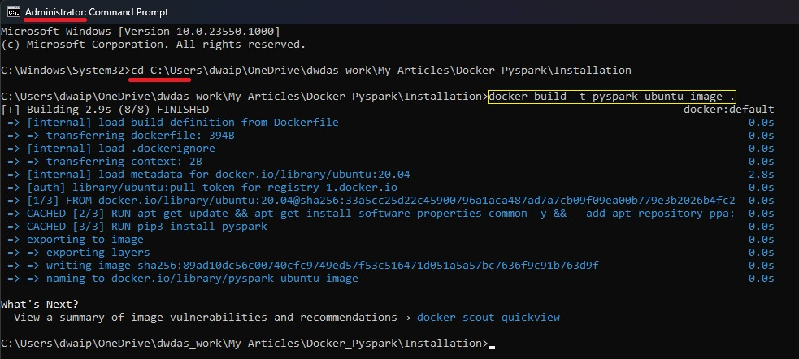
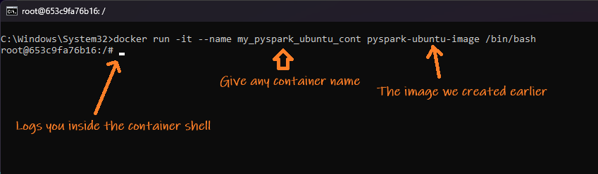
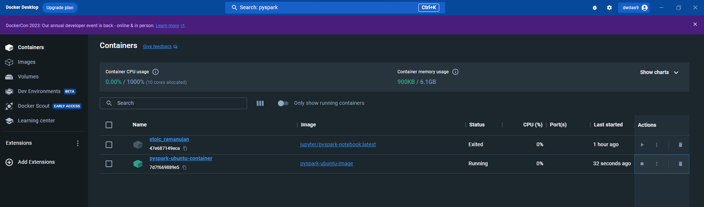
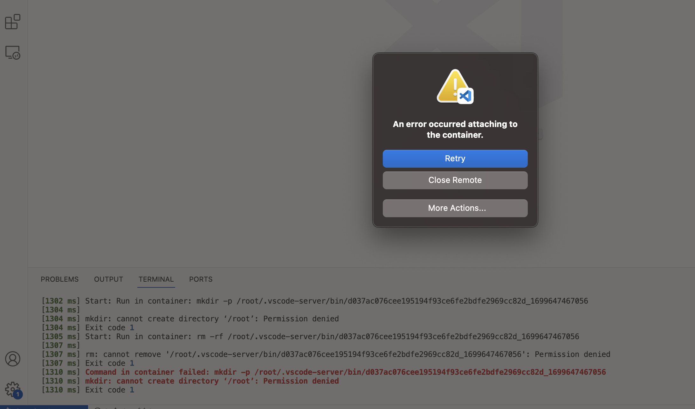

## <span style="color: navy;">Table of contents</span>

- [Setup Spark on Docker On Windows](#setup-spark-on-docker-on-windows)
  - [Background](#background)
  - [Quickstart](#quickstart)
    - [Create the Dockerfile](#create-the-dockerfile)
    - [Build the Docker Image](#build-the-docker-image)
    - [Run the Docker Container](#run-the-docker-container)
    - [Work with the docker container from a local VS Code](#work-with-the-docker-container-from-a-local-vs-code)
  - [Enable Jupyter notebook support extension](#enable-jupyter-notebook-support-extension)
- [Appendix](#appendix)
  - [Using pre-configured ready-to-use Spark containers](#using-pre-configured-ready-to-use-spark-containers)
    - [Setup for apache/spark-py](#setup-for-apachespark-py)
    - [Setup for bitnami/spark](#setup-for-bitnamispark)
    - [Container Popularity](#container-popularity)
    - [Errors](#errors)


# <span style="color: teal;">Setup Spark on Docker On Windows</span>


## <span style="color: teal;">Background

Here I'll show how to create a **Dockerfile** to create a Ubuntu container with Pyspark installed in it. Then, we will see how to connect to this container using VS Code's **Dev Container Extension**. The purpose here is to show how to create our own customized containers. Please note, typically you wold opt for pre-built containers for spark or similar environments.             

## <span style="color: teal;">Quickstart</span>

### <span style="color: teal;">Create the Dockerfile</span>

1. Create a file **Dockerfile**(Without ANY extn. D Caps f small in **D**ocker**f**ile) and paste the below contents in it

Alternatively, I have placed a [dockerfile](Dockerfile) which you may use.

```Dockerfile
# Base the image on Ubuntu 20.04
FROM ubuntu:20.04  

# Set non-interactive mode to prevent prompts during build
ENV DEBIAN_FRONTEND=noninteractive  

# Update the package list
RUN apt-get update  

# Install software-properties-common for repo management
RUN apt-get install software-properties-common -y  

# Add the 'deadsnakes' PPA for newer Python versions
RUN add-apt-repository ppa:deadsnakes/ppa  

# Update package list post-PPA addition
RUN apt-get update  

# Install Python 3.9 and pip3
RUN apt-get install -y python3.9 python3-pip  

# Install headless OpenJDK 11
# Choosing headless JDK for a smaller footprint without GUI libs
# Using OpenJDK for its open-source, transparent, and community-driven nature
RUN apt-get install -y openjdk-11-jdk-headless  

# Install the PySpark library
RUN pip3 install pyspark
```

### <span style="color: teal;">Build the Docker Image</span>
- In terminal, CD to the folder with DockerFile and run the command `docker build -t ubuntuimg .`
  - `ubuntuimg` is the name you choose for your Docker image.
  - The period `.` tells that the Dockerfile is located in the current directory.



### <span style="color: teal;">Run the Docker Container</span>

  1. In terminal, run `docker run -it --name ubuntucont ubuntuimg /bin/bash`.
  2. If successful, you'll enter the container's shell, and it should resemble the image below.
     
  3. Docker Desktop will list `ubuntucont` as running in the container window, similar to the following image.
     

# <span style="color: #228B22;">Appendix</span>

## <span style="color: teal;">Using pre-configured ready-to-use Spark containers</span>

Previously, we detailed the process of constructing a custom Docker container with all the necessary elements for PySpark. However, in real-world applications, it's more efficient to opt for a pre-configured Spark container that comes with all the required settings pre-installed. Here's a brief guide to installing pre-made Apache Spark Docker containers like apache/spark-py and bitnami/spark.

### <span style="color: #7e0041;">Setup for apache/spark-py</span>

Apache Spark-py offers a lightweight Spark environment with Python support. To use, follow these steps:

1. **Install Docker** from [Docker's Installation Guide](https://docs.docker.com/engine/install/).

2. **Pull the apache/spark-py image:**
   ```shell
   docker pull apache/spark-py
   ```

3. **Run the container:**
   
   This opens an interactive shell with PySpark.
   ```shell
   docker run -it --name apache-spark-py -p 8080:8080 -p 4040:4040 apache/spark-py
   ```
   This opens an interactive shell with bin/bash as an entry point instead of PySpark

   ```
   docker run -it --name apache-spark-py --entrypoint /bin/bash apache/spark-py
   ```
  
  **Important Note**: Instead of using terminal if you just run the container from Docker Dekstop's container image it will exit with Code 1. The entry point is necessary.

### <span style="color: #333333;">Setup for bitnami/spark</span>

Bitnami Spark provides a ready-to-go Spark environment. Setup is similar:

1. **Install Docker** as mentioned above.

2. **Pull the bitnami/spark image:**
   ```shell
   docker pull bitnami/spark
   ```

3. **Run the container:**
   ```shell
   docker run -it --name bitnami-spark -p 8080:8080 -p 4040:4040 bitnami/spark
   ```
   This starts a session with the Spark shell available.

### <span style="color: #DC143C;">Container Popularity</span>

The following table outlines the popularity of different Spark Docker containers:

| Container | Popularity |
|-----------|------------|
| apache/spark-py | 32% |
| bitnami/spark | 17% |
| Other Notable Images | 31% |
| Community Images | 1% |

### <span style="color: #DC143C;">Errors</span>

Error Description: VS Code is unable to attach to a running container. Errror encountered: mkdir: cannot create directory** '/root': permission denied**. 

To see the Dev Containers Logs. Contro/Command Shift P : Dev Containers: Show logs

Main reason: 

1. This happens mainly in linux/mac machines. Here if you don't run the container with root priviledge you will get this error.
2. If you create a dockerfile and don't mention any user on top. It will run with root priviledge. Hence, with custom Dockerfile-based images this error doesn't happen

Reasonlution: Add -u root`-u root` to docker run command like:

`docker run -u root -it --name myCont theImageFileName /bin/bash`



2. Alternatively, if you include `user: root` in the Dockerfile or docker-compose.yml, this issue gets resolved.

---

*For any questions or further assistance, please contact D Das at das.d@hotmail.com.*