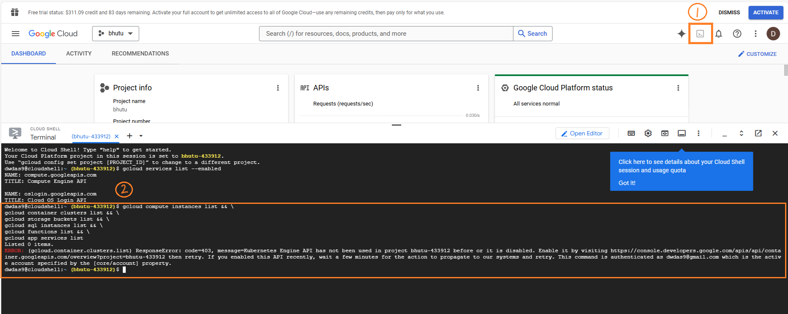

## <span style="color: #1434CB; font-family: Segoe UI, sans-serif;"> Background</span>

Worried about what resources are running and causing costs? You can check them directly from the cloud console. Here are some of the useful commands to check it.

### <span style="color: #1434CB; font-family: Segoe UI, sans-serif;">Single command to see it all</span>

Copy and paste this command in your cloud console to get an overview.

```bash
gcloud compute instances list && \
gcloud container clusters list && \
gcloud storage buckets list && \
gcloud sql instances list && \
gcloud functions list && \
gcloud app services list
```




## <span style="color: #1434CB; font-family: Segoe UI, sans-serif;">Separate commands</span>

You can run the following commands in your cloud console to see each service if they are running or not.

| **Task**                                      | **Command**                                  | **Description**                                                                                                                         |
|-----------------------------------------------|----------------------------------------------|-----------------------------------------------------------------------------------------------------------------------------------------|
| **List All Compute Engine VM Instances**      | `gcloud compute instances list`              | Shows all the virtual machines running in your project, with details like zone, machine type, and status.                               |
| **List Kubernetes Clusters**                  | `gcloud container clusters list`             | Shows all the Kubernetes Engine clusters in your project.                                                                               |
| **List Cloud Storage Buckets**                | `gcloud storage buckets list`                | Lists all the storage buckets in your project.                                                                                          |
| **List Cloud SQL Instances**                  | `gcloud sql instances list`                  | Shows all the Cloud SQL instances in your project.                                                                                      |
| **List App Engine Services**                  | `gcloud app services list`                   | Shows all the services you have deployed in App Engine.                                                                                 |
| **List Cloud Functions**                      | `gcloud functions list`                      | Lists all the Cloud Functions running in your project.                                                                                  |
| **List BigQuery Datasets**                    | `bq ls`                                      | Lists all the BigQuery datasets in your project.                                                                                        |
| **List All Resources in Your Project**        | `gcloud projects describe $(gcloud config get-value project)` | Gives an overview of your project, but doesn’t list every resource. Use specific commands for detailed info.                              |
| **Check Billing Information**                 | `gcloud alpha billing accounts list`         | Shows billing accounts, but might not give a detailed cost breakdown.                                                                   |
| **List Active Firewall Rules (Networking)**   | `gcloud compute firewall-rules list`         | Lists all the firewall rules, helping you see network settings that might be in use.                                                    |
| **List All Active Services**                  | `gcloud services list --enabled`             | Shows all the enabled APIs and services in your Google Cloud project.                                                                   |
