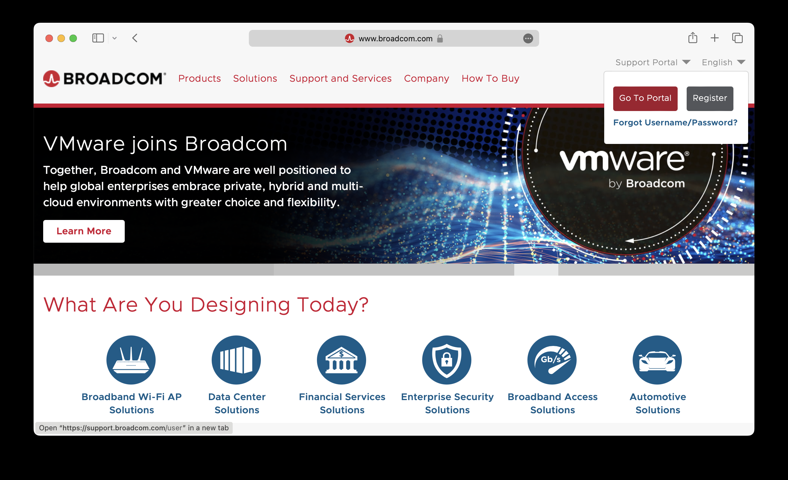
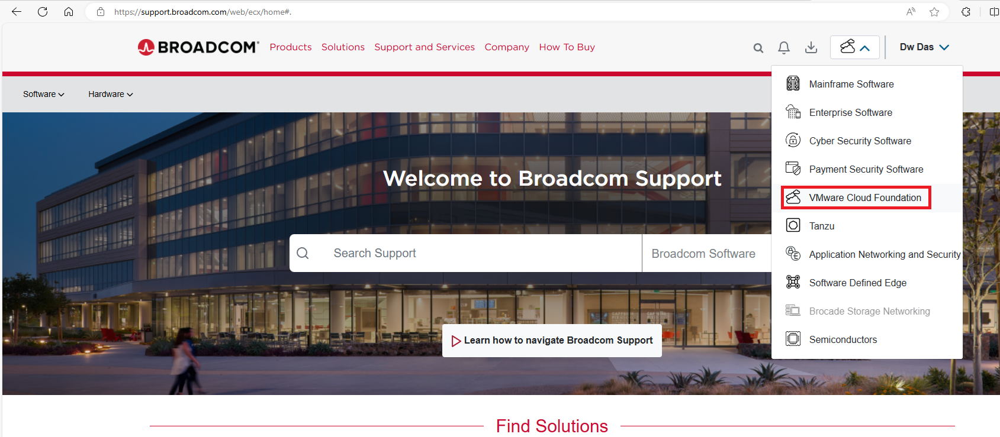
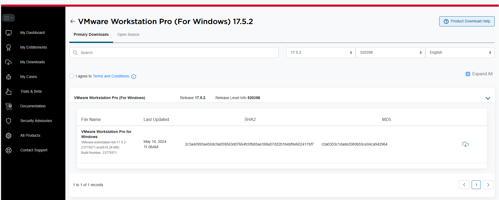
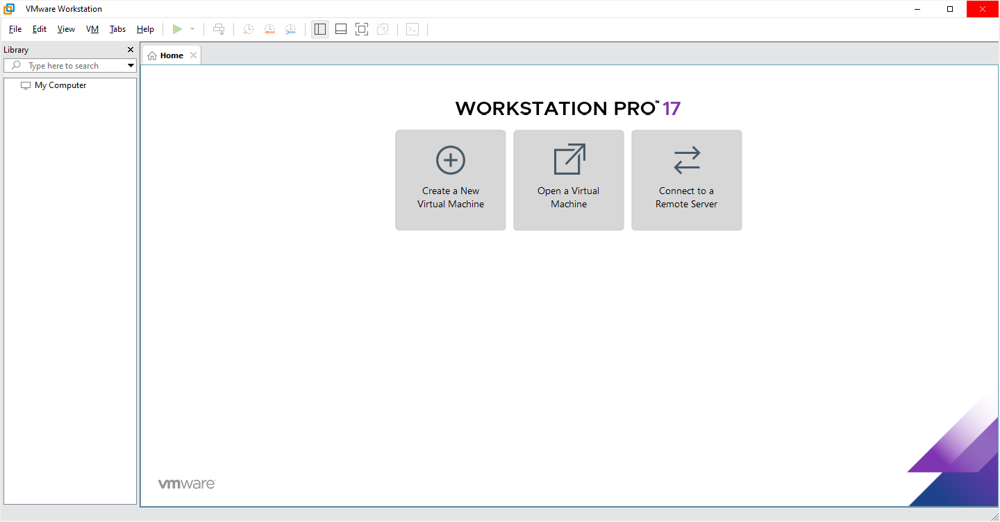
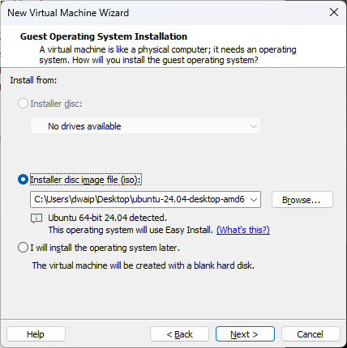
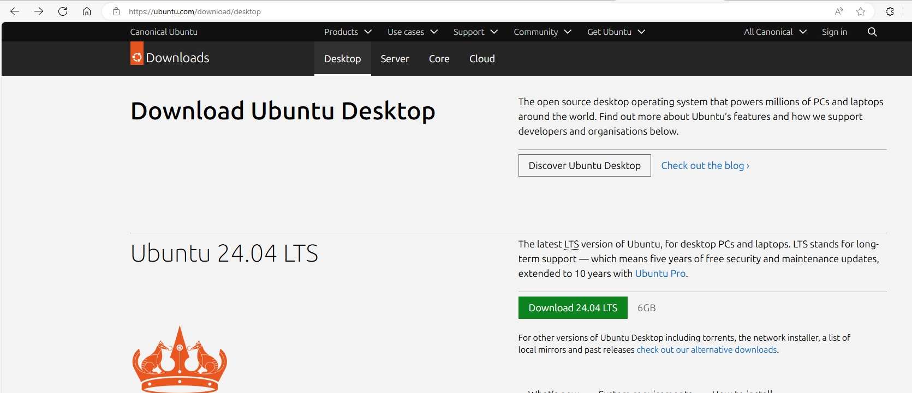
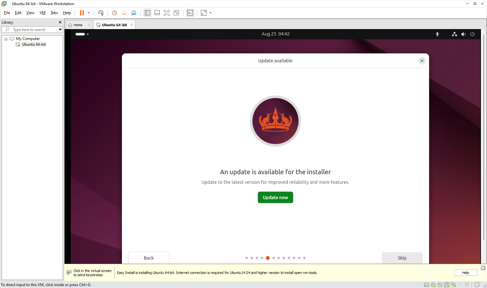

# How to Download and Install VMware Workstation Pro from Broadcom And Use for Free!

1. **Visit Broadcom's Website**:  
   Go to [broadcom.com](https://www.broadcom.com).

   

2. **Access the Support Portal**:  
   In the top right corner, click on 'Support Portal'.  
   - If you have an account, click 'Go To Portal' to log in.
   - If not, click 'Register' to create a basic Broadcom account.

3. **Go to VMware Cloud Foundation**:  
   After logging in, if you're not automatically redirected, visit [support.broadcom.com](https://support.broadcom.com).  
   From the dropdown, select the 'VMware Cloud Foundation' division.

   

4. **Find Your Downloads**:  
   On the left side, click on 'My Downloads'.  
   Search for 'Fusion' or `Workstation`.

5. **Download VMware Workstation Pro**:  
   Click on 'VMware Workstation Pro for Windows'.  
   - You’ll see a dropdown for the Personal Use edition (same as the Commercial version).
   - Select the version you want (17.5.2 or 13.5.2).

   

6. **Install and Set Up**:  
   - Download and install the software.  
   - When asked for a key, just skip it.  
   - After installation, open the software, select 'personal use', and you're all set to create VM images!

   

# Install and use Linux OS

Download Ubuntu Linux. Its free on their website. It will be dowloaded as `ubuntu-24.04-desktop-amd64.iso` or some other version.

Then Use the VMWare workstation to create the image

