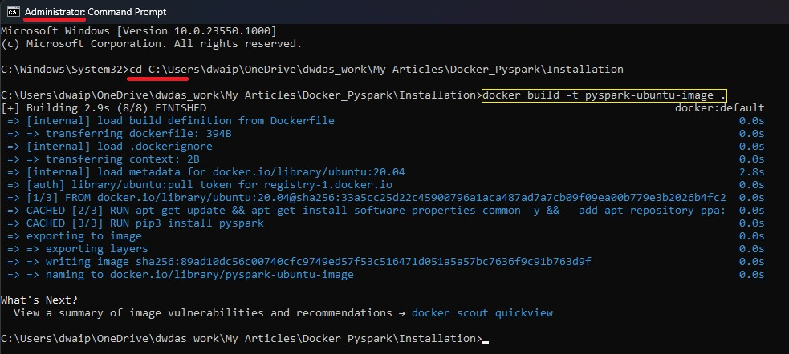
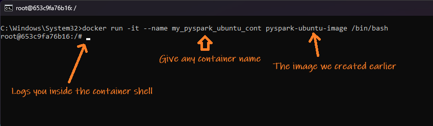
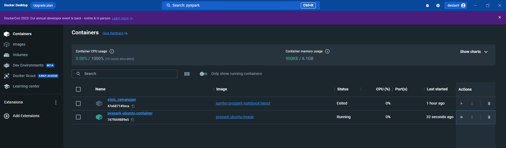
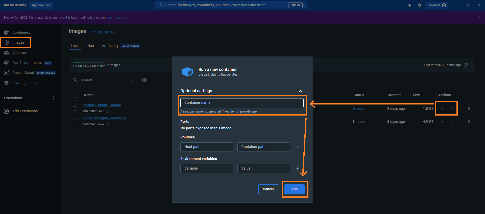
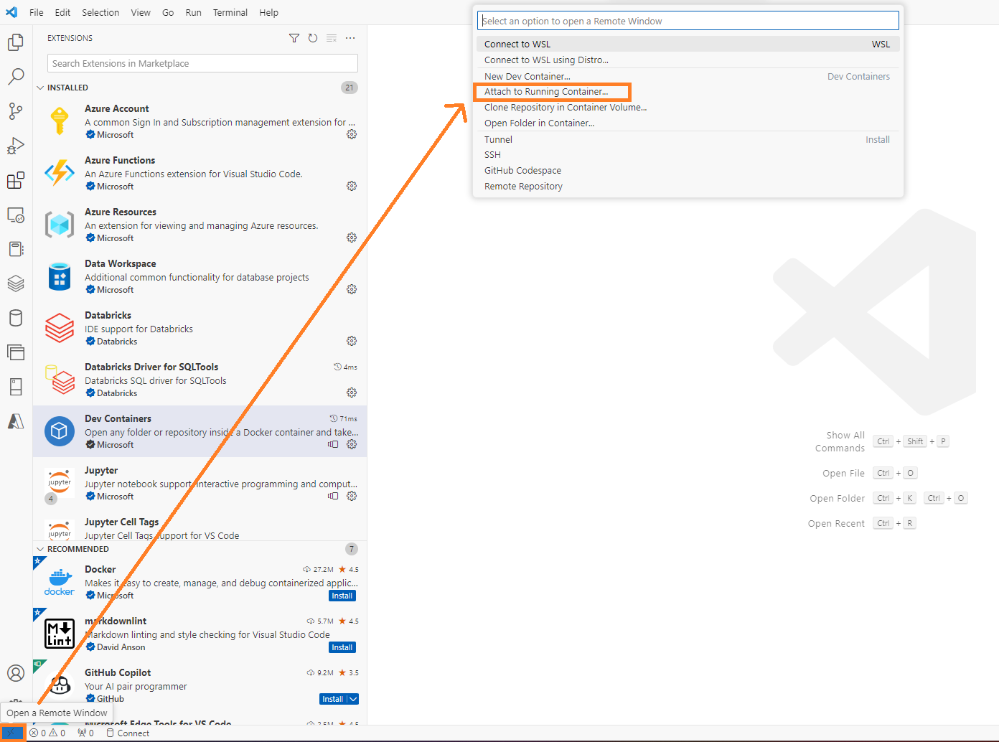
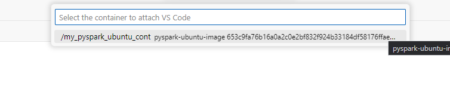

## Table of contents

- [Setting Up a Dockerized Spark Environment on Ubuntu for Windows](#setting-up-a-dockerized-spark-environment-on-ubuntu-for-windows)
  - 
  - [Background](#background)
  - [Steps](#steps)

# Setting Up a Dockerized Spark Environment on Ubuntu for Windows

## 

## Background

In this guide, I'll demonstrate how to create an Ubuntu Docker image fine-tuned for Python and Spark. We'll see how to connect the environment to Visual Studio Code using the Dev Containers extension. This VS extension allows you to work within a containerized environment seamlessly, offering the impression that all processes are running natively on your local machine. Ubuntu was selected as the base image due to its renowned stability, comprehensive apt-get system for handling packages, and flexibility in managing system-level packages or mimicking production setups. We considered other options like Python-focused images (e.g.,  python:3.9-slim,), Alpine Linux for its minimalism and security, and Debian which parallels Ubuntu's benefits but lacks some commercial features.

## Steps

1.  Create the Dockerfile

1.  Create a new file in your project directory called Dockerfile. Ensure it has no extension.
2.  Navigate to your desired location on Windows.
3.  Right-click, select New, and then choose Folder.
4.  Inside this new folder, right-click and choose New followed by Text Document.
5.  Rename the new document to Dockerfile. Ensure you remove the .txt ending. (Note: The file should have no extension.)
6.  Open the file using Notepad, insert the provided code, then save and close.

* * *

<table class="c31">

<tbody>

<tr class="c19">

<td class="c27" colspan="1" rowspan="1">

# Base the image on Ubuntu 20.04  
FROM ubuntu:20.04  

# Set non-interactive mode to prevent prompts during build  
ENV DEBIAN_FRONTEND=noninteractive  

# Update the package list  
RUN apt-get update  

# Install software-properties-common for repo management  
RUN apt-get install software-properties-common -y  

# Add the 'deadsnakes' PPA for newer Python versions  
RUN add-apt-repository ppa:deadsnakes/ppa  

# Update package list post-PPA addition  
RUN apt-get update  

# Install Python 3.9 and pip3  
RUN apt-get install -y python3.9 python3-pip  

# Install headless OpenJDK 11  
# Choosing headless JDK for a smaller footprint without GUI libs  
# Using OpenJDK for its open-source, transparent, and community-driven nature  
RUN apt-get install -y openjdk-11-jdk-headless  

# Install the PySpark library  
RUN pip3 install pyspark

</td>

</tr>

</tbody>

</table>

1.  Build the docker Image

1.  In your terminal, go to the project directory with the Dockerfile and run the following command:

<table class="c23">

<tbody>

<tr class="c19">

<td class="c26" colspan="1" rowspan="1">

docker build -t pyspark-ubuntu-image .

</td>

</tr>

</tbody>

</table>

The name pyspark-ubuntu-imageis your chosen Docker image name, and . means the Dockerfile is in the current folder

1.  Run the docker container

Once the image is successfully built, you can run a container from it, using:

1.  Command prompt:

1.  Open command prompt as an administrator
2.  Run the following command

<table class="c3">

<tbody>

<tr class="c19">

<td class="c24" colspan="1" rowspan="1">

docker run -it --name my_pyspark_ubuntu_cont pyspark-ubuntu-image /bin/bash

</td>

</tr>

</tbody>

</table>

1.  If successful, you'll enter the container's shell

1.  In Docker Desktop's container window, you'll see my_pyspark_ubuntu_cont listed as running.

1.  Using Docker Desktop

1.  Launch Docker Desktop from the system tray.
2.  In theImages tab, locate and hit Run for `pyspark-ubuntu-image`.
3.  Name your container and keep other settings default.
4.  In the Containers tab, find the container using the name you provided.

1.  Configure VS Code and connect with the remote container

1.  Install Visual Studio Code Dev Containers Extension

1.  Open Visual Studio Code.
2.  Go to Extensions (or press Ctrl+Shift+X).
3.  Search for Dev Containers.
4.  Click Install on the relevant result.

1.  Connect to the remote container

1.  In the bottom-left of VS Code, click the "Open Remote Window" icon.
2.  At the top search window, a menu will appear.
3.  Choose Attach to Running Container.

1.  Locate and click on your active container in the list.

1.  VS Code will launch a new window connected to that container.

1.  Enable Jupyter notebook support extension

1.  While VS code is connect with the container enable/install Jupyter notebook support extension

1.  Running jupyter notebooks

The environment is ready to handle Python scripts, Jupyter notebooks (.ipynb files), and execute big data operations, analytics, and machine learning processes using Spark in Python.

1.  For python files

Simply open any `.py` file and run it directly within VS Code.

1.  For Jupyter Notebooks:

Note:

1.  When executing a notebook, you'll need to select the appropriate kernel.
2.  You might be prompted to install the `ipykernel` package, especially when you try to run a Python cell for the first time.

1.  To preemptively install `ipykernel`, open a terminal in VS Code and enter

<table class="c23">

<tbody>

<tr class="c19">

<td class="c26" colspan="1" rowspan="1">

pip install ipykernel

</td>

</tr>

</tbody>

</table>

D Das(das.d@hotmail.com)

