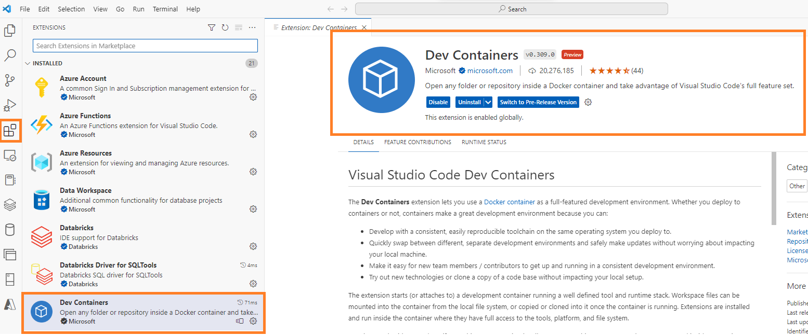
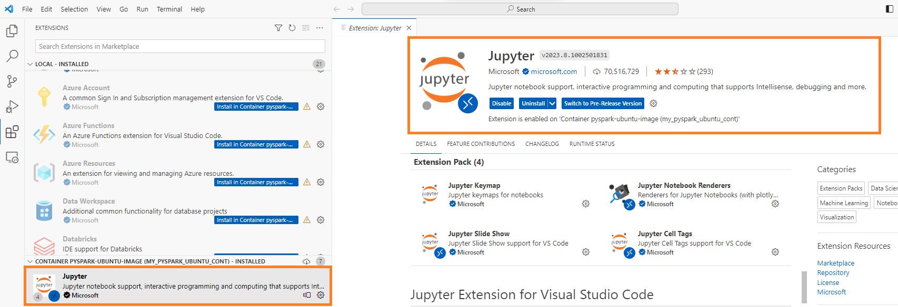

## Table of contents

- [Setting Up a Dockerized Spark Environment on Ubuntu for Windows](#setting-up-a-dockerized-spark-environment-on-ubuntu-for-windows)
  - [Background](#background)
  - [Steps](#steps)
    - [Create the Dockerfile](#create-the-dockerfile)
    - [Dockerfile Contents](#dockerfile-contents)
  - [Connect to the remote container](#connect-to-the-remote-container)
  - [Enable Jupyter notebook support extension](#enable-jupyter-notebook-support-extension)
  - [Running Jupyter notebooks](#running-jupyter-notebooks)
  - [For Python files](#for-python-files)
  - [For Jupyter Notebooks:](#for-jupyter-notebooks)


# Setting Up a Dockerized Spark Environment on Ubuntu for Windows


## Background

In this guide, we'll create an Ubuntu Docker image optimized for Python and Spark. We'll integrate the environment with Visual Studio Code using the Dev Containers extension. This extension allows for seamless work within a containerized environment, making it appear as if all processes run natively on your local machine. Ubuntu is chosen for its stability, extensive package management system with `apt-get`, and flexibility in system-level package management or production setup simulation. Alternatives like Python-focused images (`python:3.9-slim`), Alpine Linux for its minimalism, and Debian for similar benefits to Ubuntu but without some commercial features were also considered.

## Steps

### Create the Dockerfile

1. Create a new file called Dockerfile in your project directory with no file extension.
2. Navigate to your desired location in Windows.
3. Right-click, select 'New', then 'Folder'.
4. Inside the new folder, right-click and select 'New' then 'Text Document'.
5. Rename the document to Dockerfile, ensuring to remove the '.txt' extension.
6. Open the file in Notepad, paste the provided code, save and close.


### Dockerfile Contents

```Dockerfile
# Base the image on Ubuntu 20.04
FROM ubuntu:20.04  

# Set non-interactive mode to prevent prompts during build
ENV DEBIAN_FRONTEND=noninteractive  

# Update the package list
RUN apt-get update  

# Install software-properties-common for repo management
RUN apt-get install software-properties-common -y  

# Add the 'deadsnakes' PPA for newer Python versions
RUN add-apt-repository ppa:deadsnakes/ppa  

# Update package list post-PPA addition
RUN apt-get update  

# Install Python 3.9 and pip3
RUN apt-get install -y python3.9 python3-pip  

# Install headless OpenJDK 11
# Choosing headless JDK for a smaller footprint without GUI libs
# Using OpenJDK for its open-source, transparent, and community-driven nature
RUN apt-get install -y openjdk-11-jdk-headless  

# Install the PySpark library
RUN pip3 install pyspark
```

1. **Build the Docker Image**
   - Go to the project directory with the Dockerfile in your terminal.
   - Execute the command: `docker build -t pyspark-ubuntu-image .`
     - `pyspark-ubuntu-image` is the name you choose for your Docker image.
     - The period `.` signifies that the Dockerfile is located in the current directory.


2. **Run the Docker Container**
   - After building the image, you can start a container with it.
   - Using Command Prompt:
     - Open the Command Prompt as an administrator.
     - Enter the command: `docker run -it --name my_pyspark_ubuntu_cont pyspark-ubuntu-image /bin/bash`

1. If successful, you'll enter the container's shell.
   

2. In Docker Desktop's container window, you'll see `my_pyspark_ubuntu_cont` listed as running.
   

Using Docker Desktop:

3. Launch Docker Desktop from the system tray.

4. In the Images tab, locate and hit Run for `pyspark-ubuntu-image`.

5. Name your container and keep other settings default.

6. In the Containers tab, find the container using the name you provided.
   

Configure VS Code and connect with the remote container:

7. Install Visual Studio Code Dev Containers Extension.

8. Open Visual Studio Code.

9. Go to Extensions (or press Ctrl+Shift+X).

10. Search for Dev Containers.

11. Click Install on the relevant result.
    

Certainly! Here's a cleaned-up version of the markdown you provided:

## Connect to the remote container

1. In the bottom-left of VS Code, click the "Open Remote Window" icon.
2. At the top search window, a menu will appear.
3. Choose "Attach to Running Container".


4. Locate and click on your active container in the list.


5. VS Code will launch a new window connected to that container.

## Enable Jupyter notebook support extension

While VS code is connected with the container, enable/install Jupyter notebook support extension.



## Running Jupyter notebooks

The environment is ready to handle Python scripts, Jupyter notebooks (.ipynb files), and execute big data operations, analytics, and machine learning processes using Spark in Python.

## For Python files

Simply open any `.py` file and run it directly within VS Code.

## For Jupyter Notebooks:

**Note:**

- When executing a notebook, you'll need to select the appropriate kernel.
- You might be prompted to install the `ipykernel` package, especially when you try to run a Python cell for the first time.


To preemptively install `ipykernel`, open a terminal in VS Code and enter:

```
pip install ipykernel
```

---

*For any questions or further assistance, please contact D Das at das.d@hotmail.com.*