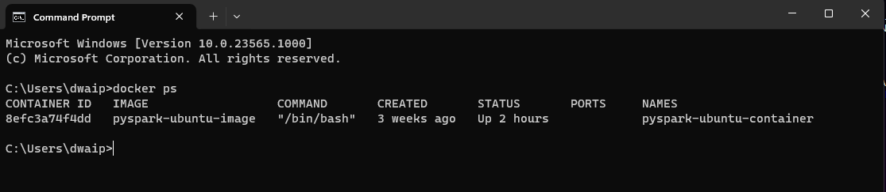

---
### **Troubleshooting `docker ps` on Your Machine: A Simple Guide**

Hey team, Docker is a fantastic tool, but like all tools, sometimes it needs a bit of tweaking to get things right. If you've found that you can't execute `docker ps` despite having Docker installed, this guide is for you. Let's get you sorted!

---

### For Our Windows Users:

1. **Verify Docker's Installation Path:** 
   - Navigate to `C:\Program Files\Docker\Docker\resources\bin` via your command prompt or PowerShell. 
   - While you're there, try running `docker ps`. If it responds, you're in luck! If not, let's move to the next step.

2. **Update the System PATH:** 
   - Sometimes, Windows isn't aware of where Docker is. We'll need to tell it.
   - Open 'System Properties' by right-clicking on the Windows start button and selecting 'System'.
   - Click on 'Advanced system settings', then choose 'Environment Variables'.
   - Locate the PATH variable under 'System Variables'. Click on it and then select 'Edit'.
   - Add a new entry with the path: `C:\Program Files\Docker\Docker\resources\bin`.
   - Confirm with 'OK'.

3. **Using PowerShell to Update the PATH:** 
   - If you're a fan of PowerShell, you can also add the path using the following command:
     ```powershell
     [Environment]::SetEnvironmentVariable("PATH", $env:PATH + ";C:\Program Files\Docker\Docker\resources\bin", "Machine")
     ```
4. **Check** if its running now. Just open command prompt and run `docker ps`. You should get some output. For example:


---

### For Our Mac Users:

1. **Verify Docker's Installation:** 
   - Open your terminal and type in `docker --version`. This ensures that Docker is installed.
   
2. **Is Docker Running?** 
   - Check if the Docker Desktop application is running. If it's not, fire it up!

3. **Update the Shell's PATH:** 
   - Sometimes, the shell doesn’t know where Docker is located. To fix this:
     ```bash
     echo "export PATH=/usr/local/bin:$PATH" >> ~/.bash_profile
     source ~/.bash_profile
     ```

4. **Final Check:** 
   - Close and reopen your terminal, then try `docker ps`. If all's well, it should work!

There you have it. With a few tweaks, you should be back in the Docker game! If you're still facing issues, don't hesitate to reach out to me at das.d@hotmail.com