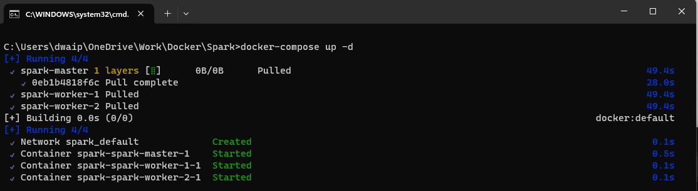
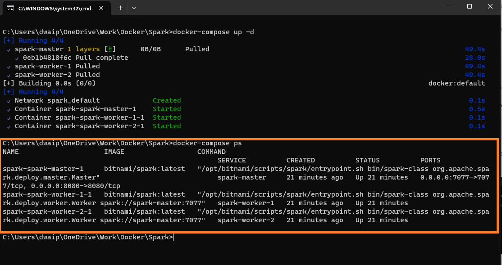
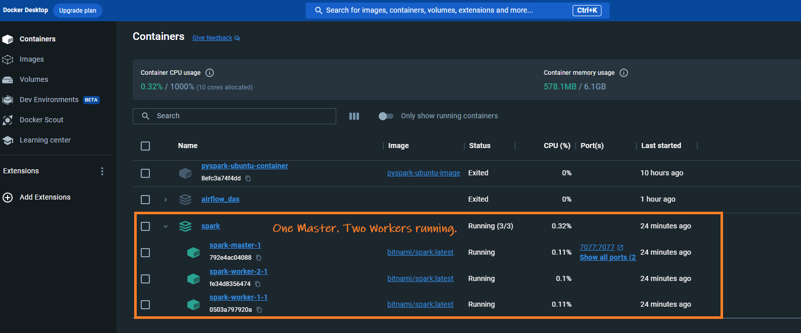

## Table of contents
- [End-to-End Tutorial: Setting Up a Spark Cluster with Docker](#end-to-end-tutorial-setting-up-a-spark-cluster-with-docker)
  - [Prerequisites](#prerequisites)
  - [Step 1: Setting Up Docker Compose File](#step-1-setting-up-docker-compose-file)
    - [Create a `docker-compose.yaml` file:](#create-a-docker-composeyaml-file)
  - [Step 2: Starting the Cluster](#step-2-starting-the-cluster)
    - [1. Open command prompt](#1-open-command-prompt)
    - [2. Run the following command](#2-run-the-following-command)
    - [3. Verify the containers are running](#3-verify-the-containers-are-running)
  - [Step 3: Accessing Spark Master UI](#step-3-accessing-spark-master-ui)
  - [Step 4: Running a Spark Job](#step-4-running-a-spark-job)
    - [1. Access the Spark Master container](#1-access-the-spark-master-container)
    - [2. Run your Spark job](#2-run-your-spark-job)
  - [Step 5: Shutting Down the Cluster](#step-5-shutting-down-the-cluster)
  - [Steps to add an extra node](#steps-to-add-an-extra-node)
    - [Steps to Add an Extra Spark Worker Node](#steps-to-add-an-extra-spark-worker-node)
      - [1. Open your docker-compose.yaml file.](#1-open-your-docker-composeyaml-file)
      - [2. Duplicate the configuration of an existing Spark worker.](#2-duplicate-the-configuration-of-an-existing-spark-worker)
      - [3. Save the docker-compose.yaml file.](#3-save-the-docker-composeyaml-file)
      - [4. Run Docker Compose.](#4-run-docker-compose)
    - [Notes:](#notes)
  - [Why This Setup?](#why-this-setup)
  - [Conclusion](#conclusion)

# End-to-End Tutorial: Setting Up a Spark Cluster with Docker

<p style="color: #006600; font-family: 'Trebuchet MS', Helvetica, sans-serif; background-color: #e6ffe6; padding: 15px; border-left: 5px solid #00cc66;">
In this tutorial I'll guide you through setting up an Apache Spark cluster using Docker, with one master and two worker nodes in windows environment. We will use docker-compose.yaml to achieve this task.
</p>

## <span style="color: #7e0041;">Prerequisites</span>

- **Docker**: Make sure Docker is installed and running on your machine. [You can Download Docker from here](https://www.docker.com/products/docker-desktop).

## <span style="color: #3333cc;">Step 1: Setting Up Docker Compose File</span>

<p style="color: #804000; font-family: 'Courier New', Courier, monospace; background-color: #fff5e6; padding: 15px; border-left: 5px solid #b35900;">
The most important file here is docker-compose.yaml. Which is used to set up multi-container docker applications. In our case it will be 1 Master container and 2 worker containers.
</p>

### <span style="color: #9e0059;">Create a `docker-compose.yaml` file</span>:

- Create new folder named, say, "spark." Within this folder, create a text file and copy and paste the content provided below into it. Remember, the name you choose for this folder ("spark") will also be used as the name for the container group, which you'll see in Docker Desktop.

```yaml
version: '3.9'

services:
spark-master:
    image: bitnami/spark:latest
    command: bin/spark-class org.apache.spark.deploy.master.Master
    ports:
    - "8080:8080"
    - "7077:7077"
    environment:
    SPARK_WORKER_MEMORY: 2g

spark-worker-1:
    image: bitnami/spark:latest
    command: bin/spark-class org.apache.spark.deploy.worker.Worker spark://spark-master:7077
    depends_on:
    - spark-master
    environment:
    SPARK_MODE: worker
    SPARK_WORKER_CORES: 2
    SPARK_WORKER_MEMORY: 2g
    SPARK_MASTER_URL: spark://spark-master:7077

spark-worker-2:
    image: bitnami/spark:latest
    command: bin/spark-class org.apache.spark.deploy.worker.Worker spark://spark-master:7077
    depends_on:
    - spark-master
    environment:
    SPARK_MODE: worker
    SPARK_WORKER_CORES: 2
    SPARK_WORKER_MEMORY: 2g
    SPARK_MASTER_URL: spark://spark-master:7077
```

- Rename the file as `docker-compose.yaml`

**Explanation of key items in the file**

| Feature               | Details |
|-----------------------|---------|
| **Version**           | Specifies the Docker Compose file format version. |
| **Services**          | Defines three services (one master and two workers). |
| **Image**             | We use `bitnami/spark:latest`, which is a pre-built, well-maintained Spark Docker image.  |
| **Ports**             | Exposes the Spark master UI (`8080`) and communication port (`7077`). |
| **Environment Variables** | Configures Spark properties like worker memory and cores. |


## <span style="color: #3333cc;">Step 2: Starting the Cluster</span>

### <span style="color: #9e0059;">1. Open command prompt</span>
**Open command prompt** and cd to the folder containing the `docker-compose.yaml`.

### <span style="color: #9e0059;">2. Run the following command</span>
- **Run the following command** to start your Spark cluster:

    ```bash
    docker-compose up -d
    ```

    <p style="color: #003366; font-family: Arial, sans-serif; background-color: #cce6ff; padding: 15px; border-left: 5px solid #333399;">
    The `-d` flag runs the containers in the background.
    </p>
    
    

### <span style="color: #9e0059;">3. Verify the containers are running</span>
- Enter the following command in the same prompt

    ```bash
    docker-compose ps
    ```

    
- Also go to the docker window and you should see the containers running

    

## <span style="color: #3333cc;">Step 3: Accessing Spark Master UI</span>

Once your cluster is running, access the Spark Master UI through your web browser at `http://localhost:8080`. Here, you can view details about your cluster, including active workers and running applications.

## <span style="color: #3333cc;">Step 4: Running a Spark Job</span>

### <span style="color: #9e0059;">1. Access the Spark Master container</span>

Run the following command:

    ```bash
    docker exec -it <spark-master-container-id> /bin/bash
    ```

### <span style="color: #9e0059;">2. Run your Spark job</span>

**Run your Spark job** from within the master container, or use `spark-submit` to deploy your application.

## <span style="color: #3333cc;">Step 5: Shutting Down the Cluster</span>

Tp shut down the container, run the following command:

    ```bash
    docker-compose down
    ```

## <span style="color: #3333cc;">Steps to add an extra node</span>

<p style="color: #006600; font-family: 'Trebuchet MS', Helvetica, sans-serif; background-color: #e6ffe6; padding: 15px; border-left: 5px solid #00cc66;">
Adding an extra Spark worker node to your existing Docker Compose setup is simple. You just need to duplicate the configuration of an existing worker node in your <code>docker-compose.yaml</code> file, making sure to change any necessary details (like the service name) to avoid conflicts. Here's how you can do it:
</p>

### <span style="color: #7e0041;">Steps to Add an Extra Spark Worker Node</span>

#### <span style="color: #000000;">1. Open your <code>docker-compose.yaml</code> file</span>.

#### <span style="color: #000000;">2. Duplicate the configuration of an existing Spark worker</span>.
- For instance, if you have a `spark-worker-1`, you can create a `spark-worker-3` by copying the `spark-worker-1` service and changing the name. Here's an example:

    ```yaml
    version: '3.7'

    services:
      spark-master:
        image: bitnami/spark:latest
        ports:
          - "7077:7077"
          - "9090:8080"

      spark-worker-1:
        image: bitnami/spark:latest
        environment:
          - SPARK_MASTER_URL=spark://spark-master:7077
          - SPARK_WORKER_MEMORY=2g
          - SPARK_WORKER_CORES=1

      spark-worker-2:
        image: bitnami/spark:latest
        environment:
          - SPARK_MASTER_URL=spark://spark-master:7077
          - SPARK_WORKER_MEMORY=2g
          - SPARK_WORKER_CORES=1

      spark-worker-3:  # New worker node
        image: bitnami/spark:latest
        environment:
          - SPARK_MASTER_URL=spark://spark-master:7077
          - SPARK_WORKER_MEMORY=2g
          - SPARK_WORKER_CORES=1
    ```

#### <span style="color: #000000;">3. Save the <code>docker-compose.yaml</code> file</span>.

#### <span style="color: #000000;">4. Run Docker Compose</span>.

   ```bash
   docker-compose up -d
   ```

### <span style="color: #b35900;">Notes:</span>

- **Service Names**: Each service in the Docker Compose file must have a unique name. In the example above, `spark-worker-3` was added.
- **Resource Allocation**: Adjust the `SPARK_WORKER_MEMORY` and `SPARK_WORKER_CORES` values according to the available resources and your requirements.
- **Scaling Workers**: For scaling the number of identical workers, the `docker-compose up --scale` command can be used. However, for Spark workers, individual management is often preferable for resource or environment settings.
- **Network**: All services in a `docker-compose.yaml` file are usually part of the same network, enabling the new worker to communicate with the master automatically.

## <span style="color: #b35900;">Why This Setup?</span>

- **Ease of Use**: Docker simplifies the setup of a Spark cluster. You don't need to worry about manual installations and configurations on your local machine.
- **Consistency**: Docker ensures your Spark environment is consistent, making it easy to share and replicate among team members or deploy across different environments.
- **Scalability**: Easily scale your Spark workers up or down by adjusting the `docker-compose.yaml` file and using Docker Compose commands.

## <span style="color: #3333cc;">Conclusion</span>

<p style="color: #993333; font-family: Arial, sans-serif; background-color: #ffcccc; padding: 15px; border-left: 5px solid #cc0000;">
I prefer the Bitnami container for its maintenance and pre-set configurations including Java. However, Apache's official container is also a viable option, albeit requiring changes to the <code>docker-compose.yaml</code> file.
</p>

---
© D Das  
📧 [das.d@hotmail.com](mailto:das.d@hotmail.com) | [ddasdocs@gmail.com](mailto:ddasdocs@gmail.com)