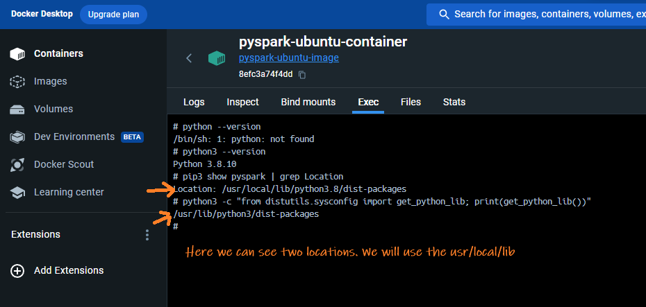
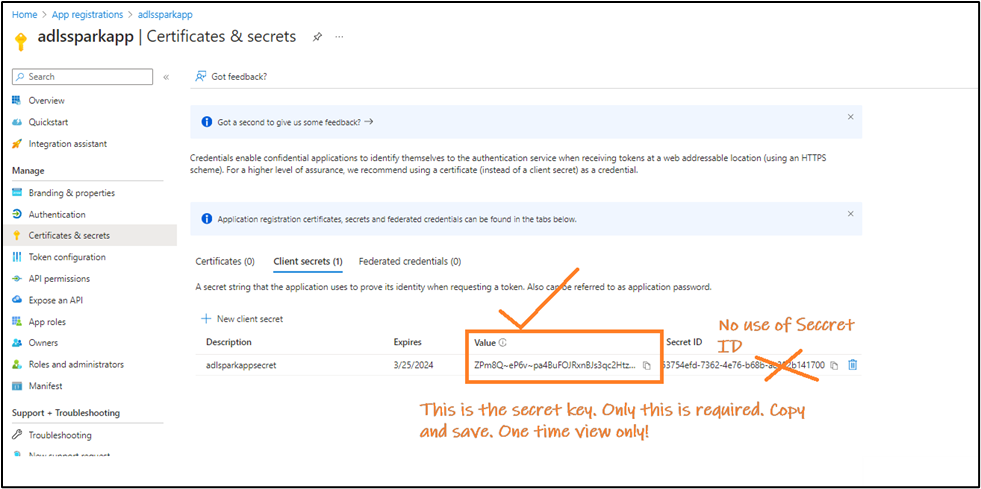
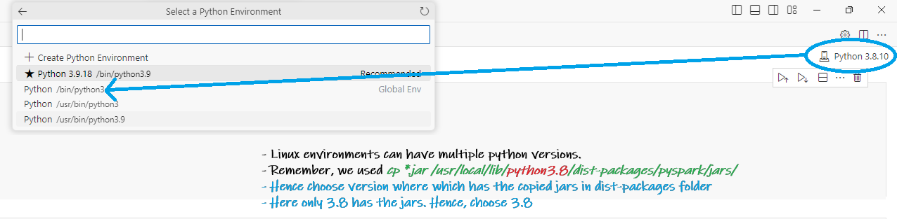

## Table of contents
- [Project Sparkzure Part1 - Connecting Local Spark to Azure Data Lake](#project-sparkzure-part1---connecting-local-spark-to-azure-data-lake)
  - [Overview](#overview)
  - [Kickstart: Integrating Spark with Azure Data Lake](#kickstart-integrating-spark-with-azure-data-lake)
    - [Create the containerized setup](#create-the-containerized-setup)
    - [Register an App for OAuth Authentication](#register-an-app-for-oauth-authentication)
      - [Register a new App using App Registration](#register-a-new-app-using-app-registration)
      - [Copy Ids and secret From The App](#copy-ids-and-secret-from-the-app)
      - [Give the App Permission to the Container](#give-the-app-permission-to-the-container)
    - [Access ADLS Data From Spark Using OAuth Authentication and Service Principal](#access-adls-data-from-spark-using-oauth-authentication-and-service-principal)
      - [Open VS Code and Connect To the Container](#open-vs-code-and-connect-to-the-container)
      - [Run the code](#run-the-code)
    - [Access data in ADLS container using Storage Account's Access Key Method](#access-data-in-adls-container-using-storage-accounts-access-key-method)
  - [Common Errors](#common-errors)
    - [AuthorizationPermissionMismatch During OAuth Authenticaiton](#authorizationpermissionmismatch-during-oauth-authenticaiton)
  - [Appendix](#appendix)
    - [Why Does Spark Rely on Hadoop Libraries to Access Azure Data Lake Storage (ADLS)?](#why-does-spark-rely-on-hadoop-libraries-to-access-azure-data-lake-storage-adls)
    - [Understanding Essential JARs for Azure Data Lake Operations with Spark](#understanding-essential-jars-for-azure-data-lake-operations-with-spark)

---
# Project Sparkzure Part1 - Connecting Local Spark to Azure Data Lake

## Overview

Azure Databricks to Azure Data Lake is easy and straightforward. All the requied jars pre-installed in Databricks. All you need to do is to create a session and connect. However, connecting a local Spark instance to Azure Data Lake can be complicated, especially when managing JAR dependencies. In this project, I will show you how to connect your local Spark application to ADLS and run a Spark query using Visual Studio Code. The local Spark application will be hosted in a container, but it can also be hosted locally locally ;-)

## Kickstart: Integrating Spark with Azure Data Lake

### Create the containerized setup

Our environment is set up inside a Docker container running Ubuntu on a Windows OS host. Within this container, Python 3 and Spark are installed. But the steps can be used in local environments as well.

- **Check the python version in the container and find out site-packages directory**
   - Often, systems have both Python 2.x and Python 3.x installed. Use the following commands to determine which versions are available:
     ```bash
     python --version
     python3 --version
     ```
    

  - Determine where PySpark is installed using `pip`. Your enviornment may have multiple python installation especially if its linux or in a docker. You need to find the right `site-packages` directory so that the packages are copied to right location. To find out run this command in docker terminal or normal command prompt: 
  
     ```bash
     pip3 show pyspark | grep Location
     ```
     Alternatively, you can get the location by running the command:
     ```bash
     python3 -c "from distutils.sysconfig import get_python_lib; print(get_python_lib())"
     ```
   
    

- **Install `wget`**
   - `wget` is a tool for downloading files from the internet. If you don’t have it in your environment you can get it using the given command:
     ```bash
     apt-get update && apt-get install -y wget
     ```

-  **Download Hadoop ADLS JARs**

    - I've downloaded and placed the jars [here](Hadoop_Azure_Jars.zip). Download and copy it to a desired location.
    - Alternatively, run the command below to download jars to your home directory
    
     ```bash
    cd ~
    wget https://repo1.maven.org/maven2/org/apache/hadoop/hadoop-azure/3.3.3/hadoop-azure-3.3.3.jar
    wget https://repo1.maven.org/maven2/org/apache/hadoop/hadoop-azure-datalake/3.3.3/hadoop-azure-datalake-3.3.3.jar
    wget https://repo1.maven.org/maven2/org/apache/hadoop/hadoop-common/3.3.3/hadoop-common-3.3.3.jar
    wget https://repo1.maven.org/maven2/com/microsoft/azure/azure-storage/8.6.6/azure-storage-8.6.6.jar
    wget https://repo1.maven.org/maven2/com/azure/azure-security-keyvault-secrets/4.3.0/azure-security-keyvault-secrets-4.3.0.jar
    wget https://repo1.maven.org/maven2/com/azure/azure-identity/1.3.0/azure-identity-1.3.0.jar
    ```
    - After downloading, place the jars in any desired folder. These jars will be referenced during spark session creation.
    - Alternatively you can use download the jars [on-the-fly](mavencoordinates.html) using maven coordinates using `.config('spark.jars.packages', '...')`
    
### Register an App for OAuth Authentication

If you want to access a file(say CSV) in **Azure** through **OAuth** authentication, you need to create an **App registration** and grant this app permission to the CSV. This registered App's identity is used by **Spark** to authenticate. The same principle applies in **Databricks**, where an app is already created, named **AzureDatabricks**. Follow the steps below to register the app and give it permission to the file.

#### Register a new App using App Registration
- In the Azure Portal to search for **App registrations**', select it, and opt for '+ New registration'. 
  
  
  
- Give a name, say **`adlssparkapp`**, choose 'Accounts in this organizational directory only', keep the Redirect URI empty, and click **Register**. 
  
  

#### Copy Ids and secret From The App

- After registration, jot down the **Application ID** and **Directory ID**. 
  
  

- Go to **Manage** > **Certificates & secrets**, select **+ New client secret**, label it **`SparkAppSecret`**, set an expiration, and click  'Add'. 
  
  

- Post-creation, make note of the **one-time** viewable secret value essential for the Spark-Azure handshake. 
  
  

#### Give the App Permission to the Container

- Open the container, navigate to **Access Control (IAM)** > **Role assignments**, click **Add** > **Add role assignment**, select **Storage Blob Contributor**, 
  

- Search for the app **`adlssparkapp`**, and click **OK**.

  


### Access ADLS Data From Spark Using OAuth Authentication and Service Principal

With the app now registered and the key, ID, and secret in hand, we can proceed to execute the main code. Follow the steps outlined below to continue:

#### Open VS Code and Connect To the Container

- **Open VS Code**: Launch Visual Studio Code and click the remote container icon at the bottom left.
   
   

- **Attach to Container**: From the top menu, choose "Attach to running container".
   
   

-  **Select Container**: Pick the displayed running container. 
   
   
   
   This action launches a new VS Code instance connected to that container.
   
   

-  **Create Notebook**: In this instance, create a .ipynb (Jupyter notebook) to execute the subsequent section's code.
   

- **Connect to the python version where we copied the hadoop jars**
   There could be multiple python versions in a linux enviornment. From VS Code choose the python version whcih has our jars

   

#### Run the code
    
    Run the code below in the jupyter notebok:

```python
from pyspark.sql import SparkSession
# Initialize a Spark session with necessary configurations for connecting to ADLS
#Offline version
spark = SparkSession.builder \
    .appName("ADLS Access") \
    .config("spark.jars", "/usr/local/lib/python3.8/dist-packages/pyspark/jars/hadoop-azure-3.3.3.jar,/usr/local/lib/python3.8/dist-packages/pyspark/jars/hadoop-azure-datalake-3.3.3.jar,/usr/local/lib/python3.8/dist-packages/pyspark/jars/hadoop-common-3.3.3.jar") \
    .getOrCreate()

# Or using maven coordinates
# Online version
spark = SparkSession.builder \
    .appName("ADLS Access") \
    .config("spark.jars.packages", 
            "org.apache.hadoop:hadoop-azure:3.3.3,"
            "org.apache.hadoop:hadoop-azure-datalake:3.3.3,"
            "org.apache.hadoop:hadoop-common:3.3.3") \
    .getOrCreate()


# Define credentials and storage account details for ADLS access
storage_account = "<The_Storage_Act_Name_Containing_Container>"
app_client_id = "<The_Client_ID_From_Registered_App>"
app_directory_tenant_id = "<The_Client_ID_From_Registered_App>"
app_client_secret = "<The_Secret_Value_From_Registered_App>"

# Configure Spark to use OAuth authentication for ADLS access
spark.conf.set(f"fs.azure.account.auth.type.{storage_account}.dfs.core.windows.net", "OAuth")
spark.conf.set(f"fs.azure.account.oauth.provider.type.{storage_account}.dfs.core.windows.net", "org.apache.hadoop.fs.azurebfs.oauth2.ClientCredsTokenProvider")
spark.conf.set(f"fs.azure.account.oauth2.client.id.{storage_account}.dfs.core.windows.net", app_client_id)
spark.conf.set(f"fs.azure.account.oauth2.client.secret.{storage_account}.dfs.core.windows.net", app_client_secret)
spark.conf.set(f"fs.azure.account.oauth2.client.endpoint.{storage_account}.dfs.core.windows.net", f"https://login.microsoftonline.com/{app_directory_tenant_id}/oauth2/token")

# Define the path to the dataset in ADLS and read the CSV file using Spark
path = "abfss://<containerName>@<storaegaccountname>.dfs.core.windows.net/<CSV_File_Name.csv>"
spark.read.format("csv").load(path).show()

```
### Access data in ADLS container using Storage Account's Access Key Method

Another methods to access ADLS is using the Access key method. Here we get the access key from the storage account then use it to access the files inside it. To use this method, follow these steps:

-  **Get the Access Keys from the Storage Account**
   - In your storage account, under the `Security + networking` section in the left sidebar, find and select `Access keys`.
   - You’ll be presented with two keys: `key1` and `key2`. Both keys can be used to authenticate, so choose one and copy it. This will be used in the subsequent steps.
  
    

-  **Execute the code**  
After getting the access key use this code. Replace your access key in the access key location:

```python
# Import the required module for creating a Spark session.
from pyspark.sql import SparkSession

# Initialize the Spark session. The builder pattern is utilized to configure the session.
# We set the application name to "ADLS Access" for identification in Spark UI.
# Necessary JAR files are specified for Spark to connect and interact with Azure Data Lake Storage (ADLS).
spark = SparkSession.builder \
    .appName("ADLS Access") \
    .config("spark.jars", "/usr/local/lib/python3.8/dist-packages/pyspark/jars/hadoop-azure-3.3.3.jar,/usr/local/lib/python3.8/dist-packages/pyspark/jars/hadoop-azure-datalake-3.3.3.jar,/usr/local/lib/python3.8/dist-packages/pyspark/jars/hadoop-common-3.3.3.jar") \
    .getOrCreate()

# Specify the Azure storage account name and the associated access key for authentication purposes.
storage_account_name = "<The_Storage_Account_Name>"
storage_account_key = "<key1_or_key2>"

# Configure Spark to utilize AzureBlobFileSystem. This is essential for Azure Blob storage connectivity.
spark.conf.set(f"fs.azure", "org.apache.hadoop.fs.azurebfs.AzureBlobFileSystem")

# Authenticate the Spark session by providing the access key for the specified Azure storage account.
spark.conf.set(f"fs.azure.account.key.{storage_account_name}.dfs.core.windows.net", storage_account_key)

# Read the desired CSV file located in ADLS into a DataFrame (df) using Spark.
df = spark.read.csv(f"abfss://<container_name>@{storage_account_name}.dfs.core.windows.net/<filename.csv>")
```

## Common Errors

### AuthorizationPermissionMismatch During OAuth Authenticaiton

While executing the code you may encounter errors like:

```
AuthorizationPermissionMismatch, "This request is not authorized to perform this operation using this permission."
```
or

```
java.nio.file.AccessDeniedException: Operation failed: "This request is not authorized to perform this operation using this permission.", 403, HEAD, https://strgacweatherapp.dfs.core.windows.net/weather-timer/2023-10-19-09.json?upn=false&action=getStatus&timeout=90
	at org.apache.hadoop.fs.azurebfs.AzureBlobFileSystem.checkException(AzureBlobFileSystem.java:1384)
```


OAuth uses a registered apps identity to connect. This app should have permission to the folder where the file resides.


## Appendix

### Why Does Spark Rely on Hadoop Libraries to Access Azure Data Lake Storage (ADLS)?

**Long story short**: In a standalone Spark setup, we use specific Hadoop JARs solely for connecting to ADLS. It's important to note that these are just JARs and don't represent the full Hadoop ecosystem. 

Apache Spark is used for distributed data processing. But for data storage it relies on other systems like ADLS, S3 etc. But why, when connecting Spark to ADLS, do we bring Hadoop into the picture? Let’s find out.

**Spark's Core Functionality:**
Spark is designed to process data, not to understand the intricacies of every storage system. It can pull data from various sources, but it doesn't always have native integrations for each one.

**Hadoop's Role:**
Hadoop, primarily known for its distributed file system (HDFS), also **offers connectors to diverse storage systems**. Over time, it has become the standard bridge between storage solutions and big data tools.

**ADLS and Hadoop Integration:**
When Microsoft developed ADLS, they provided a connector to the Hadoop FileSystem API. This approach made sense. Why reinvent the wheel when big data tools already communicate efficiently with HDFS via Hadoop's API?

**Conclusion**

HSpark uses Hadoop libraries to access ADLS due to the standardized and robust nature of the Hadoop FileSystem API. Microsoft integrated ADLS with this Hadoop API to ensure that ADLS would be compatible with a broad range of big data tools, such as Spark and Hive. This decision was to use the extensive community support of the Hadoop ecosystem and also allowed Microsoft to reuse what was already working In essence, the Hadoop API serves as a bridge between Spark and ADLS.


### Understanding Essential JARs for Azure Data Lake Operations with Spark

1. **hadoop-azure-3.3.3.jar**:
   - **Description**: This library provides support for Azure Blob Storage integration with Hadoop. It contains the `WASB` (Windows Azure Storage Blob) file system connector.
   - **Use-Cases**: Reading/writing data from/to Azure Blob Storage (often ADLS Gen1) using Hadoop's FileSystem API.

2. **hadoop-azure-datalake-3.3.3.jar**:
   - **Description**: This is the Data Lake connector for Hadoop, providing support for ADLS Gen1.
   - **Use-Cases**: If you're working with ADLS Gen1, this JAR lets Spark access the data lake using the Hadoop FileSystem API.

3. **hadoop-common-3.3.3.jar**:
   - **Description**: The core library for Hadoop, it contains common utilities and the Hadoop FileSystem API.
   - **Use-Cases**: Fundamental for almost all Hadoop-related operations. It's the foundational library upon which other Hadoop components rely.

4. **azure-storage-8.6.6.jar**:
   - **Description**: Azure's storage SDK, facilitating interaction with Azure Storage services like Blob, Queue, and Table.
   - **Use-Cases**: Interacting with Azure Blob Storage (and by extension, ADLS Gen2 which is built on Blob). It's essential for Spark to communicate and access Azure storage services.

5. **azure-security-keyvault-secrets-4.3.0.jar**:
   - **Description**: Provides capabilities to interact with Azure Key Vault's secrets. It facilitates fetching, setting, or managing secrets.
   - **Use-Cases**: Whenever you need to securely access or manage secrets (like storage account keys or database connection strings) stored in Azure Key Vault from your Spark application.

6. **azure-identity-1.3.0.jar**:
   - **Description**: Azure SDK's identity library, providing various credentials classes for Azure Active Directory (AAD) token authentication.
   - **Use-Cases**: Authenticating against Azure services using AAD-based credentials, especially when trying to securely access resources like Key Vault or ADLS Gen2.


---

© D Das  
📧 [das.d@hotmail.com](mailto:das.d@hotmail.com) | [ddasdocs@gmail.com](mailto:ddasdocs@gmail.com)