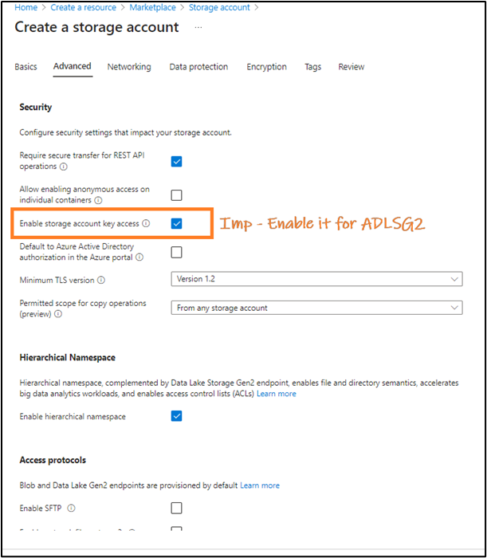
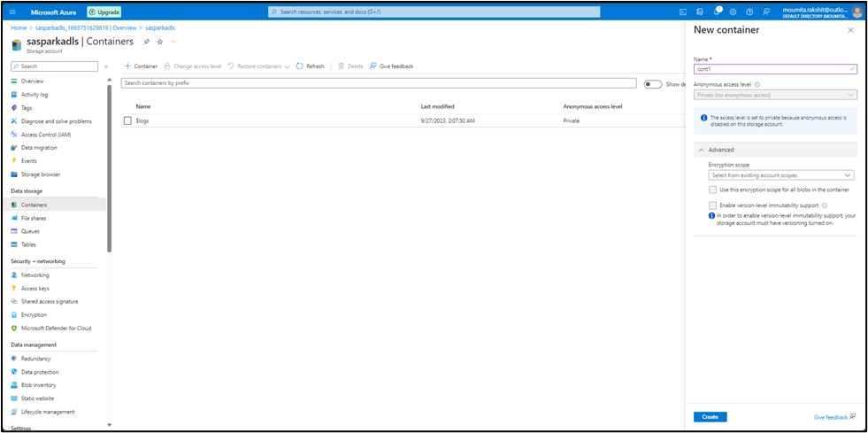

- [Spark Integration with ADLS: A Technical Overview](#spark-integration-with-adls-a-technical-overview)
  - [Create a storage account on Azure](#create-a-storage-account-on-azure)
    - [Procedure](#procedure)
  - [Create a container and upload a sample csv file inside it](#create-a-container-and-upload-a-sample-csv-file-inside-it)
  - [Create a new App Registration](#create-a-new-app-registration)
    - [Why App Registration?](#why-app-registration)
    - [Steps to Register the App](#steps-to-register-the-app)
    - [Provide necessary role to the app to the container](#provide-necessary-role-to-the-app-to-the-container)
  - [Generating a Client Secret For our App Registration](#generating-a-client-secret-for-our-app-registration)
    - [Why Secrets in App Registration?](#why-secrets-in-app-registration)
    - [Steps to Create a Secret for `adlssparkapp`](#steps-to-create-a-secret-for-adlssparkapp)
  - [Configuring PySpark for Connection to Azure Data Lake](#configuring-pyspark-for-connection-to-azure-data-lake)
    - [Environment Context](#environment-context)
    - [Procedure](#procedure-1)
  - [Accessing the CSV file](#accessing-the-csv-file)
    - [Setting up ADLS Configuration in Spark](#setting-up-adls-configuration-in-spark)
  - [Resolve Permission Errors](#resolve-permission-errors)
    - [Background](#background)
    - [Concepts](#concepts)
    - [Resolution Approach 1](#resolution-approach-1)
    - [Resolution Approach 2](#resolution-approach-2)
  - [Accessing ADLS Using Access Key](#accessing-adls-using-access-key)
    - [Background](#background-1)
    - [Steps](#steps)
    - [Security Note:](#security-note)
  - [Conclusion](#conclusion)

# Spark Integration with ADLS: A Technical Overview

Configuring ADLS for Azure Databricks is straightforward due to their shared Azure Directory (AD) infrastructure and Databricks’ built-in support for ADLS. For standalone Spark applications, however, integrating with ADLS requires careful management of JAR dependencies in the site-packages directory.

In this guide, we’ll cover:
1. Setting up an Azure storage account and container.
2. Populating the container with a sample CSV file.
3. Configuring PySpark for ADLS access.
4. Addressing potential permission issues with containers and files.
5. Demonstrating two connection methods: oAuth and access keys.

## Create a storage account on Azure

To begin, we'll set up an Azure storage account with Azure Data Lake Storage Gen2 (ADLS Gen2) enabled. ADLS Gen2 augments Azure Blob Storage with features like hierarchical namespaces and better analytics performance. Here's how to create this account and ensure it's accessible from all networks:

### Procedure

1. **Sign in to the Azure portal:** Go to [https://portal.azure.com/](https://portal.azure.com/) and sign in with your account.
2. **Navigate to Storage accounts:** In the left sidebar, select "Create a resource", then choose "Storage" and then "Storage account".
3. **Basics tab:**
   - **Subscription:** Choose your Azure subscription.
   - **Resource Group:** Either create a new resource group or select an existing one.
   - **Storage account name:** Give your storage account a unique name, e.g. `sasparkadls`. It should be between 3-24 characters and can contain numbers and lowercase letters only. 
   - **Location:** Choose the desired region for your storage account.
   - **Performance:** Choose 'Standard'.
   - **Redundancy:** Choose your desired replication option (e.g., LRS, GRS, etc.). For this POC I suggest we use LRS.
  
1. **Advanced tab:**
   - **Security + networking > Secure transfer required:** You can keep it enabled (recommended) to ensure secure data transfer.
   - **Data Lake Storage Gen2 > Hierarchical namespace:** Set it to "Enabled" to enable ADLS Gen2 features.
  
1. **Networking tab:** Here, you will define how the storage account can be accessed.
   - **Connectivity method:** Choose "Public endpoint (all networks)" to make it accessible from all networks. Note: This will expose your storage account to the internet, so ensure you have other security measures in place, such as setting up proper RBAC, using private links, or monitoring with Azure Security Center.
  
1. **Data protection tab (optional):** Configure additional data protection settings as required, like point-in-time restore, blob soft delete, etc.

1. **Review + create tab:** Review your settings and wait for Azure to validate. Once validated, click "Create" to establish your storage account. Check the Overview page to confirm it matches the expected layout.


## Create a container and upload a sample csv file inside it

1. **Access the `sasparkadls` Storage Account:**
   - In the search bar, type "Storage accounts" and select it.
   - Click on the storage account named `sasparkadls`.

2. **Create the `cont1` Container:**
   - Under Blob service on the left sidebar, click Containers.
   - Click the + button or + Container.
   - Name the container `cont1` and set desired permissions.
   - Click Create.

3. **Upload `Airports2.csv` File:**
   - Click on the `cont1` container you just created.
   - Click the Upload button.
   - Choose or drag & drop your `Airports2.csv` file.

4. **Note:** If you haven't prepared the CSV file yet, create one using a text editor or spreadsheet software with content like:
```
AirportCode,Name,City
JFK,John F. Kennedy,New York
LAX,Los Angeles International,Los Angeles
DFW,Dallas/Fort Worth,Texas
```
   Save this as `Airports2.csv` and proceed to upload.

5. **Confirm Upload:**
   - After the upload completes, `Airports2.csv` should be visible in the `cont1` container's file list.


## Create a new App Registration

After creating the storage account, we'll proceed with an App registration.

### Why App Registration?
For a Spark application to access Azure resources securely, such as a CSV file in a storage account, it requires an identity for authentication. App registration in Azure AD provides this identity. Once registered and granted the necessary permissions, the Spark application can use this identity to securely access and read the CSV file from Azure.

### Steps to Register the App

1. **Search for App Registration in Azure Portal:**
   - In the search bar at the top, type "App registrations" and select it from the dropdown.

2. **Start the App Registration Process:**
   - Once in the "App registrations" page, click on the "+ New registration" button.
  

3. **Provide Application Details:**
   - **Name:** Enter `adlssparkapp` for the application name.
   - **Supported account types:** Select "Accounts in this organizational directory only (Your directory name - Single tenant)".
   - **Redirect URI:** Leave this field blank.

4. **Finalize the Registration:**
   - Click the "Register" button at the bottom of the page.

5. **Review & Note Details for Subsequent Use:**
   - Upon registration, you'll be on the application's overview page.
   - Take note of:
     - **Application (client) ID:** This is the identity your Spark application will utilize for connecting to Azure.
     - **Directory (tenant) ID:** Represents the specific Azure AD context for authentication.


You'll be using these details in the Spark application to ensure a secure connection to Azure and access the CSV file.

### Provide necessary role to the app to the container

We'll intentionally omit this step to trigger an access error. Later, by assigning the role and resolving the error, we can gain a deeper understanding of roles and service principals.
## Generating a Client Secret For our App Registration

### Why Secrets in App Registration?
In the context of Azure App Registration, a secret (often termed as the "client secret") is like a password for your application. It's used in combination with the Application (client) ID to authenticate the application when it tries to access Azure resources. By providing a client secret, you're adding an extra layer of security – ensuring that not just any application can access the resource, but only those that also possess this secret.

For Spark applications specifically, the client secret allows the application to authenticate itself when trying to read from or write to Azure services, such as a Storage Account.

### Steps to Create a Secret for `adlssparkapp`

1. **Search for App Registration in Azure Portal:**
   - In the Azure portal search bar, type "App registrations" and select it from the dropdown.

2. **Access the Registered App:**
   - Find and click on the `adlssparkapp` from the list.

3. **Navigate to Secrets:**
   - In the left-hand sidebar under "Manage", click on "Certificates & secrets".

4. **Add a New Client Secret:**
   - Under the "Client secrets" section, click on the "+ New client secret" button.
   - Provide a description for your secret. This can be anything descriptive, like "SparkAppSecret".
   - Choose an expiry duration for the secret. Options typically include 1 year, 2 years, or never.
   - Click "Add".


5. **Note Down the Secret Value:**
   - Once the secret is generated, its value will be displayed. **Important:** This is the only time you'll see the actual value of the secret in the Azure portal. Make sure to copy and save it securely.
   - You'll use this secret, in combination with the Application (client) ID, to authenticate your Spark application with Azure.


Remember, treat your client secret like a password. Keep it confidential, and never expose it in plaintext in your application code or config files. Ideally, use secure mechanisms like Azure Key Vault or environment variables to store and retrieve it when needed.

## Configuring PySpark for Connection to Azure Data Lake

### Environment Context
Our environment is set up inside a Docker container running Ubuntu on a Windows OS host. Within this container, Python 3 and PySpark are installed. But the steps can be used in local environments as well.

### Procedure

1. **Python Version Check:**
   - Often, systems have both Python 2.x and Python 3.x installed. Use the following commands to determine which versions are available:
     ```bash
     python --version
     python3 --version
     ```

2. **Installing `wget`:**
   - `wget` is a tool for downloading files from the internet. If you don’t have it in your environment you can get it using the given command:
     ```bash
     apt-get update && apt-get install -y wget
     ```

3. **Download ADLS-related JARs:**
   - For PySpark to connect with Azure Data Lake Storage (ADLS), specific Hadoop-based JAR files are needed. Navigate to a preferred directory, like the home directory, and download the required JARs using `wget`:
     ```bash
     cd ~
     wget https://repo1.maven.org/maven2/org/apache/hadoop/hadoop-azure/3.3.3/hadoop-azure-3.3.3.jar
     wget https://repo1.maven.org/maven2/org/apache/hadoop/hadoop-azure-datalake/3.3.3/hadoop-azure-datalake-3.3.3.jar
     wget https://repo1.maven.org/maven2/org/apache/hadoop/hadoop-common/3.3.3/hadoop-common-3.3.3.jar
     ```

4. **Locate Active PySpark Installation and Python's `site-packages` Directory:**
   - Determine where PySpark is installed using `pip`. When dealing with multiple Python versions, it's crucial to determine which one has PySpark installed, especially for consistent execution in tools like VS Code. To locate the PySpark installation and its associated `site-packages` directory, use this command: 
     ```bash
     pip3 show pyspark | grep Location
     ```
     Alternatively, you can get the location by running the command:
     ```bash
     python3 -c "from distutils.sysconfig import get_python_lib; print(get_python_lib())"
     ```

5. **Copy the JAR Files to `pyspark/jars`:**
   - Now, navigate to the directory where you downloaded the JAR files and copy them to the PySpark directory:
     ```bash
     cd ~  # assuming you downloaded the JARs in the home directory
     cp *.jar /usr/local/lib/python3.8/dist-packages/pyspark/jars/
     ```

6. **Verify the JAR Copy:**
   - Ensure the JARs have been copied correctly:
     ```bash
     ls /usr/local/lib/python3.8/dist-packages/pyspark/jars/ | grep ".jar"
     ```

7. **Configure Spark to Connect to ADLS:**
   - When initializing your Spark session, include these JARs and configure the session for ADLS:
     1. **Using Pyspark:**
        Below is the configuration for a Spark session tailored for ADLS:
        ```python
        from pyspark.sql import SparkSession

        spark = SparkSession.builder \
            .appName("ADLS Access") \
            .config("spark.jars", "/usr/local/lib/python3.8/dist-packages/pyspark/jars/hadoop-azure-3.3.3.jar,/usr/local/lib/python3.8/dist-packages/pyspark/jars/hadoop-azure-datalake-3.3.3.jar,/usr/local/lib/python3.8/dist-packages/pyspark/jars/hadoop-common-3.3.3.jar") \
            .getOrCreate()

        # Further configurations for ADLS access, including setting keys and account info
        ```

     2. **Using `spark-submit`:**
        As an alternative to embedding JAR file paths directly within your PySpark code you can dynamically registers the necessary JARs at runtime using the command below:
        ```bash
        spark-submit --jars /usr/local/lib/python3.8/dist-packages/pyspark/jars/hadoop-azure-3.3.3.jar,/usr/local/lib/python3.8/dist-packages/pyspark/jars/hadoop-azure-datalake-3.3.3.jar,/usr/local/lib/python3.8/dist-packages/pyspark/jars/hadoop-common-3.3.3.jar your_spark_app.py
        ```


## Accessing the CSV file

### Setting up ADLS Configuration in Spark

1. **Initialize Configuration Parameters:**  
   Begin by setting up essential parameters such as the storage account name (`storage_account`), `client_id`, `directory_id`, and `client_secret` (info that we noted earlier). These are unique identifiers and secrets that authenticate your Spark session to access the Azure Data Lake Storage.
   ```python
   storage_account = "sasparkadls"
   client_id = "a6f32934-6f10-4767-8c7d-blabla"
   directory_id = "899f168f-5435-47f2-blabla-767c307c0ed5"
   client_secret = "ZPm8Q~eP6v~blabla"
   ```

2. **Configure Spark for OAuth Authentication:**  
   Utilizing OAuth2 ensures secure access to ADLS. These configuration settings instruct Spark to use OAuth authentication, specifically providing details on how and where to get the access token.
   ```python
   spark.conf.set(f"fs.azure.account.auth.type.{storage_account}.dfs.core.windows.net", "OAuth")
   spark.conf.set(f"fs.azure.account.oauth.provider.type.{storage_account}.dfs.core.windows.net", "org.apache.hadoop.fs.azurebfs.oauth2.ClientCredsTokenProvider")
   spark.conf.set(f"fs.azure.account.oauth2.client.id.{storage_account}.dfs.core.windows.net", client_id)
   spark.conf.set(f"fs.azure.account.oauth2.client.secret.{storage_account}.dfs.core.windows.net", client_secret)
   spark.conf.set(f"fs.azure.account.oauth2.client.endpoint.{storage_account}.dfs.core.windows.net", f"https://login.microsoftonline.com/{directory_id}/oauth2/token")
   ```

3. **Read Data from ADLS:**  
   With configurations set, you can now read data directly from ADLS. The file path specifies the exact location within ADLS where your data resides.
   ```python
   path = "abfss://cont1@sasparkadls.dfs.core.windows.net/Airports2.csv"
   spark.read.format("csv").load(path).show()
   ```


## Resolve Permission Errors

### Background
You may encounter errors like:
```
AuthorizationPermissionMismatch, "This request is not authorized to perform this operation using this permission."
```


### Concepts
1. **Registered App in Azure AD:** When you register an application in Azure Active Directory, a service principal is automatically created for that application. This service principal serves as the application's identity for Azure resources.
2. **Service Principal:** When an application wants to access an Azure resource (like a storage account), it must authenticate. Instead of using a user's identity to authenticate, the application uses a service principal to authenticate against Azure AD. This authentication returns a token which the application can then use to access the resource.
3. **Role-Based Access Control (RBAC):** Azure uses a role-based access control system to determine what actions a user or service can perform on a given resource. You can give "Storage Blob Data Contributor" role to a service principal for a specific blob container, which means the application or service using that service principal will have the necessary permissions to contribute data to that blob container.
4. **Storage Account Level Permissions:** If you assign the "Storage Blob Data Contributor" role (or similar roles) to an app at the storage account level, the app essentially receives permissions to every container and blob within that storage account. This means it would have the ability to read, write, and delete blobs across the entire storage account depending on the permissions granted by the role.
5. **Controlling Access:** If you want more granular control, you should consider assigning permissions at the container level instead. When you assign a role to an app at the container level, its permissions are restricted to only that specific container. It won't have access to others.

### Resolution Approach 1
Assign the "Storage Blob Data Contributor" role (or similar roles) to an app at the storage account level, or at the container, or at the file level. All will work.

1. **In the storage account, open the container Cont1:**
2. Click on 'Access Control (IAM)' in the left panel.
3. Click on 'Add' and then 'Add role assignment'.
4. Assign the role, typically 'Storage Blob Data Contributor', to the Service Principal (search with the name, searching with client_id will give no result).
5. Now you will see the registered app having the desired role in the Role assignments tab.
6. If this is provided, nothing needs to be done for the csv file and the container using Manage ACL. Meaning, just this step is enough and the container and csv can have only access for `$superuser` and no permission for anyone else.

### Resolution Approach 2

1. **Open the Cont1 Container:**
   - Navigate to the Azure Portal and access your Azure Data Lake Storage.
   - Locate and open the Cont1 container.

2. **Access 'Manage ACL':**
   - Inside the Cont1 container, find and click on the 'Manage ACL' option.

3. **Add the Service Principal:**
   - Click on 'Add principal'.
   - Enter the client_id associated with the adlssparkapp we registered earlier.

4. **Set Permissions:**
   - For the added client_id, select the 'Read', 'Write', and 'Execute' permissions.

5. **Verify Mask Permissions:**
   - Under the 'Security Principal' section, ensure there's an entry labeled 'Mask'. This should reflect the permissions (Read, Write, Execute) you've just set.

6. **Apply to All Directories/Files:**
   - Repeat the above steps for every container, directory, and specific file (like the CSV) that you intend to access with Spark.
Here's the content converted to Markdown format:

## Accessing ADLS Using Access Key

### Background
Azure Data Lake Storage (ADLS) Gen2, an enterprise-level data lake solution for big data analytics, can be accessed via multiple authentication methods. One of the straightforward methods is using the access key. Here’s how to retrieve the access key from the Azure Portal and configure Spark to connect to ADLS using this method.

### Steps

1. **Retrieving Access Keys:**
   - Navigate to the Azure Portal.
   - Access the Storage accounts service.
   - Select your desired storage account (for our example, “sasparkadls”).
   - Under the `Security + networking` section in the left sidebar, find and select `Access keys`.
   - You’ll be presented with two keys: `key1` and `key2`. Both keys can be used to authenticate, so choose one and copy it. This will be used in the subsequent steps.

2. **Setting up Spark Configuration:**  
Using the copied access key, you can now set up Spark to authenticate and access ADLS.
   ```python
   # Define the storage account name and access key.
   storage_account = "sasparkadls"
   account_key = "YOUR_COPIED_ACCESS_KEY"

   # Specify the AzureBlobFileSystem implementation for Spark. 
   # This implementation is optimized for ADLS Gen2 operations.
   spark.conf.set(f"fs.azure", "org.apache.hadoop.fs.azurebfs.AzureBlobFileSystem")

   # Configure Spark with the access key to authenticate with the storage account.
   spark.conf.set(f"fs.azure.account.key.{storage_account}.dfs.core.windows.net", account_key)
   ```

3. **Reading Data from ADLS:**  
Once configured, Spark can seamlessly read data stored in ADLS. For example, to read a CSV file from a specific container:
   ```python
   df = spark.read.csv(f"abfss://your-container@{storage_account}.dfs.core.windows.net/path/to/your/file.csv")
   ```

### Security Note:
Always handle access keys with care. They provide extensive permissions to your ADLS. Avoid hardcoding them in scripts or applications. Periodically rotate access keys, and where possible, employ more granular authentication methods, like service principals.

---

## Conclusion
To wrap things up, the crux of accessing Azure Data Lake Storage with Spark lies in adding the right ADLS JAR files and setting the correct permissions for your container. Once these steps are sorted, the rest feels just like working with any typical Spark data source.  

---
© D Das  
📧 [das.d@hotmail.com](mailto:das.d@hotmail.com) | [ddasdocs@gmail.com](mailto:ddasdocs@gmail.com)
