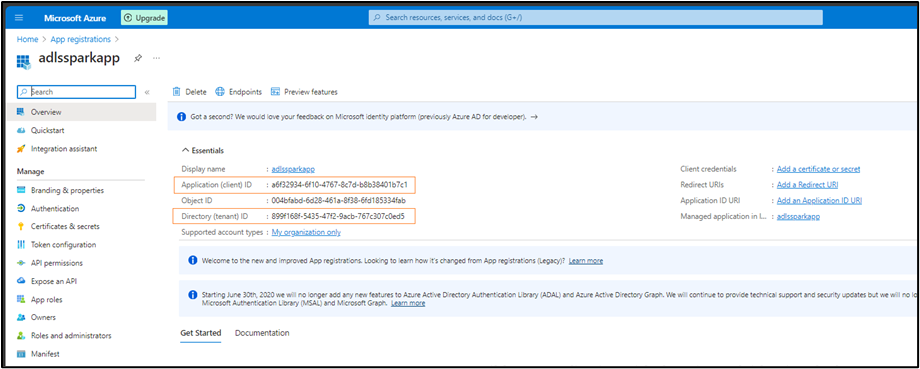
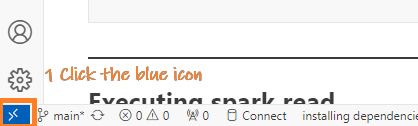
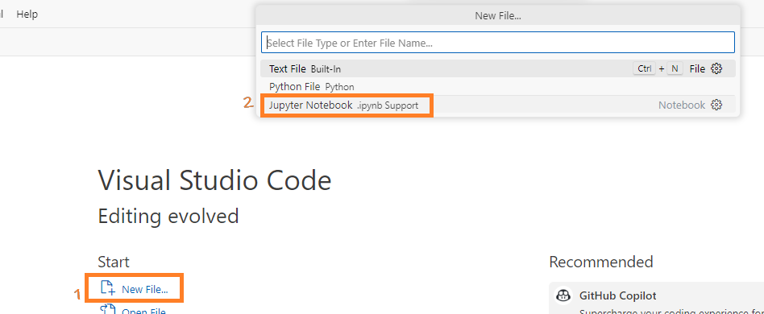

- [Spark Integration with ADLS: A Technical Overview](#spark-integration-with-adls-a-technical-overview)
  - [Create a storage account on Azure](#create-a-storage-account-on-azure)
    - [Azure Storage Account Setup](#azure-storage-account-setup)
  - [Create Container \& Upload CSV](#create-container--upload-csv)
  - [Create a new App Registration](#create-a-new-app-registration)
    - [Why App Registration?](#why-app-registration)
    - [Steps to Register the App](#steps-to-register-the-app)
    - [Provide necessary role to the app to the container](#provide-necessary-role-to-the-app-to-the-container)
  - [Generating a Client Secret For our App Registration](#generating-a-client-secret-for-our-app-registration)
    - [Why Secrets in App Registration?](#why-secrets-in-app-registration)
    - [Create `adlssparkapp` Secret in Azure](#create-adlssparkapp-secret-in-azure)
  - [Configuring PySpark for Connection to Azure Data Lake](#configuring-pyspark-for-connection-to-azure-data-lake)
    - [Environment Context](#environment-context)
    - [Procedure](#procedure)
  - [Accessing the CSV file using pyspark in Visual Studio](#accessing-the-csv-file-using-pyspark-in-visual-studio)
    - [Connect Visual Studio Code to the running container](#connect-visual-studio-code-to-the-running-container)
    - [Run the pyspark code in Visual Studio to connect to ADLS](#run-the-pyspark-code-in-visual-studio-to-connect-to-adls)
  - [Resolve Permission Errors](#resolve-permission-errors)
    - [Background](#background)
    - [Concepts](#concepts)
    - [Approach 1: Role Assignment](#approach-1-role-assignment)
    - [Approach 2: Manage ACL](#approach-2-manage-acl)
  - [Accessing ADLS Using Access Key](#accessing-adls-using-access-key)
    - [Background](#background-1)
    - [Steps](#steps)
    - [Security Note:](#security-note)
  - [Conclusion](#conclusion)

# Spark Integration with ADLS: A Technical Overview

Configuring ADLS for Azure Databricks is straightforward due to their shared Azure Directory (AD) infrastructure and Databricks’ built-in support for ADLS. For standalone Spark applications, however, integrating with ADLS requires careful management of JAR dependencies in the site-packages directory.

In this guide, we’ll cover:
1. Setting up an Azure storage account and container.
2. Populating the container with a sample CSV file.
3. Configuring PySpark for ADLS access.
4. Addressing potential permission issues with containers and files.
5. Demonstrating two connection methods: oAuth and access keys.

## Create a storage account on Azure

To begin, we'll set up an Azure storage account with Azure Data Lake Storage Gen2 (ADLS Gen2) enabled. ADLS Gen2 augments Azure Blob Storage with features like hierarchical namespaces and better analytics performance. Here's how to create this account and ensure it's accessible from all networks:


### Azure Storage Account Setup

1. **Sign In & Begin**: Open [Azure portal](https://portal.azure.com/), log in, and select "Create a resource" > "Storage" > "Storage account".

2. **Basics Tab**: Set **Subscription**, **Resource Group** (new or existing), name (e.g., `sasparkadls`), **Location**, **Performance** as Standard, and **Redundancy** as LRS.
   

3. **Advanced Tab**: Ensure **Secure Transfer** is enabled and activate **Hierarchical Namespace**.
   

4. **Networking**: Set **Connectivity Method** to "Public endpoint (all networks)" and ensure security.
   

5. **Data Protection (Optional)**: Apply additional protection features if needed.
   

6. **Review & Create**: Validate and confirm with "Create". Verify on the Overview page.
   

## Create Container & Upload CSV

1. **Access Storage**: In the search, type "Storage accounts", select it, then choose `sasparkadls` storage account.

2. **Setup Container**: In Blob service, click Containers > + Container. Name it `cont1`, set permissions, and hit Create.

3. **Prepare & Upload CSV**: If not ready, create `Airports2.csv` with content:
```
AirportCode,Name,City
JFK,John F. Kennedy,New York
LAX,Los Angeles International,Los Angeles
DFW,Dallas/Fort Worth,Texas
```
Then, inside `cont1`, click Upload and select/drag your `Airports2.csv`.

4. **Verify**: Post-upload, `Airports2.csv` should appear in `cont1`'s file list.


## Create a new App Registration

After creating the storage account, we'll proceed with an App registration.

### Why App Registration?
For a Spark application to access Azure resources securely, such as a CSV file in a storage account, it requires an identity for authentication. App registration in Azure AD provides this identity. Once registered and granted the necessary permissions, the Spark application can use this identity to securely access and read the CSV file from Azure.

### Steps to Register the App

1. **Initiate Registration**: In the Azure Portal's search, type "App registrations", select it, and click "+ New registration".
   

2. **Fill Details & Finalize**: Set the Name as `adlssparkapp`, select "Accounts in this organizational directory only", leave the Redirect URI blank, and click "Register".
   

3. **Document Key IDs**: From the post-registration overview, note down the **Application ID** and **Directory ID** for Spark-Azure connection.
   

You'll be using these details in the Spark application to ensure a secure connection to Azure and access the CSV file.

### Provide necessary role to the app to the container
We'll intentionally omit this step to trigger an access error. Later, by assigning the role and resolving the error, we can gain a deeper understanding of roles and service principals.

## Generating a Client Secret For our App Registration

### Why Secrets in App Registration?
In the context of Azure App Registration, a secret (often termed as the "client secret") is like a password for your application. It's used in combination with the Application (client) ID to authenticate the application when it tries to access Azure resources. By providing a client secret, you're adding an extra layer of security – ensuring that not just any application can access the resource, but only those that also possess this secret.

For Spark applications specifically, the client secret allows the application to authenticate itself when trying to read from or write to Azure services, such as a Storage Account.


### Create `adlssparkapp` Secret in Azure

1. **Initiate**: In Azure portal, search "App registrations", select it, then click on `adlssparkapp`.

2. **Secrets Setup**: Under "Manage" > "Certificates & secrets", click "+ New client secret". Fill in a description like "SparkAppSecret", pick an expiry, and hit "Add".
   

3. **Record Secret**: After creation, note the secret's value immediately, as it's only displayed once. This, with the Application ID, authenticates your Spark app with Azure.
   

⚠️ Handle the secret like a password: keep it confidential and use secure mechanisms (e.g., Azure Key Vault) for storage and access.

## Configuring PySpark for Connection to Azure Data Lake

### Environment Context
Our environment is set up inside a Docker container running Ubuntu on a Windows OS host. Within this container, Python 3 and PySpark are installed. But the steps can be used in local environments as well.

### Procedure

1. **Python Version Check:**
   - Often, systems have both Python 2.x and Python 3.x installed. Use the following commands to determine which versions are available:
     ```bash
     python --version
     python3 --version
     ```


2. **Installing `wget`:**
   - `wget` is a tool for downloading files from the internet. If you don’t have it in your environment you can get it using the given command:
     ```bash
     apt-get update && apt-get install -y wget
     ```

3. **Download ADLS-related JARs:**
   - For PySpark to connect with Azure Data Lake Storage (ADLS), specific Hadoop-based JAR files are needed. Navigate to a preferred directory, like the home directory, and download the required JARs using `wget`:
     ```bash
     cd ~
     wget https://repo1.maven.org/maven2/org/apache/hadoop/hadoop-azure/3.3.3/hadoop-azure-3.3.3.jar
     wget https://repo1.maven.org/maven2/org/apache/hadoop/hadoop-azure-datalake/3.3.3/hadoop-azure-datalake-3.3.3.jar
     wget https://repo1.maven.org/maven2/org/apache/hadoop/hadoop-common/3.3.3/hadoop-common-3.3.3.jar
     ```

4. **Locate Active PySpark Installation and Python's `site-packages` Directory:**
   - Determine where PySpark is installed using `pip`. When dealing with multiple Python versions, it's crucial to determine which one has PySpark installed, especially for consistent execution in tools like VS Code. To locate the PySpark installation and its associated `site-packages` directory, use this command: 
     ```bash
     pip3 show pyspark | grep Location
     ```
     Alternatively, you can get the location by running the command:
     ```bash
     python3 -c "from distutils.sysconfig import get_python_lib; print(get_python_lib())"
     ```


5. **Copy the JAR Files to `pyspark/jars`:**
   - Now, navigate to the directory where you downloaded the JAR files and copy them to the PySpark directory:
     ```bash
     cd ~  # assuming you downloaded the JARs in the home directory
     cp *.jar /usr/local/lib/python3.8/dist-packages/pyspark/jars/
     ```
     

6. **Verify the JAR Copy:**
   - Ensure the JARs have been copied correctly:
     ```bash
     ls /usr/local/lib/python3.8/dist-packages/pyspark/jars/ | grep ".jar"
     ```

7. **Configure Spark to Connect to ADLS:**
   - Don't perform this step now. This is for info only. This step will be performed in the next section. When initializing your Spark session, include these JARs and configure the session for ADLS:
     1. **Using Pyspark:**
        Below is the configuration for a Spark session tailored for ADLS:
        ```python
        from pyspark.sql import SparkSession

        spark = SparkSession.builder \
            .appName("ADLS Access") \
            .config("spark.jars", "/usr/local/lib/python3.8/dist-packages/pyspark/jars/hadoop-azure-3.3.3.jar,/usr/local/lib/python3.8/dist-packages/pyspark/jars/hadoop-azure-datalake-3.3.3.jar,/usr/local/lib/python3.8/dist-packages/pyspark/jars/hadoop-common-3.3.3.jar") \
            .getOrCreate()

        # Further configurations for ADLS access, including setting keys and account info
        ```

     2. **Using `spark-submit`:**
        As an alternative to embedding JAR file paths directly within your PySpark code you can dynamically registers the necessary JARs at runtime using the command below:
        ```bash
        spark-submit --jars /usr/local/lib/python3.8/dist-packages/pyspark/jars/hadoop-azure-3.3.3.jar,/usr/local/lib/python3.8/dist-packages/pyspark/jars/hadoop-azure-datalake-3.3.3.jar,/usr/local/lib/python3.8/dist-packages/pyspark/jars/hadoop-common-3.3.3.jar your_spark_app.py
        ```

## Accessing the CSV file using pyspark in Visual Studio

### Connect Visual Studio Code to the running container

1. **Open VS Code**: Launch Visual Studio Code and click the remote container icon at the bottom left.
   
2. **Attach to Container**: From the top menu, choose "Attach to running container".
   
3. **Select Container**: Pick the displayed running container. 
   
   This action launches a new VS Code instance connected to that container.
   
4. **Create Notebook**: In this instance, create a .ipynb (Jupyter notebook) to execute the subsequent section's code.



### Run the pyspark code in Visual Studio to connect to ADLS

1. **Connect to the python version where we copied the hadoop jars**
   There could be multiple python versions in a linux enviornment. From VS Code choose the python version whcih has our jars

   

2. **Initialize Configuration Parameters:**  
   Begin by setting up essential parameters such as the storage account name (`storage_account`), `client_id`, `directory_id`, and `client_secret` (info that we noted earlier). These are unique identifiers and secrets that authenticate your Spark session to access the Azure Data Lake Storage. Then utilizing OAuth2 ensures secure access to ADLS. These configuration settings instruct Spark to use OAuth authentication, specifically providing details on how and where to get the access token.

   ```python
   storage_account = "sasparkadls"
   client_id = "a6f32934-6f10-4767-8c7d-blabla"
   directory_id = "899f168f-5435-47f2-blabla-767c307c0ed5"
   client_secret = "ZPm8Q~eP6v~blabla"

   spark.conf.set(f"fs.azure.account.auth.type.{storage_account}.dfs.core.windows.net", "OAuth")
   spark.conf.set(f"fs.azure.account.oauth.provider.type.{storage_account}.dfs.core.windows.net", "org.apache.hadoop.fs.azurebfs.oauth2.ClientCredsTokenProvider")
   spark.conf.set(f"fs.azure.account.oauth2.client.id.{storage_account}.dfs.core.windows.net", client_id)
   spark.conf.set(f"fs.azure.account.oauth2.client.secret.{storage_account}.dfs.core.windows.net", client_secret)
   spark.conf.set(f"fs.azure.account.oauth2.client.endpoint.{storage_account}.dfs.core.windows.net", f"https://login.microsoftonline.com/{directory_id}/oauth2/token")

   ```
3. **Read Data from ADLS:**  
   With configurations set, you can now read data directly from ADLS. The file path specifies the exact location within ADLS where your data resides.
   ```python
   path = "abfss://cont1@sasparkadls.dfs.core.windows.net/Airports2.csv"
   spark.read.format("csv").load(path).show()
   ```

## Resolve Permission Errors

### Background
You may encounter errors like:
```
AuthorizationPermissionMismatch, "This request is not authorized to perform this operation using this permission."
```


### Concepts
1. **Registered App in Azure AD:** When you register an application in Azure Active Directory, a service principal is automatically created for that application. This service principal serves as the application's identity for Azure resources.
2. **Service Principal:** When an application wants to access an Azure resource (like a storage account), it must authenticate. Instead of using a user's identity to authenticate, the application uses a service principal to authenticate against Azure AD. This authentication returns a token which the application can then use to access the resource.
3. **Role-Based Access Control (RBAC):** Azure uses a role-based access control system to determine what actions a user or service can perform on a given resource. You can give "Storage Blob Data Contributor" role to a service principal for a specific blob container, which means the application or service using that service principal will have the necessary permissions to contribute data to that blob container.
4. **Storage Account Level Permissions:** If you assign the "Storage Blob Data Contributor" role (or similar roles) to an app at the storage account level, the app essentially receives permissions to every container and blob within that storage account. This means it would have the ability to read, write, and delete blobs across the entire storage account depending on the permissions granted by the role.
5. **Controlling Access:** If you want more granular control, you should consider assigning permissions at the container level instead. When you assign a role to an app at the container level, its permissions are restricted to only that specific container. It won't have access to others.

### Approach 1: Role Assignment
1. **Assign Role**: In the storage account's Cont1 container, select 'Access Control (IAM)' > 'Add' > 'Add role assignment'. Assign 'Storage Blob Data Contributor' to the Service Principal by name.
2. **Confirm Role**: Check the Role assignments tab to see the app's role. This grants `$superuser` access to the container and csv, requiring no additional permissions.

### Approach 2: Manage ACL
1. **Open Cont1**: In Azure Portal's Data Lake Storage, access the Cont1 container.
2. **Modify ACL**: Click 'Manage ACL' > 'Add principal' and input the `adlssparkapp` client_id. Set 'Read', 'Write', and 'Execute' permissions. Ensure a 'Mask' entry under 'Security Principal' reflects these permissions.
3. **Apply Everywhere**: Repeat for all desired containers, directories, and files for Spark access.
## Accessing ADLS Using Access Key

### Background
 One of the straightforward methods to access ADLS is using the access key. Here’s how to retrieve the access key from the Azure Portal and configure Spark to connect to ADLS using this method.

### Steps

1. **Retrieving Access Keys:**
   - Navigate to the Azure Portal.
   - Access the Storage accounts service.
   - Select your desired storage account (for our example, “sasparkadls”).
   - Under the `Security + networking` section in the left sidebar, find and select `Access keys`.
   - You’ll be presented with two keys: `key1` and `key2`. Both keys can be used to authenticate, so choose one and copy it. This will be used in the subsequent steps.

2. **Setting up Spark Configuration:**  
Using the copied access key, you can now set up Spark to authenticate and access ADLS.
   ```python
   # Define the storage account name and access key.
   storage_account = "sasparkadls"
   account_key = "YOUR_COPIED_ACCESS_KEY"

   # Specify the AzureBlobFileSystem implementation for Spark. 
   # This implementation is optimized for ADLS Gen2 operations.
   spark.conf.set(f"fs.azure", "org.apache.hadoop.fs.azurebfs.AzureBlobFileSystem")

   # Configure Spark with the access key to authenticate with the storage account.
   spark.conf.set(f"fs.azure.account.key.{storage_account}.dfs.core.windows.net", account_key)
   ```

3. **Reading Data from ADLS:**  
Once configured, Spark can seamlessly read data stored in ADLS. For example, to read a CSV file from a specific container:
   ```python
   df = spark.read.csv(f"abfss://your-container@{storage_account}.dfs.core.windows.net/path/to/your/file.csv")
   ```

### Security Note:
Always handle access keys with care. They provide extensive permissions to your ADLS. Avoid hardcoding them in scripts or applications. Periodically rotate access keys, and where possible, employ more granular authentication methods, like service principals.

---

## Conclusion
To wrap things up, the crux of accessing Azure Data Lake Storage with Spark lies in adding the right ADLS JAR files and setting the correct permissions for your container. Once these steps are sorted, the rest feels just like working with any typical Spark data source.  

---
© D Das  
📧 [das.d@hotmail.com](mailto:das.d@hotmail.com) | [ddasdocs@gmail.com](mailto:ddasdocs@gmail.com)
