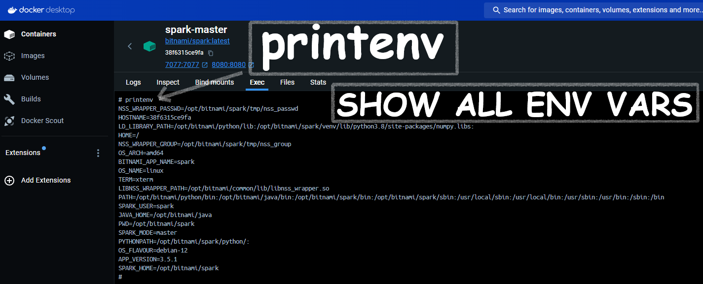

## sudo su
## ls -la show hidden folders also
## chown

The `chown` command in Unix-like operating systems is used to change the ownership of files and directories. The `-R` option stands for "recursive," which means it will apply the ownership change to the specified directory and all its contents, including subdirectories and files.

### Breakdown of `chown -R dwdas:dwdas /user/hive`

- **`chown`**: Change ownership.
- **`-R`**: Apply changes recursively to the directory and its contents.
- **`dwdas:dwdas`**: 
  - The first `dwdas` is the user name to which you want to give ownership.
  - The second `dwdas` is the group name to which you want to give ownership.
- **`/user/hive`**: The path to the directory whose ownership you want to change.

### Example

Suppose you want to ensure that the `dwdas` user has the correct permissions for the Hive warehouse directory in a Docker container. You can use the following steps:

1. **Create the Directory Path**: 
   Use `mkdir -p` to create the directory path, including any necessary parent directories.

   ```sh
   mkdir -p /user/hive/warehouse
   ```

2. **Change Ownership**: 
   Use `chown -R` to change the ownership of the directory and all its contents to the `dwdas` user and group.

   ```sh
   chown -R dwdas:dwdas /user/hive
   ```

## mkdir -p

The `mkdir -p` command is used to create directories in a Unix-like operating system. Here's a breakdown of what it does:

- **`mkdir`**: This is the command used to create directories (folders).
- **`-p`**: This option stands for "parents". It allows `mkdir` to create the entire directory path specified, including any necessary parent directories that do not already exist. If the directories already exist, it does nothing and does not produce an error.

### Explanation:

- **`mkdir -p /user/hive/warehouse`**: This command will create the directory `/user/hive/warehouse`, including the parent directories `/user` and `/user/hive` if they do not already exist.

### Example without `-p`:

If you try to create `/user/hive/warehouse` without the `-p` option and the parent directories do not exist, you will get an error.

```sh
mkdir /user/hive/warehouse
```

If `/user` and `/user/hive` do not exist, this will fail with an error message like:

```sh
mkdir: cannot create directory ‘/user/hive/warehouse’: No such file or directory
```

### Example with `-p`:

Using `-p` ensures that all necessary parent directories are created along the way.

```sh
mkdir -p /user/hive/warehouse
```

This will create:

- `/user`
- `/user/hive`
- `/user/hive/warehouse`

If any of these directories already exist, `mkdir -p` will not raise an error; it will just move on to the next part of the path.

### Practical Usage in Your Context:

To ensure the `/user/hive/warehouse` directory exists with the correct permissions for the `dwdas` user, you should run the following commands in the root shell of your container:

1. **Create the Directory Path:**

   ```sh
   mkdir -p /user/hive/warehouse
   ```

2. **Set the Ownership to `dwdas`:**

   ```sh
   chown -R dwdas:dwdas /user/hive
   ```

3. **Exit the Root Shell:**

   ```sh
   exit
   ```

This ensures that the `dwdas` user can write to the Hive warehouse directory without encountering permissions issues.

## whoami
## id
## printenv


The `printenv` command is a shell command used to display the environment variables in the current shell session. Environment variables are key-value pairs that can affect the way running processes behave on a computer.

### Using `printenv`

#### In a Docker Container or Unix/Linux Terminal:
1. **To display all environment variables:**
   ```bash
   printenv
   ```

   This will list all the environment variables along with their values.

2. **To display a specific environment variable:**
   You can specify the name of the environment variable you want to see. For example, to see the value of `SPARK_HOME`:
   ```bash
   printenv SPARK_HOME
   ```

### Examples

#### Displaying All Environment Variables:
```bash
$ printenv
USER=username
HOME=/home/username
PATH=/usr/bin:/bin:/usr/sbin:/sbin
SHELL=/bin/bash
...
```

#### Displaying a Specific Environment Variable:
```bash
$ printenv PATH
/usr/bin:/bin:/usr/sbin:/sbin
```

### Using `printenv` in a Docker Container
To use the `printenv` command inside a Docker container, you can either run it directly within the container or use `docker exec` to execute the command in a running container.

#### Running Directly in a Container:
If you are already inside a Docker container's shell, simply run:
```bash
printenv
```
or
```bash
printenv SPARK_HOME
```

#### Using `docker exec`:
If you want to check the environment variables of a running container from your host machine:
```bash
docker exec -it <container_id> printenv
```
or for a specific variable:
```bash
docker exec -it <container_id> printenv SPARK_HOME
```

### Using `printenv` in Windows Command Prompt:
On Windows, the equivalent of `printenv` is `set`. You can list all environment variables by running:
```cmd
set
```
or for a specific variable:
```cmd
echo %SPARK_HOME%
```

