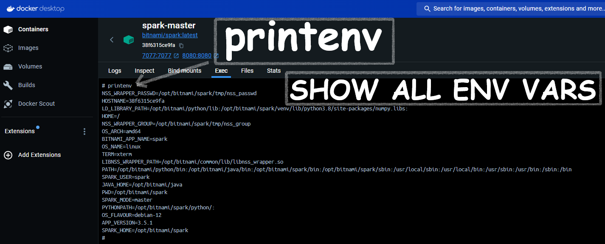

## printenv


The `printenv` command is a shell command used to display the environment variables in the current shell session. Environment variables are key-value pairs that can affect the way running processes behave on a computer.

### Using `printenv`

#### In a Docker Container or Unix/Linux Terminal:
1. **To display all environment variables:**
   ```bash
   printenv
   ```

   This will list all the environment variables along with their values.

2. **To display a specific environment variable:**
   You can specify the name of the environment variable you want to see. For example, to see the value of `SPARK_HOME`:
   ```bash
   printenv SPARK_HOME
   ```

### Examples

#### Displaying All Environment Variables:
```bash
$ printenv
USER=username
HOME=/home/username
PATH=/usr/bin:/bin:/usr/sbin:/sbin
SHELL=/bin/bash
...
```

#### Displaying a Specific Environment Variable:
```bash
$ printenv PATH
/usr/bin:/bin:/usr/sbin:/sbin
```

### Using `printenv` in a Docker Container
To use the `printenv` command inside a Docker container, you can either run it directly within the container or use `docker exec` to execute the command in a running container.

#### Running Directly in a Container:
If you are already inside a Docker container's shell, simply run:
```bash
printenv
```
or
```bash
printenv SPARK_HOME
```

#### Using `docker exec`:
If you want to check the environment variables of a running container from your host machine:
```bash
docker exec -it <container_id> printenv
```
or for a specific variable:
```bash
docker exec -it <container_id> printenv SPARK_HOME
```

### Using `printenv` in Windows Command Prompt:
On Windows, the equivalent of `printenv` is `set`. You can list all environment variables by running:
```cmd
set
```
or for a specific variable:
```cmd
echo %SPARK_HOME%
```

