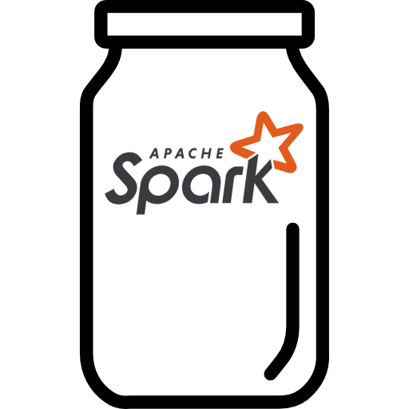
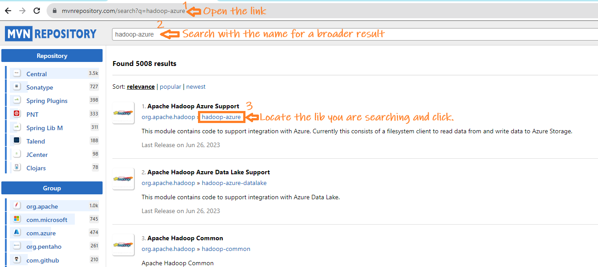
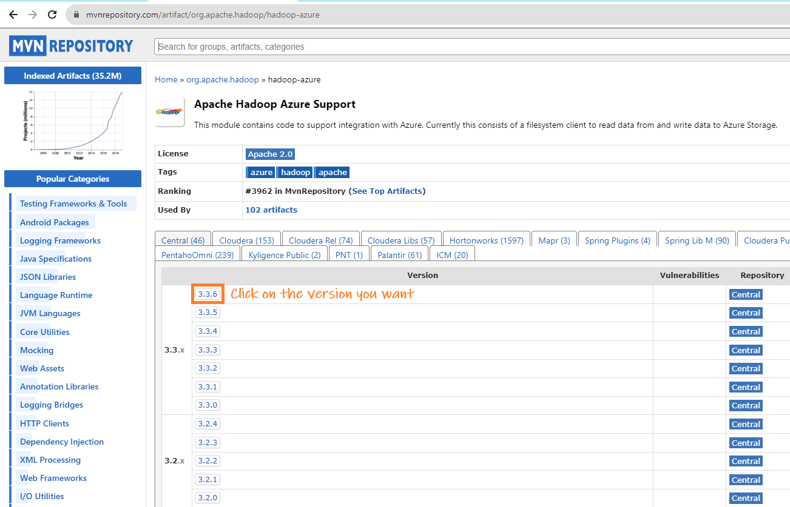
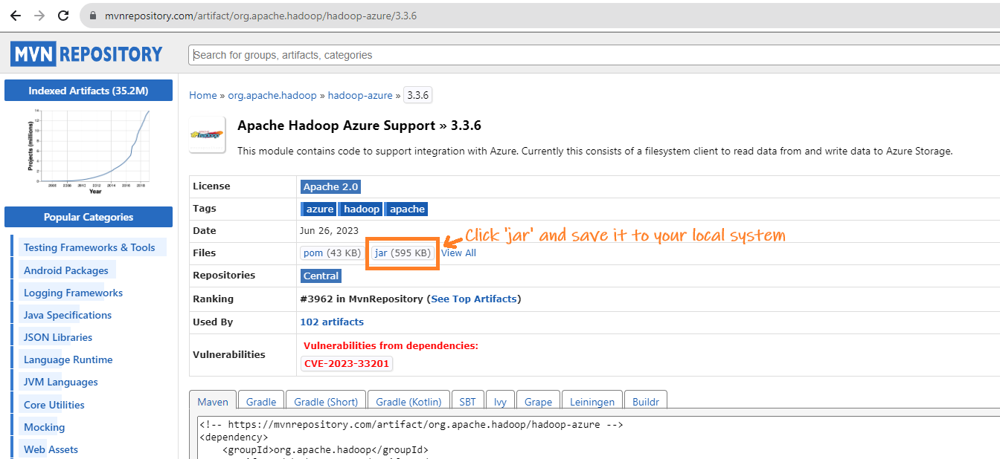

## Table of Contents
- [How to Download JAR Files from Apache Maven Repository](#how-to-download-jar-files-from-apache-maven-repository)
  - [Steps to Download JAR Files](#steps-to-download-jar-files)
    - [Go to Apache Maven Repository](#go-to-apache-maven-repository)
    - [Search for the JAR File](#search-for-the-jar-file)
    - [Pick the Version You Want](#pick-the-version-you-want)
    - [Download the JAR File](#download-the-jar-file)
    - [How to Use the JARs](#how-to-use-the-jars)



# How to Download JAR Files from Apache Maven Repository

Need to download JAR files like `hadoop-azure-x.x.x.jar` for your project? Don't worry, I'll show you how to get them from Apache Maven Repository. It's easy and doesn't take much time.

## Steps to Download JAR Files

### Go to Apache Maven Repository
Open your browser and visit [mvnrepository.com](https://mvnrepository.com/). This website has a lot of JAR files.

### Search for the JAR File
In the website, there will be a search box. Type the name of the JAR file you are looking for (like `hadoop-azure`) and press enter. You will see a list of JAR files.

   

### Pick the Version You Want
After you click on the JAR file name, you'll see different versions. Click on the version you need.

   

### Download the JAR File
In the page for your chosen version, look for the "Files" section. There will be a link for a `.jar` file. Click on this link to start downloading the file.
   
   

### How to Use the JARs
Once downloaded, you can store the JAR files in a location of your choice, for example, `C:\spark_jars\`. You can reference these JARs in your code when needed. For instance, if you are trying to access Azure Data Lake Storage (ADLS) from a local Spark installation on a Windows machine, you can set up your Spark session like this:

```python
from pyspark.sql import SparkSession

spark = SparkSession.builder \
    .appName("ADLS Access") \
    .config("spark.jars", "C:\\spark_jars\\hadoop-azure-3.3.3.jar;C:\\spark_jars\\hadoop-azure-datalake-3.3.3.jar;C:\\spark_jars\\hadoop-common-3.3.3.jar") \
    .getOrCreate()
```
---
© D Das  
📧 [das.d@hotmail.com](mailto:das.d@hotmail.com) | [ddasdocs@gmail.com](mailto:ddasdocs@gmail.com)