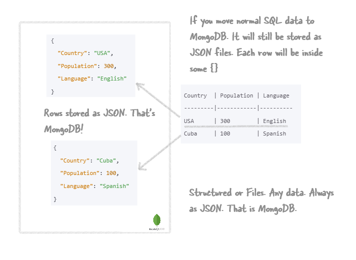

- [Overview](#overview)
  - [How MongoDB would store your normal SQL Data(simple text)?](#how-mongodb-would-store-your-normal-sql-datasimple-text)
    - [Create the Database and Collection](#create-the-database-and-collection)
  - [Storing unstructured data like files in MongoDB](#storing-unstructured-data-like-files-in-mongodb)
    - [How GridFS Splits Files](#how-gridfs-splits-files)
    - [Storing a sample file `Resume.pdf`](#storing-a-sample-file-resumepdf)
  - [Let's See This in Practice](#lets-see-this-in-practice)
    - [Storing a PDF File Using Python](#storing-a-pdf-file-using-python)
  - [Let's recap the splitting process](#lets-recap-the-splitting-process)
  - [Now, let's see the actual details](#now-lets-see-the-actual-details)
    - [Detailed Explanation](#detailed-explanation)
    - [Summary](#summary)


# <span style="color: #C71585;Font-family: Segoe UI, sans-serif;">Overview</span>

MongoDB is a document database. **Document** database? You mean, it's good for storing PDFs/Word files? **No**. The reason it is called a Document database is not because it stores PDFs/Word docs well(it does). But, because whatever data it stores—whether it's files or SQL table data—**it stores as JSON files**.

What? Yes, even for storing something simple like Name and Roll Number, it will be saved like this: `{Name: "Donald", Roll Number: 100}`. And for storing a PDF, the 0s and 1s (binary data of the PDF) are stored as entries in JSON files.

<p style="color: #804000; font-family: 'Trebuchet MS', Helvetica, sans-serif; background-color: BurlyWood; padding: 15px; border-left: 5px solid #b35900;">
So, whatever data you store, it’s stored in a JSON document. Hence, it's called a document database.
</p>


Let's see below how the data, structured(sql tables) and unstructured(pdf documents) are stored in MongoDB.

## <span style="color: #D87093;Font-family: Segoe UI, sans-serif;">How MongoDB would store your normal SQL Data(simple text)?</span>

Suppose, we have a simple MSSQL table but, we want to store the data now in MongoDB. How would MongoDB store it. When you save this data in MongoDB, each row becomes a JSON file. These documents are stored inside a collection (like a table) called `countries` inside a database called `Earth`.




Now, let's do some practical to see it in reality. Follow the steps below.

> To run MongoDB commands, you can install MongoDB Shell from [here](https://www.mongodb.com/try/download/shell).

### <span style="color: #8B0000;Font-family: Segoe UI, sans-serif;">Create the Database and Collection</span>

- Open CMD and key in `mongosh`. It will log in and start a `test` database:

    


- Create the `Earth` Database. Just enter `Earth` and it will create the database. No need to create it separately.
    
- Now, insert the Data into the `countries` Collection:
   
   This will create the collection. No need to create it beforehand.

    ```javascript
    db.countries.insertMany([
      { "Country": "USA", "Population": 300, "Language": "English" },
      { "Country": "Cuba", "Population": 100, "Language": "Spanish" }
    ]);
    ```
    

- You can see the data in MongoDB Compass

    

- To make sure the data is inserted properly. you can query the collection using this command: `db.countries.find().pretty();`. This command will display the documents stored in the `countries` collection in a readable format.

## <span style="color: #D87093;Font-family: Segoe UI, sans-serif;">Storing unstructured data like files in MongoDB</span>

Let's now see how MongoDB stores a PDF file. Say we have a 1 MB PDF file named `Resume.pdf`. How would MongoDB store it? MongoDB uses a specification called **GridFS** to store large files. GridFS divides the file into smaller chunks and stores each chunk as a separate document.

### <span style="color: #8B0000;Font-family: Segoe UI, sans-serif;">How GridFS Splits Files</span>

When you save a file in MongoDB using GridFS, the file is split into smaller pieces (around 255 KB). For a 1 MB PDF file, it will be split into 4 smaller files.

Each file-piece is stored in the `fs.chunks` collection as a JSON file. Yes, your Adobe PDF's binary data is split into pieces, and the 01$#$#$ is put inside the JSON file.

There will be one metadata file for the entire PDF stored as a JSON file in the `fs.files` collection. JSON, JSON everywhere.

### <span style="color: #8B0000;Font-family: Segoe UI, sans-serif;">Storing a sample file `Resume.pdf`</span>

When you save the `Resume.pdf` file in MongoDB, it is broken into chunks and stored across two collections: `fs.files` and `fs.chunks`.

1. **File Metadata - `fs.files`**:
   Each file has a metadata document in the `fs.files` collection.

    ```json
    {
      "_id": ObjectId("..."),
      "filename": "Resume.pdf",
      "length": 1048576, // Size in bytes (1 MB)
      "chunkSize": 261120, // Default chunk size (255 KB)
      "uploadDate": ISODate("2024-07-20T12:34:56Z"),
      "md5": "..."
    }
    ```
   
    

2. **File Chunks - `fs.chunks`**:
   The file data is stored in chunks in the `fs.chunks` collection. Each chunk is linked to the file via the `files_id`.

    ```json
    {
      "_id": ObjectId("..."),
      "files_id": ObjectId("..."), // Reference to fs.files document
      "n": 0, // Chunk number
      "data": <binary data $###$WhenYouOpenAdobePDFinNotepad01010101>
    }
    {
      "_id": ObjectId("..."),
      "files_id": ObjectId("..."), // Reference to fs.files document
      "n": 1, // Chunk number
      "data": <binary data $###$WhenYouOpenAdobePDFinNotepad01010101>
    }
    // More chunks follow...
    ```
    

## <span style="color: #D87093;Font-family: Segoe UI, sans-serif;">Let's See This in Practice</span>

To run MongoDB commands, you can install MongoDB Shell from [here](https://www.mongodb.com/try/download/shell).

### <span style="color: #8B0000;Font-family: Segoe UI, sans-serif;">Storing a PDF File Using Python</span>

1. **Install Required Packages**:
   Make sure you have `pymongo` installed. You can install it using pip:

   ```bash
   pip install pymongo gridfs
   ```

2. **Python Code to Store `Resume.pdf`**:

    ```python
    from pymongo import MongoClient
    import gridfs

    # Connect to MongoDB
    client = MongoClient('mongodb://localhost:27017')
    db = client['Earth']

    # Create a GridFS bucket
    fs = gridfs.GridFS(db)

    # Open the PDF file and store it in MongoDB
    with open('Resume.pdf', 'rb') as f:
        file_id = fs.put(f, filename='Resume.pdf')

    print(f'File stored with id: {file_id}')
    ```

3. **Verify the File Storage**:

   You can verify that the file has been stored correctly by querying the `fs.files` collection:

    ```python
    # Verify file storage
    stored_file = db.fs.files.find_one({'filename': 'Resume.pdf'})
    print(stored_file)
    ```

## <span style="color: #D87093;Font-family: Segoe UI, sans-serif;">Let's recap the splitting process</span>

When you upload **Resume.pdf** using GridFS:
- The file is split into pieces. The default chunk size is 255 KB.
- For a 1 MB file, it would be split into around 4 pieces (1 MB / 255 KB ≈ 4).
- Each piece is stored as a separate JSON file in the `fs.chunks` collection. Yes, the Adobe PDF's binary data is stuffed inside the JSON file.
- There will be one JSON file in the `fs.files` collection to store metadata about the real file, including its length, chunk size, and upload date.
- Each chunk document in `fs.chunks` contains a reference to the file's metadata document in `fs.files`.


## <span style="color: #D87093;Font-family: Segoe UI, sans-serif;">Now, let's see the actual details</span>


In actual fact, each row in a SQL table when saved in MongoDB becomes a document. Documents are not exactly .JSON files. Rather, they are stored in BSON (Binary JSON) format within MongoDB, which is an internal storage format optimized for performance and space efficiency.

### <span style="color: #8B0000;Font-family: Segoe UI, sans-serif;">Detailed Explanation</span>

- **SQL to MongoDB**: When migrating data from a SQL table to MongoDB, each row from the SQL table becomes a document in a MongoDB collection.
- **Documents**: These documents are similar to JSON objects but are stored internally as BSON. BSON allows MongoDB to efficiently store and retrieve data.
- **Storage in MongoDB**: 
  - MongoDB does not store each document as a separate file on the filesystem. Instead, all documents within a collection are stored together in large database files managed by MongoDB’s storage engine.
  - These database files typically reside in the `dbpath` directory of your MongoDB installation and have extensions like `.wt` for WiredTiger.
- **Accessing Data**: When you query MongoDB, it retrieves the BSON documents from these large files and converts them to JSON-like structures for ease of use in your application.

### <span style="color: #8B0000;Font-family: Segoe UI, sans-serif;">Summary</span>

For conceptual understanding, you can think of each document as a JSON object. However, in reality, these documents are stored in a more efficient binary format (BSON) within MongoDB's internal database files.