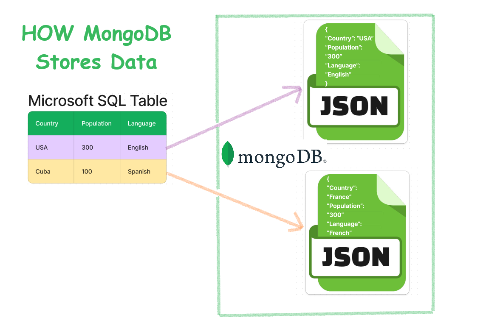
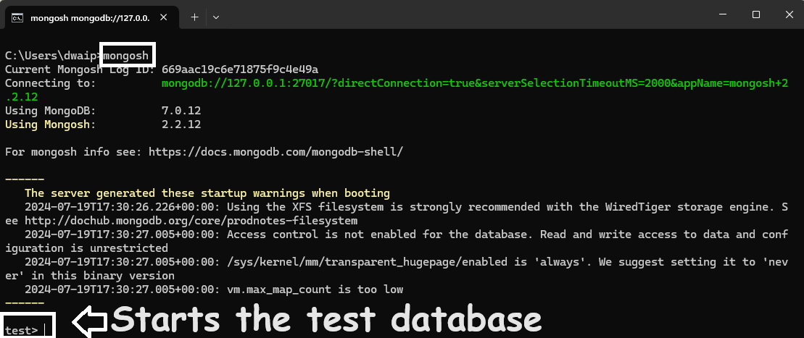
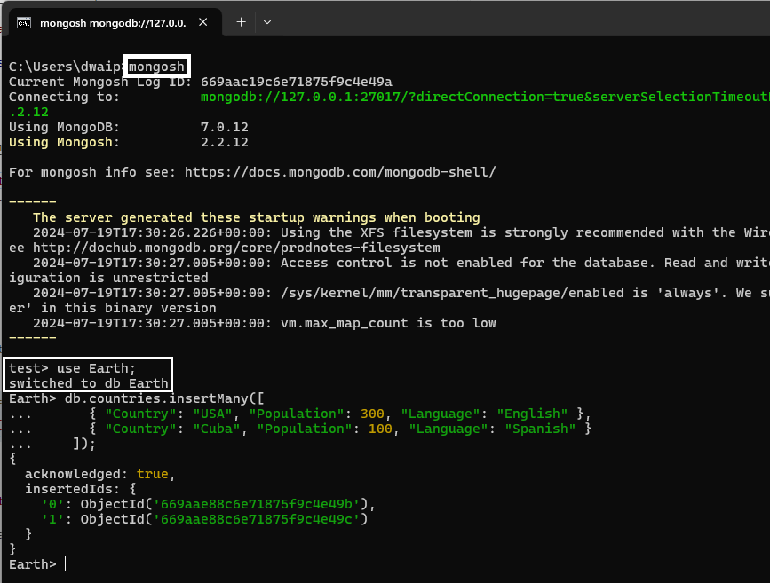
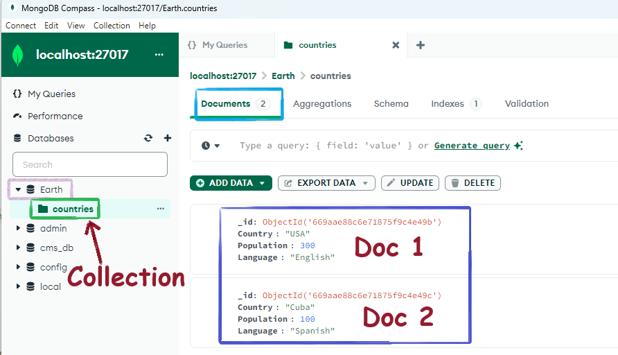
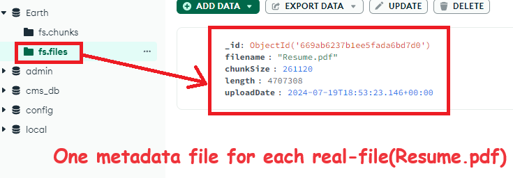
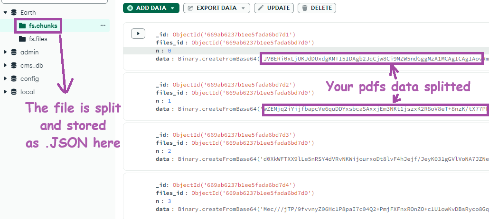

- [How MongoDB Stores Data](#how-mongodb-stores-data)
- [Saving Traditional SQL tables in MongoDB](#saving-traditional-sql-tables-in-mongodb)
    - [Example Documents:](#example-documents)
  - [Let's See This in Practice](#lets-see-this-in-practice)
    - [Creating the Database and Collection](#creating-the-database-and-collection)
    - [Verifying the Data](#verifying-the-data)
- [Saving Files like .pdfs](#saving-files-like-pdfs)
    - [How GridFS Splits Files](#how-gridfs-splits-files)
    - [Example: Storing `Resume.pdf`](#example-storing-resumepdf)
  - [Let's See This in Practice](#lets-see-this-in-practice-1)
    - [Storing a PDF File Using Python](#storing-a-pdf-file-using-python)
  - [Let's recap the splitting process](#lets-recap-the-splitting-process)



# How MongoDB Stores Data

When we talk about data, it can be like SQL tables or it can be files (like .pdf).

# Saving Traditional SQL tables in MongoDB

Let's first see how MongoDB stores a usual SQL table.

Here is our table, which is present in, say, a Microsoft SQL Database. How would MongoDB store it?

```
Country  | Population | Language
---------|------------|----------
USA      | 300        | English
Cuba     | 100        | Spanish
```

When you save this data in MongoDB, each row becomes a JSON file.

### Example Documents:

1. **File 1 - USA:**
    ```json
    {
      "Country": "USA",
      "Population": 300,
      "Language": "English"
    }
    ```

2. **File 2 - Cuba:**
    ```json
    {
      "Country": "Cuba",
      "Population": 100,
      "Language": "Spanish"
    }
    ```

These documents are stored inside a collection (like a table) called `countries` inside a database called `Earth`.

## Let's See This in Practice

To run MongoDB commands, you can install MongoDB Shell from [here](https://www.mongodb.com/try/download/shell).

### Creating the Database and Collection

1. **Open the Mongo shell in CMD**:
    ```bash
    mongosh
    ```

    

2. **Create the `Earth` Database**:
    Just use `Earth`. It will create the database. No need to create it separately.
    
    ```javascript
    use Earth;
    ```

3. **Insert the Data into the `countries` Collection**:
   
   This will create the collection. No need to create it beforehand.

    ```javascript
    db.countries.insertMany([
      { "Country": "USA", "Population": 300, "Language": "English" },
      { "Country": "Cuba", "Population": 100, "Language": "Spanish" }
    ]);
    ```
    

4. **You can see the data in MongoDB Compass**

    

### Verifying the Data

To ensure the data has been inserted correctly, you can query the collection:

```javascript
db.countries.find().pretty();
```

This command will display the documents stored in the `countries` collection in a readable format.

# Saving Files like .pdfs

Let's now see how MongoDB stores a PDF file.

Suppose we have a 1 MB PDF file named `Resume.pdf`. How would MongoDB store it?

MongoDB uses a specification called **GridFS** to store large files. GridFS divides the file into smaller chunks and stores each chunk as a separate document.

### How GridFS Splits Files

When you save a file in MongoDB using GridFS, the file is split into smaller pieces (around 255 KB). For a 1 MB PDF file, it will be split into 4 smaller files.

Each file-piece is stored in the `fs.chunks` collection as a JSON file. Yes, your Adobe PDF's binary data is split into pieces, and the 01$#$#$ is put inside the JSON file.

There will be one metadata file for the entire PDF stored as a JSON file in the `fs.files` collection. JSON, JSON everywhere.

### Example: Storing `Resume.pdf`

When you save the `Resume.pdf` file in MongoDB, it is broken into chunks and stored across two collections: `fs.files` and `fs.chunks`.

1. **File Metadata - `fs.files`**:
   Each file has a metadata document in the `fs.files` collection.

    ```json
    {
      "_id": ObjectId("..."),
      "filename": "Resume.pdf",
      "length": 1048576, // Size in bytes (1 MB)
      "chunkSize": 261120, // Default chunk size (255 KB)
      "uploadDate": ISODate("2024-07-20T12:34:56Z"),
      "md5": "..."
    }
    ```
    

2. **File Chunks - `fs.chunks`**:
   The file data is stored in chunks in the `fs.chunks` collection. Each chunk is linked to the file via the `files_id`.

    ```json
    {
      "_id": ObjectId("..."),
      "files_id": ObjectId("..."), // Reference to fs.files document
      "n": 0, // Chunk number
      "data": <binary data $###$WhenYouOpenAdobePDFinNotepad01010101>
    }
    {
      "_id": ObjectId("..."),
      "files_id": ObjectId("..."), // Reference to fs.files document
      "n": 1, // Chunk number
      "data": <binary data $###$WhenYouOpenAdobePDFinNotepad01010101>
    }
    // More chunks follow...
    ```
    

## Let's See This in Practice

To run MongoDB commands, you can install MongoDB Shell from [here](https://www.mongodb.com/try/download/shell).

### Storing a PDF File Using Python

1. **Install Required Packages**:
   Make sure you have `pymongo` installed. You can install it using pip:

   ```bash
   pip install pymongo gridfs
   ```

2. **Python Code to Store `Resume.pdf`**:

    ```python
    from pymongo import MongoClient
    import gridfs

    # Connect to MongoDB
    client = MongoClient('mongodb://localhost:27017')
    db = client['Earth']

    # Create a GridFS bucket
    fs = gridfs.GridFS(db)

    # Open the PDF file and store it in MongoDB
    with open('Resume.pdf', 'rb') as f:
        file_id = fs.put(f, filename='Resume.pdf')

    print(f'File stored with id: {file_id}')
    ```

3. **Verify the File Storage**:

   You can verify that the file has been stored correctly by querying the `fs.files` collection:

    ```python
    # Verify file storage
    stored_file = db.fs.files.find_one({'filename': 'Resume.pdf'})
    print(stored_file)
    ```

## Let's recap the splitting process

When you upload **Resume.pdf** using GridFS:
- The file is split into pieces. The default chunk size is 255 KB.
- For a 1 MB file, it would be split into around 4 pieces (1 MB / 255 KB ≈ 4).
- Each piece is stored as a separate JSON file in the `fs.chunks` collection. Yes, the Adobe PDF's binary data is stuffed inside the JSON file.
- There will be one JSON file in the `fs.files` collection to store metadata about the real file, including its length, chunk size, and upload date.
- Each chunk document in `fs.chunks` contains a reference to the file's metadata document in `fs.files`.