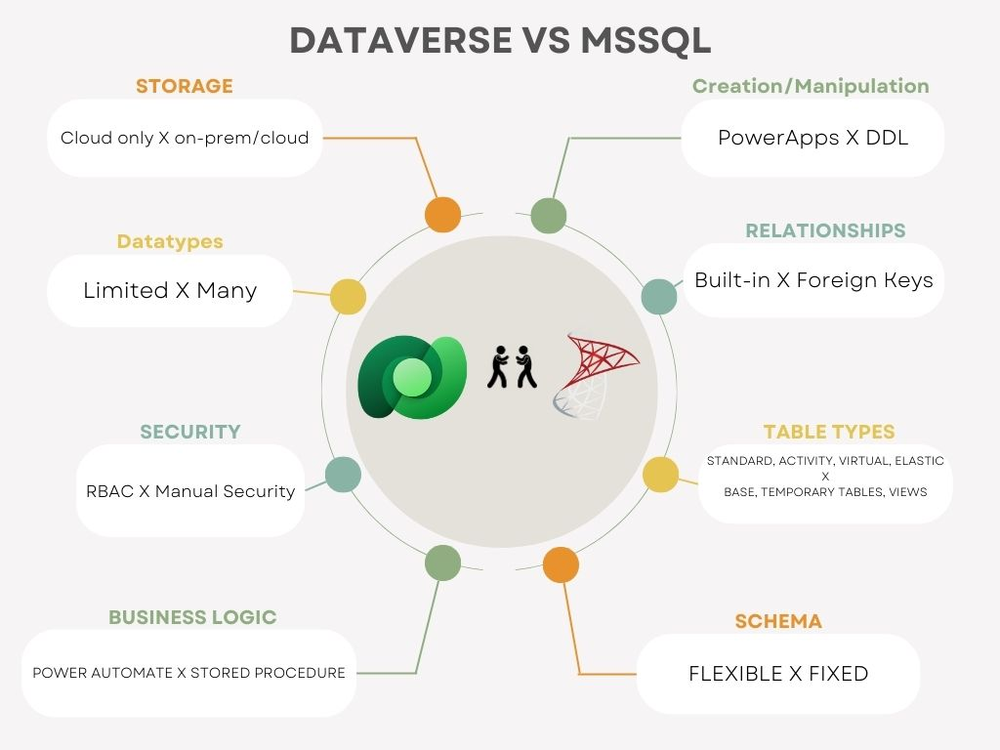

## Dataverse vs. MSSQL Tables: A Quick Comparison

**Dataverse:** User-friendly, low-code for apps with built-in security and Power Platform integration. Ideal for simpler data models.

**Key Features:**

* Flexible schema for easy data changes.
* Built-in relationships for linking tables.
* User interface for data manipulation (Power Apps, web interface).
* Role-based access control (RBAC) and auditing.
* Virtual tables for simplified data views.
* Power Automate workflows for business logic.

**MSSQL:** Powerful, flexible for complex data management with granular control. Ideal for complex data models and integrations.

**Key Features:**

* Fixed schema requiring careful modifications.
* Foreign keys for establishing data relationships (more complex queries).
* T-SQL commands and programming languages for data manipulation.
* Manual security setup and auditing configuration.
* Traditional views for complex data representations.
* Stored procedures and triggers for advanced business logic.

**Consider these factors when choosing:**

* **Complexity:** Dataverse for simpler models, MSSQL for complex ones.
* **Development Skills:** Dataverse for non-programmers, MSSQL requires SQL expertise.
* **Integration Needs:** Dataverse for seamless Power Platform integration, MSSQL requires additional development effort.

## Dataverse vs. MSSQL Tables: Detailed comparison

**Table Structure:**

| Feature | Dataverse | MSSQL |
|---|---|---|
| Schema | Flexible | Fixed |
| Data Types | Various, including complex | Similar, with granular control |
| Relationships | Built-in | Foreign Keys |

**Data Manipulation:**

| Feature | Dataverse | MSSQL |
|---|---|---|
| Interface | User-friendly | T-SQL (code) |
| Coding | Low-code (Power Automate) | Programming languages |

**Security:**

| Feature | Dataverse | MSSQL |
|---|---|---|
| Access Control | RBAC (roles) | Manual setup |
| Auditing | Built-in | Additional configuration |

**Table Types:**

| Feature | Dataverse | MSSQL |
|---|---|---|
| Standard Tables | ✓ | ✓ |
| Virtual Tables (simplified data views) | ✓ | Views (complex data views) |
| Custom Tables (more control) | ✓ |  |
| Elastic Tables (large datasets) | ✓ (limited) |  |

**Business Logic:**

| Feature | Dataverse | MSSQL |
|---|---|---|
| Table Level | Power Automate workflows | Stored Procedures, Triggers |
| Column Level | Validation Rules, Workflows | Constraints, Triggers |