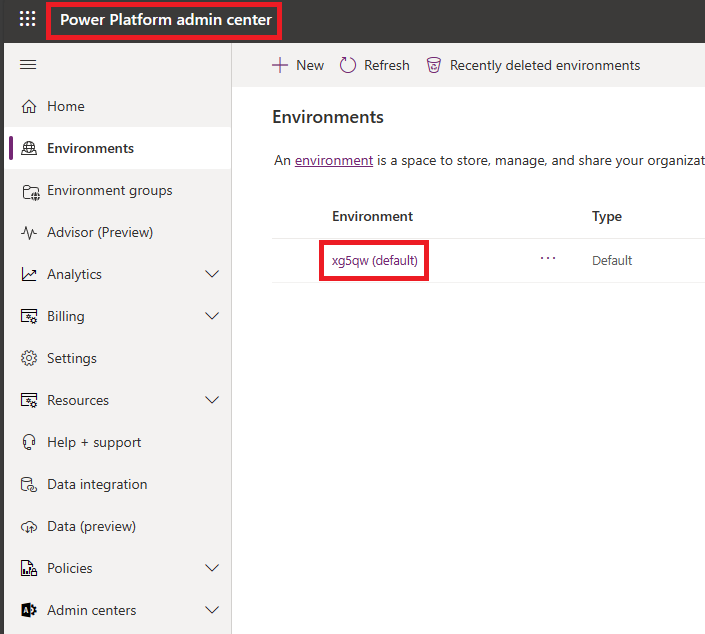
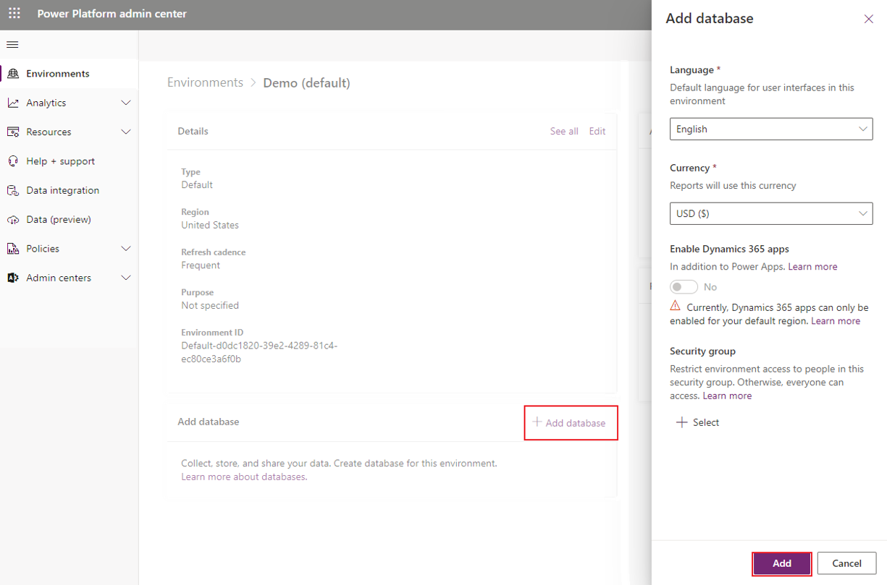
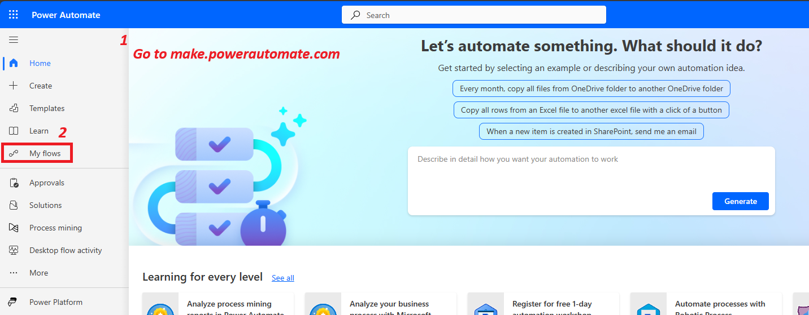
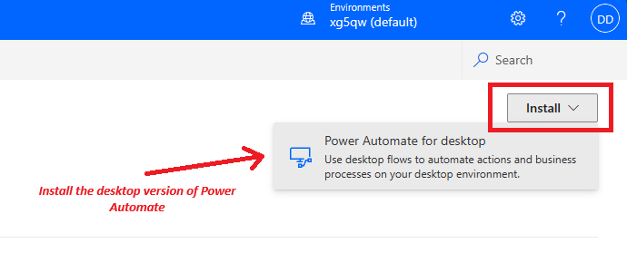
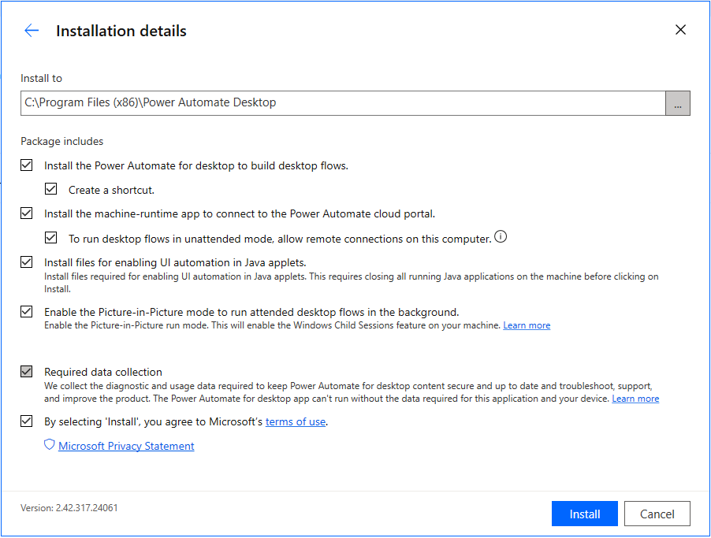

<h2 style="color: #003366;">Microsoft Power Platform</h2>

<h3 style="color: #4C9A2A;">Key Products</h3>

<ul>
  <li>Power Apps - For web and mobile apps</li>
  <li>Power Automate - Workflows to automate work tasks</li>
  <li>Power BI - Data dashboards and reports</li>
  <li>Power Pages - For websites</li>
</ul>

<h3 style="color: #4C9A2A;">Supporting Tools</h3>

<ul>
  <li>Copilot Studio - Tool to automate the automate</li>
  <li>Connectors - Connect to Dropbox, Twitter, etc. Approx 900.</li>
  <li>AI Builder - Add AI functionality to Power Automate and Power Apps</li>
  <li>Dataverse - Backend data for Power Platform</li>
  <li>Power FX - Programming language for Power Platform</li>
</ul>

## A typical power platform project

<table style="background-color: #F7F7F7; color: #333333; width: 100%;">
  <thead style="background-color: #4C9A2A; color: #FFFFFF;">
    <tr>
      <th>Step</th>
      <th>Process</th>
      <th>Service</th>
    </tr>
  </thead>
  <tbody>
    <tr style="color: #FF8C00;">
      <td>1</td>
      <td>Receive invoice emails</td>
      <td>Office 365 Outlook</td>
    </tr>
    <tr style="color: #008080;">
      <td>2</td>
      <td>Store attachments in SharePoint</td>
      <td>Microsoft SharePoint</td>
    </tr>
    <tr style="color: #800080;">
      <td>3</td>
      <td>Send for approval in Teams</td>
      <td>Microsoft Teams</td>
    </tr>
    <tr style="color: #4169E1;">
      <td>4</td>
      <td>Enter approved invoices in ERP</td>
      <td>Oracle</td>
    </tr>
    <tr style="color: #B22222;">
      <td>5</td>
      <td>Send confirmation email</td>
      <td>Office 365 Outlook</td>
    </tr>
  </tbody>
</table>

---

Setup a Power Automate Enviornment. It like a workspace, it stores data, apps and power automate flows.

Go to Power Platform Admin Center: https://admin.powerplatform.microsoft.com/environments/

I already have a E365 developer license. Hence it has created a default enviornment with my user name(xg5qw )

 

Now, click on the environment to load it then click on Add database, then Add

Now, we will install the Power Automate Desktop.

1. Go to flow.microsoft.com(old) or make.powerautomate.com(new)
2. Click on My Flows

Now click on the Install to Install Power Automate Desktop Version

Go with the defaults, or customize the installation:

---