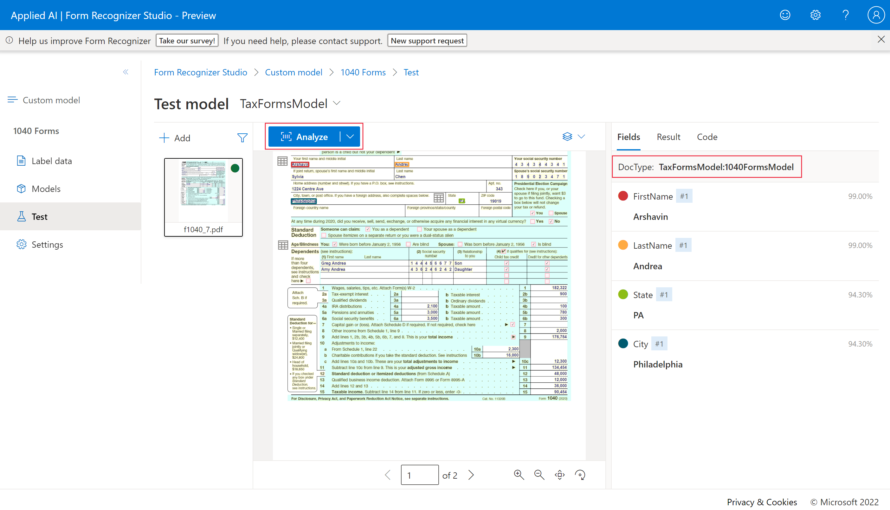

1. You have a composed model that consists of three custom models. You're writing code that sends forms to the composed model and you need to check which of the custom models was used to analyze each form. Which property should you use from the returned JSON? 

modelId.
status.
docType.

Ans: docType.
Explanation: The docType property includes the model ID of the custom model that was used to analyze the document.

2. You're trying to create a composed model but you're receiving an error. Which of the following should you check? 

That the custom models were trained with labels.
That the custom models all have the same model ID.
That the custom models all have the same list of fields.

Ans: That the custom models were trained with labels.
Explanation: Only custom models that have been trained with labeled example forms can be added to a composed model

1. You have a large set of documents with varying structures that contain customer name and address information. You want to extract entities for each customer. Which prebuilt model should you use? 

Read model.
General document model.
ID document model.

Answer: General document model.
Explanation: The general document model is the only one that supports entity extraction.

2. You are using the prebuilt layout model to analyze a document with many checkboxes. You want to find out whether each box is checked or empty. What object should you use in the returned JSON code? 

Selection marks.
Bounding boxes.
Confidence indicators.

Answer: Selection marks.

Explanation: Selection marks record checkboxes and radio buttons and include whether they're selected or not.

3. You submit a Word document to the Azure AI Document Intelligence general document model for analysis but you receive an error. The file is A4 size, contains 1 MB of data, and is not password-protected. How should you resolve the error? 

Change from the free tier to the standard tier.
Submit the document one page at a time.
Convert the document to PDF format.

Answer: Convert the document to PDF format.
Explanation: Word documents are not supported by Azure AI Document Intelligence but PDF documents are supported. Azure AI Document Intelligence is **designed to analyze scanned and photographed paper documents**, not documents that are already in a digital format so you should consider using another technology to extract the data in Word documents.

1. A person plans to use an Azure Document Intelligence prebuilt invoice model. To extract document data using the model, what are two calls they need to make to the API? 

Train Model and Get Model Labels
Analyze Invoice and Get Analyze Invoice Result
Create Azure Document Intelligence and Get Analyze Invoice Result

Answer: Analyze Invoice and Get Analyze Invoice Result
Explanation: The Analyze Invoice function starts the form analysis and returns a result ID, which they can pass in a subsequent call to the Get Analyze Invoice Result function to retrieve the results.

2. A person needs to build an application that submits expense claims and extracts the merchant, date, and total from scanned receipts. What's the best way to do this? 

Use the Read API of the Computer Vision service.
Use Azure Document Intelligence's Layout service
Use Azure Document Intelligence's prebuilt receipts model

Answer: Use Azure Document Intelligence's prebuilt receipts model
Explanation: Use the Azure Document Intelligence's prebuilt receipts model. It can intelligently extract the required fields even if the scanned receipts have different names in them.

3. A person is building a custom model with Azure Document Intelligence services. What is required to train a model? 

Along with the form to analyze, JSON files need to be provided.
Training must be done through language specific SDKs.
Nothing else is required.

Answer: Along with the form to analyze, JSON files need to be provided.
Explanation: The labels needed in training are referenced in the ocr.json files, labels.json files, and single fields.json file.

