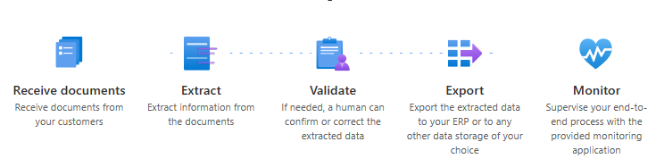
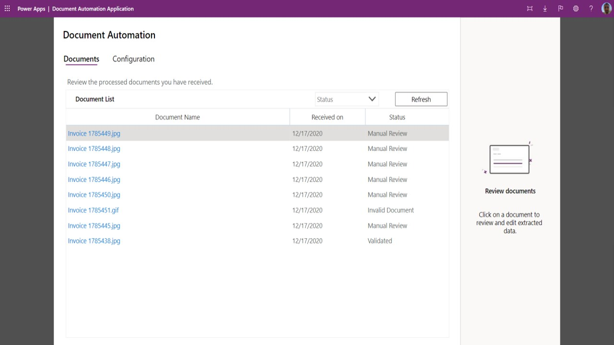
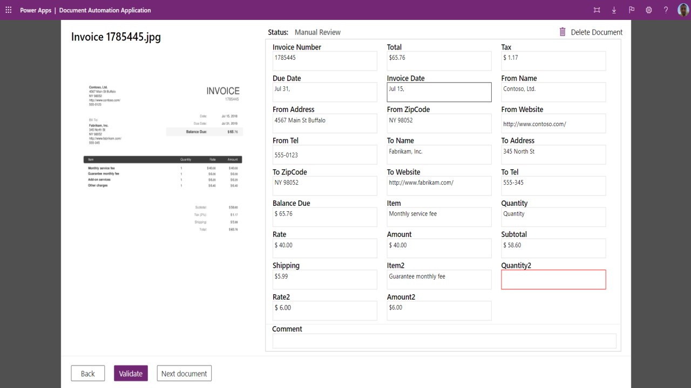

- [Background](#background)
- [How its done traditionally](#how-its-done-traditionally)
- [Enter Power Platform's AI Builder](#enter-power-platforms-ai-builder)
- [Introduing Document automation base kit](#introduing-document-automation-base-kit)
- [Conclusion](#conclusion)

# Background
This article may be beneficial for ECM and Data Capture specialists exploring alternative solutions offered by Power Platform to traditional Document Capture tools such as Captiva InputAccel (OpenText Intelligent Capture), Kofax Capture, and IBM Datacap.
# How its done traditionally
In most major banks, insurance companies, and pharmaceutical organizations, document capture tools like OpenText Intelligent Capture or Kofax are utilized to capture documents from scanners, emails, and other sources. These tools extract metadata and then forward both the documents and metadata to backend ECM systems such as OpenText Documentum, IBM FileNet, or SharePoint.

<figure>
  
  <figcaption>Multi-channel capture using traditional products</figcaption>
</figure>

A key feature of these Document Capture products is their capability to automatically classify and extract information, allowing users to validate this information.
<figure>
  
  <figcaption>Captiva Document Processing Modules</figcaption>
</figure>
OpenText facilitates this process through modules like ScanPlus for capture, Classification for automatic classification, Extraction for metadata extraction, and IndexPlus/Completion for manual validation.
Over the past two decades, EMC Captiva, Kofax, and now OpenText Intelligent Capture have dominated the market. These products have been widely adopted across large banks, insurance corporations, and the pharmaceutical sector.
<figure>
  
  <figcaption>Captiva Capture provides a centralized development tool called Captiva Designer for creating,
configuring, deploying, and testing the capture system end-to-end..</figcaption>
</figure>

# Enter Power Platform's AI Builder
In recent years, Microsoft has made notable strides in the Document Capture market. I've demonstrated how straightforward it is to develop a workflow using Power Automate and AI Builder that extracts data from fixed-template documents like passports and driving licenses.

AI Builder also provides ready-to-use models for processing standard documents such as invoices and receipts, which can be utilized as they are or customized with ease.

For instance, if you need to extract information from Singapore NRIC or Indian PAN Cards, you only need about 5 sample images in PNG or JPEG format. Simply create the fields and outline the areas you want AI Builder to recognize and extract. It takes less than 30 minutes to create a custom model if your documents adhere to a very standard fixed template.

While this capability is powerful, it does not include an operator-based validation feature, which means the extracted data might not always be 100% accurate.
However, you can deisgn a solution for that too. You can create an end-to-end solution that combines a Power Automate workflow for data extraction using AI Builder, Power Apps for manual validation, and Dataverse or SharePoint to manage storage and indexing queues. Yet, building such a solution from scratch can be complex.

# Introduing Document automation base kit

Microsoft now offers a **Document Automation Base**—a ready-to-use, complete solution that includes AI Builder, Power Automate, and Power Apps for document capture, extraction, and validation.

**Document automation base** solution has these components:

**Email Importer Flow:** 
Documents received by email are imported for processing. If you receive documents differently, you can adjust this to collect documents from places like SharePoint or cloud storage.

**Document Processor Flow:** 
This step uses AI to extract data from the documents. It triggers when a document reaches the 'Extracting data' state in the queue. The data extracted by the AI is then stored in Dataverse, a storage system.

**Validator Flow:** 
This flow adds business rules to the process. It starts after the data has been extracted and stored. If the data meets certain criteria (like confidence levels or specific data thresholds), it might be approved automatically; otherwise, it goes for manual review. By default, this step does not have preset rules and sends all documents for manual review.

**Automation Application:** 
This is where manual review and approval of documents take place. Users can see all documents in the pipeline, open them to view the data, make necessary edits, and approve them. This application also allows the process owner to configure the AI model and track documents through various states from receiving and extracting to validating and final approval.

# Conclusion
The key question is whether the Power Platform's AI-Builder and related solutions can effectively handle real-world document processing in sectors like banking.

From my observations, the Power Platform may not be suitable for large-scale scanning where industrial scanners are linked to desktops and data validation is performed by dedicated operators, typical of setups outsourced to third-party operators like Iron Mountain. Power Automate lacks support for scanner-connected setups and may struggle with high-volume scanning due to its web-based nature. However, it could work for processes involving already digitized documents needing OCR processing and ECM integration. While solutions like OpenText Intelligent Capture’s web-based Captiva Capture Web Client might be partly replaceable by Power Automate, the durability of AI Builder's OCR engines compared to established ones like Nuance OCR from Captiva is less certain.

Below, you'll find a table comparing traditional scanning products with the Power Platform's solutions.

| Feature / Module                        | Microsoft Power Platform Document Automation Base Kit    | OpenText Intelligent Capture   |
|-----------------------------------------|----------------------------------------------------------|--------------------------------|
| **Document Import**                     | Email import, SharePoint and cloud storage integration.  | Modules like ScanPlus and Standard Import handle various sources including emails, MFP, Fax, browser-connected scanners etc.. |
| **AI-Powered Data Extraction**          | AI Builder for configurable data extraction.             | Uses modules like NuanceOCR, Classification, Recognition and IndexPlus for OCR, classification, and data extraction from various document types. |
| **OCR Engine**                          | Built-in OCR capabilities within AI Builder.             | NuanceOCR for high-accuracy OCR, capable of handling both machine-printed and handwritten texts. |
| **Data Storage and Management**         | Uses Dataverse for data management and storage.          | Focuses on processing and exporting data; does not typically store documents long-term. |
| **Process Customization**               | Customizable through Power Apps for various workflows.   | Extensive customization options with C#/VB.NET scripting, advanced recognition settings, and use of RESTful services. |
| **Validation and Review**               | Validator flow for manual and automated data validation. | Modules like IndexPlus, Completion for manual review and validation, with robust tools for automated data validation. |
| **Business Rule Application**           | Validator flow for applying business rules.             | Advanced scripting capabilities for applying complex business logic through modules like IndexPlus. |
| **Integration with Other Systems**      | Limitless integration capability with M365 and Azure ecosystem            | Ready-made modules like Documentum Export, SharePoint Export, XML Export, SAP Export, makes it very easy to integrate with ECM, ERP, BPM systems. |
| **User Interface and Experience**       | Power Apps-based centralized application.                | Mostly windows desktop applications also browser based application like Captiva Web  Client. |
| **Specific Modules**                    | Import, AI Extraction, Validation, and Review modules.   | Comprehensive suite including ScanPlus, IndexPlus, Completion, Web Services Input/Output, and more. |
| **Scalability and Distribution**        | Auto-scalling. | ScaleServer for load distribution and clustering for HA and DR. |