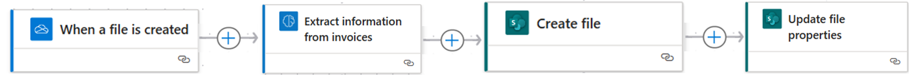
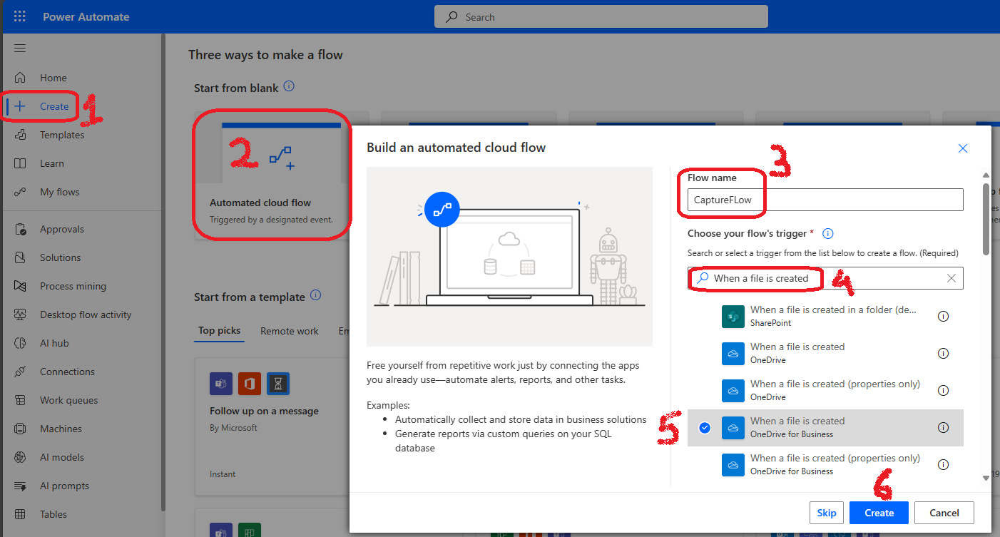
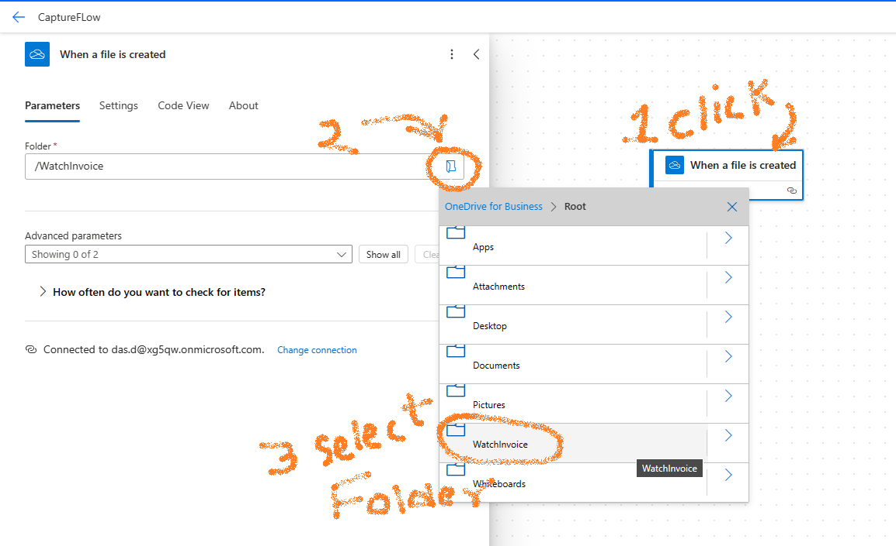
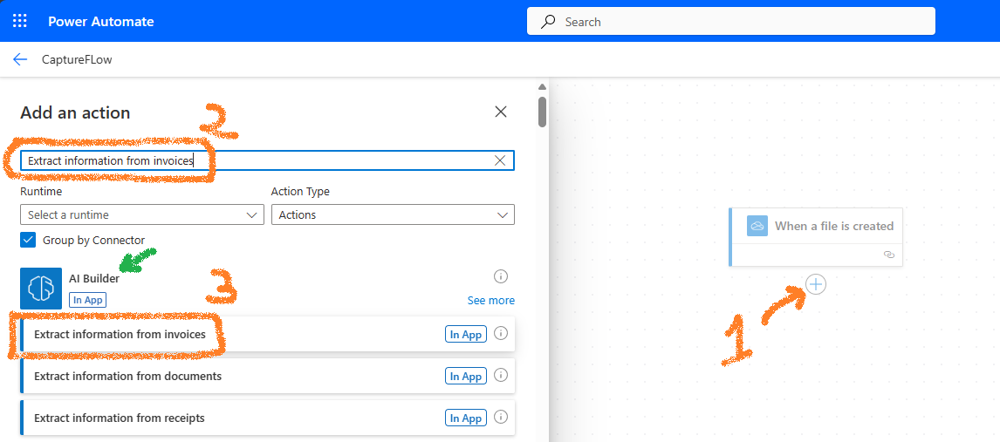
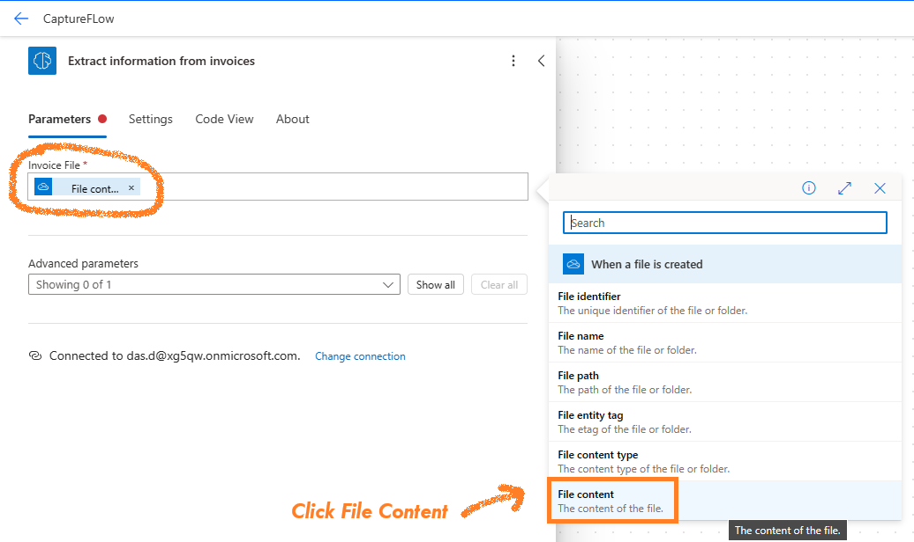
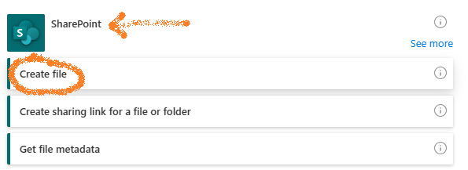
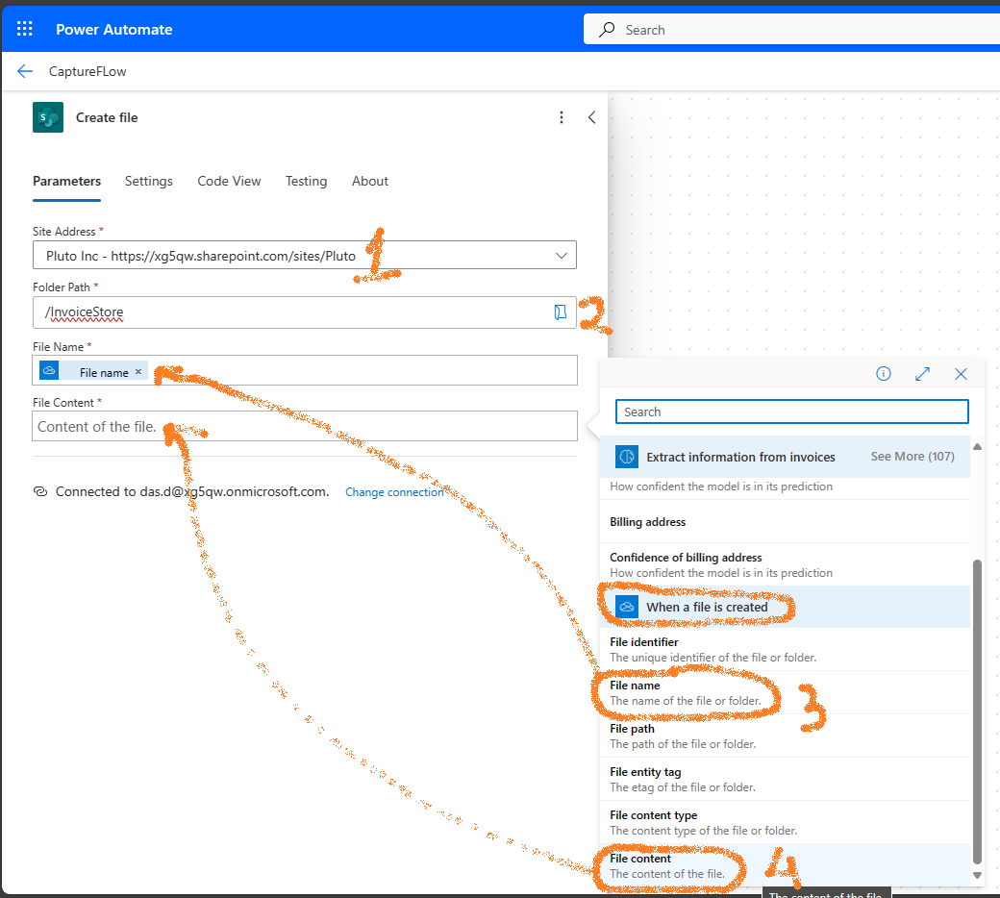
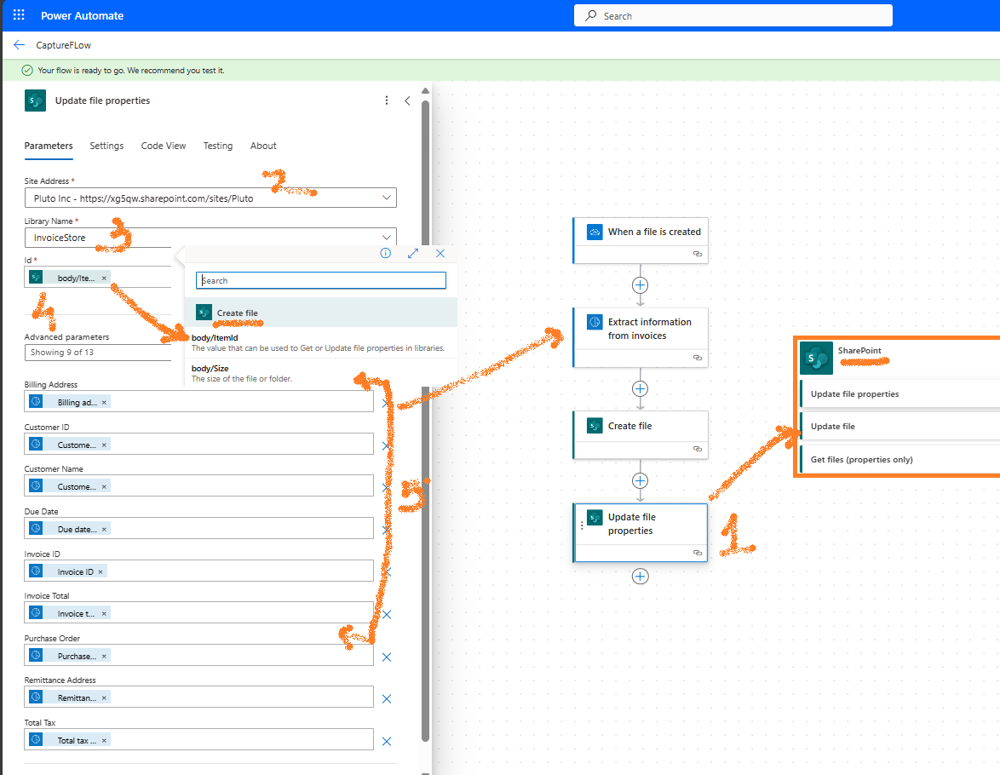
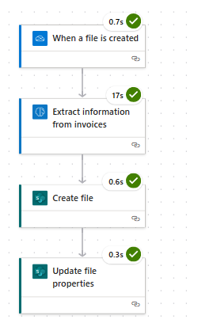
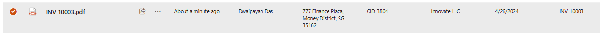

- [Overview](#overview)
  - [Traditional method of document capture ](#traditional-method-of-document-capture-)
  - [Alternative method - using Power Platform ](#alternative-method---using-power-platform-)
  - [Let's get started](#lets-get-started)
    - [Our Workflow](#our-workflow)
    - [How to Create the Workflow](#how-to-create-the-workflow)
  - [Conclusion](#conclusion)
  - [Further Reading](#further-reading)

# Overview

Image capture and extraction workflows are heavily used in the Banking and Insurance sectors. Almost all institutions use products like OpenText inteligent capture, Kofax Capture, Datacap  etc to Capture documents from multiple channels and store them in backend ECM systems like Opentext content server, SharePoint server etc.

## Traditional method of document capture 

In the banking and insurance sectors, the usual way to handle document capture is shown in the diagram below:

## Alternative method - using Power Platform 

I'll demonstrate how you can use Power Platform to achieve some of these functions easily. I'll guide you through a simplified solution to get started with this approach.

## Let's get started

### Our Workflow

This guide outlines how to capture and extract data from invoices and store them in SharePoint using a simple workflow. Invoices are placed in a dedicated folder on OneDrive and processed automatically when a new file is detected by the Power Automate OneDrive trigger.

### How to Create the Workflow

Follow these steps to set up the automated workflow:

1. In Power Automate, click **+ Create** > **Automated cloud flow**. Provide a flow name, enter **When a file is created** in the search box, and then select **When a file is created (OneDrive for Business)**.

   

2. Click on **Next Step**, then **+ New step**. To specify the folder to monitor, click on the folder icon under **Parameters** and select the OneDrive folder that will contain the invoices.

   

3. Click **+ Add an action**, search for **Extract information from invoice**, and select **AI Builder** > **Extract information from invoices**.

   

4. Configure the **Extract information from invoices** step by clicking on it and then selecting the **Parameters** tab. For **Invoice File**, click the lightning bolt icon , then select **File content**.

   

5. Add another action by selecting **SharePoint** > **Create file**.

   

6. Configure the **Create file** action with the following details:
   - **Site Address**: Enter the SharePoint site URL where the document library is located.
   - **Folder Path**: Choose the document library.
   - **File Name**: Select **When a file is created** > **File name**.
   - **File Content**: Choose **When a file is created** > **File content**.

   

7. Add an action for **SharePoint** > **Update file properties**. Configure it by providing:
   - The site address hosting the document library.
   - The document library from the dropdown menu.
   - **Id**: Select **Create file** > **body** > **ItemId**.
   - Map the properties of the document with values extracted from the invoice in the previous steps.

   

8. To test the flow, click **Test**, opt for a manual test, and place a file in the monitored OneDrive folder. After a short period, the flow will trigger, and the SharePoint library will be updated with the document and all extracted metadata.

   

Below is how the file will appear in the document library, showcasing the extracted metadata:

## Conclusion

Choosing between AI-based methods and traditional document capture software like Kofax Capture or Captiva Capture involves a careful evaluation of various factors:

- **Licensing Costs**: Traditional software often has licensing fees based on usage volume. For instance, a Kofax Capture license for processing 100,000 pages annually may cost approximately $16,526.00 [Kofax Capture License Cost](https://www.shi.com/product/42180951/Kofax-Capture-License).
  
- **Functionality and Modules**: OpenText Intelligent Capture (formerly Captiva) includes a suite of modules designed for different aspects of document handling, such as Standard Import, Standard Export, and Completion (for manual verification), as well as eInput (for browser-based capture). These features may integrate seamlessly into the workflow of financial or insurance environments, offering out-of-the-box solutions.

- **Integration and Customization**: Microsoft Power Automate allows for the creation of customized document capture workflows, which can be advantageous for those already utilizing the Microsoft 365 platform. It offers a way to avoid substantial licensing fees while still achieving a high level of functionality.

- **Scan-to-network-folder**: A very typical document capture is to scan to a network folder and use Captiv standard import to crate batches. I have seen that this workflow can be easily created using Power Autoamte. All you have to do is configure your scanner to scan to the oneDrive folder.

**Long story short:** The decision hinges on your company's specific needs, existing infrastructure, and budget. For future reference, should this subject arise, consider conducting a POC to show the power of Power Automate to your management team and let them take a call!

## Further Reading

[Use the invoice processing prebuilt model in Power Automate](https://learn.microsoft.com/en-us/ai-builder/flow-invoice-processing#output).
