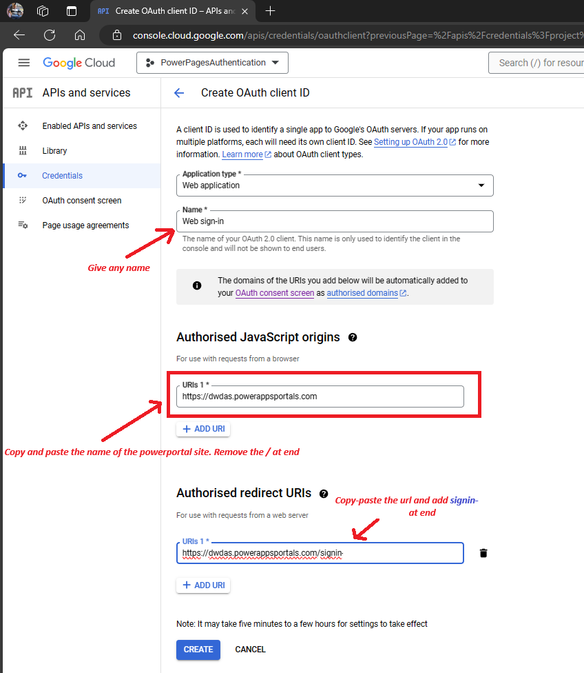

- [Overview](#overview)
  - [Steps to follow](#steps-to-follow)
    - [Set up Google in Power Pages](#set-up-google-in-power-pages)
    - [Register an App in Google](#register-an-app-in-google)
      - [Add the API](#add-the-api)
      - [Set up your consent screen](#set-up-your-consent-screen)
      - [Enter your top-level domain](#enter-your-top-level-domain)
      - [Add credentials](#add-credentials)
    - [Enter site settings in Power Pages](#enter-site-settings-in-power-pages)
    - [Appendix](#appendix)

# Overview

Power Apps portals & Dynamics 365 portals are now called Power Pages. Power Pages websites can be open-to-all or you can have register/sign-in using Google, LinkedIn, Twitter, and Facebook.

Here, I will show you how to use Google sign-in on your Power Pages websites. The protocol behind this is OAuth2.0. Using this Google allow users to access your site using their google accounts without exposing their userid/passwords.

## Steps to follow

### Set up Google in Power Pages

1.  In your Power Pages site, select **Set up** > **Identity providers**.

2.  **Google** > **More Commands** (**…**) > **Configure**.

3.  Select **Next**.
4.  Under **Reply URL**, select **Copy**.
5.  Select **Open Google**.

### Register an App in Google

#### Add the API
1.  Open the [Google Developers Console](https://console.developers.google.com/). And create an API project.

2.  In the left side panel, select **APIs & Services**.
3.  Select **\+ Enable APIs and Services**.

4.  Search for and enable **Google People API**.

#### Set up your consent screen
1.  In the left side panel, select **Credentials** > **Configure consent screen**.

2.  Select the **External** user type and click **Create**.
3.  Enter the name of the application and select your organization's user support email address.
4.  Upload a logo image file if necessary.
5.  Enter the URLs of your site's home page, privacy policy, and terms of service, if applicable.
6.  Enter an email address where Google can send you developer notifications.

#### Enter your top-level domain
1.  Under **Authorized domains**, select **\+ Add Domain**.
2.  Enter your site's top-level domain; for example, `powerappsportals.com`.
3.  Select **Save and Continue**.

#### Add credentials
1.  In the left side panel, select **Credentials**.
2.  Select **Create credentials** > **OAuth client ID**.

3.  Select **Web application** as the application type.
4.  Enter any name e.g. `Web sign-in`. This is internal. Not shown.
5.  Under **Authorized JavaScript origins**, select **\+ Add URI**.
6.  Enter your site's URL; for example, `https://mySite.powerappsportals.com`.
7.  Under **Authorized redirect URIs**, select **\+ Add URI**.
8.  Enter your site's URL followed by `/signin`; for example, `https://mySite.powerappsportals.com/signin`.

9.  Select **Create**.
10.  In the **OAuth client created** window, select the copy icons to copy the **Client ID** and **Client secret**.

11.   Click **CLOSE**.

### Enter site settings in Power Pages

1.  Return to the Power Pages **Configure identity provider** page you left earlier.
2.  Under **Configure site settings**, paste the following values:
    *   **Client ID​**: Paste the **Client ID** [you copied](#add-credentials).
    *   **Client secret**: Paste the **Client secret** you copied.

3. Click **Continue** then **Close**

### Appendix

How to open Power Page Design Studio

- Go to Power Pages(https://make.powerpages.microsoft.com/)

- Select the Microsoft Dataverse environment

- Locate your site in the Active sites list.

