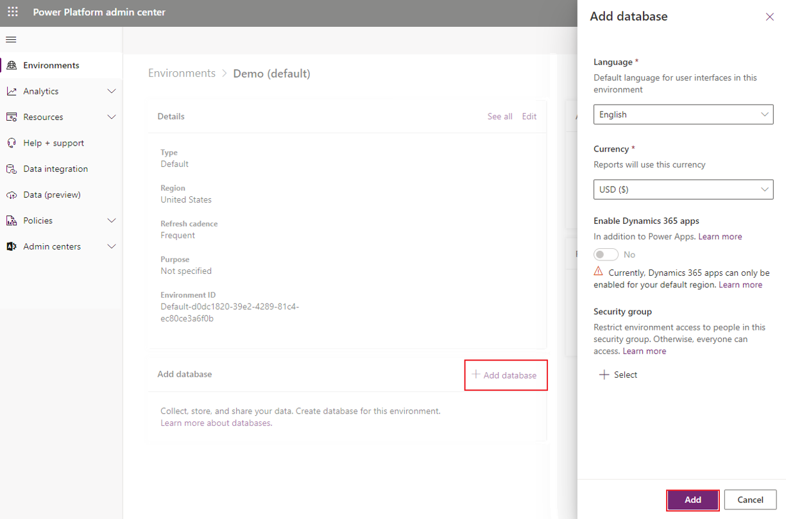

<h2 style="color: #003366;">Microsoft Power Platform</h2>

<h3 style="color: #4C9A2A;">Key Products</h3>

<ul>
  <li>Power Apps - For web and mobile apps</li>
  <li>Power Automate - Workflows to automate work tasks</li>
  <li>Power BI - Data dashboards and reports</li>
  <li>Power Pages - For websites</li>
</ul>

<h3 style="color: #4C9A2A;">Supporting Tools</h3>

<ul>
  <li>Copilot Studio - Tool to automate the automate</li>
  <li>Connectors - Connect to Dropbox, Twitter, etc. Approx 900.</li>
  <li>AI Builder - Add AI functionality to Power Automate and Power Apps</li>
  <li>Dataverse - Backend data for Power Platform</li>
  <li>Power FX - Programming language for Power Platform</li>
</ul>

## A typical power platform project

<table style="background-color: #F7F7F7; color: #333333; width: 100%;">
  <thead style="background-color: #4C9A2A; color: #4169E1;">
    <tr>
      <th>Step</th>
      <th>Process</th>
      <th>Service</th>
    </tr>
  </thead>
  <tbody>
    <tr style="color: #FF8C00;">
      <td>1</td>
      <td>Receive invoice emails from vendors</td>
      <td>Office 365 Outlook</td>
    </tr>
    <tr style="color: #008080;">
      <td>2</td>
      <td>Store attachments in SharePoint</td>
      <td>Microsoft SharePoint</td>
    </tr>
    <tr style="color: #800080;">
      <td>3</td>
      <td>Send for approval in Teams</td>
      <td>Microsoft Teams</td>
    </tr>
    <tr style="color: #4169E1;">
      <td>4</td>
      <td>Enter approved invoices in ERP</td>
      <td>Oracle</td>
    </tr>
    <tr style="color: #B22222;">
      <td>5</td>
      <td>Send confirmation email to vendors</td>
      <td>Office 365 Outlook</td>
    </tr>
  </tbody>
</table>

## Dataverse

- Dataverse ~ Power Platform DB.
- Tables: Standard(OOTB), managed(part of a solution, read-only), custom
- 4TB  storage limit
- You can apply business logic to tables! E.g. If country is US, then postal code mandatory.

## Copilot

This is like GPT4/Bing. Here, you just say in plain English what you want. CoPilot will create the power automate/App for you!

## Copilot Studio

Now using Copilot it becomes easy to create a working bot without the complexity which was there earlier.

## Power FX

This is the language of PowerPlatform. It's like Excel formulas. Its used in PowerApps, Dataverse and Copilot Studio.

## Power Platform and Microsoft Teams

All power platform components can be used from within MS Teams.

## Power Platform & Dynamics 365

- Power Apps: All Dynamics 365 customer engagement apps are model-driven apps(built in PowerApps). - The data for such apps is in Dataverse. 
- Power BI: Can create reports from Dynamics 365
- Power Automate: Business process flows are creating using Power Automate.
- Copilot Studio: Call/SMS/Facebook Msgs -> Dynamics 365 Customer Service App -> Copilot -> Live agent
- Power Pages: Self-support web sites.

## Power Platform and Azure

Power Platform and Azure offer countless ways to create end-to-end solutions. Take, for instance, an airline project where:

- Azure API Management hosts a custom API for airline system communication.
- A coordinator handles notifications, assigns flights to Teams channels, and sends them to Power Apps.
- Azure Functions process Graph API calls from a storage queue, sending notifications to Teams and streaming events to Azure Event Hubs.
- Azure Bot Service powers a custom bot messaging service for flight updates in Teams.
- Azure Data Lake stores event data from Event Hubs for long-term retention and analytics with Power BI.

## Dataverse OOTB features

Here is a picture showing OOTB features of Dataverse

## Dataflows

- ETL tool for PowerPlatform Ecosystem
- Uses very less code
- Uses power query(Like Excel)
- No infra required, fully on cloud
- No sep license, use Power BI / Power Apps license

## Common Data Model

Common Data Model as a ready-made collection of tables. Say for healthcare you have patient table and a admission table. With this you don't have to design tables and choose columns. Microsoft has partnered with industries like Healthcare, automobile, banking to create CDM.

## Power Platform connectors - Connect PP with other Apps

## Dataverse tables

## Dataverse vs. MSSQL

| Feature | Dataverse | MSSQL |
|---|---|---|
|**Focus** | Business Applications | Data Management |
|**Schema** | Flexible | Fixed |
|**Data Types** | Limited | Complete |
|**Relationships** | Built-in | Foreign Keys |
|**Data Manipulation** | User-friendly interface, low-code | T-SQL, Programming Languages |
|**Security** | Role-Based Access Control | Manual Setup |
|**Table Types** | Standard, Custom, Virtual, Elastic | Base, Temporary, Views, Table-Valued Functions |
|**Views** | Limited (Virtual Tables) | Traditional Views |
|**Business Logic (Table Level)** | Power Automate Workflows | Stored Procedures, Triggers |
|**Business Logic (Column Level)** | Validation Rules, Workflows | Constraints, Triggers |

---

Setup a Power Automate Enviornment. It like a workspace, it stores data, apps and power automate flows.

Go to Power Platform Admin Center: https://admin.powerplatform.microsoft.com/environments/

I already have a E365 developer license. Hence it has created a default enviornment with my user name(xg5qw )

 

Now, click on the environment to load it then click on Add database, then Add

Now, we will install the Power Automate Desktop.

1. Go to flow.microsoft.com(old) or make.powerautomate.com(new)
2. Click on My Flows

Now click on the Install to Install Power Automate Desktop Version

Go with the defaults, or customize the installation:

---