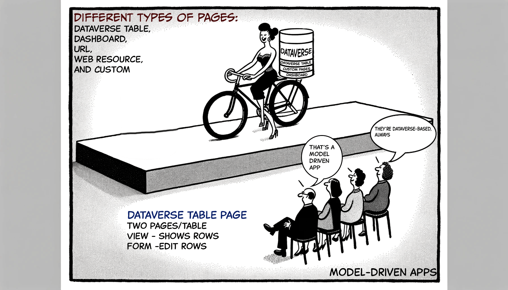

- [What are model-driven apps?](#what-are-model-driven-apps)

### What are model-driven apps?

In canvas apps you have complete control over everything. In model-driven apps the layout done already  on the components you choose.

Canvas apps are built screen-by-screen. Model-driven apps are created with few simple steps.

Remember: Canvas apps can have many data sources. Model-driven apps **must** be on dataverse tables.

Model-driven apps start with a page:

Different types of pages are Dataverse table, Dashboard, URL, Web resource, and Custom

Remember: Two pages for each Dataverse table

