# On-Premise to Cloud ETL Using DataFlows & On-Premise Gateway

## Background

Case Study: We have a large number of xml files in a local folder. We want to move it to Dataverse. In this article I will show you how you can do it using on-premise gateway and Dataflow in Power platform. This ETL is particularly  useful in bank settings where xml files from many sources like right-fax servers are recieved and they have to be moved to backend database.Even though its not a full-solution as rightfax servers also send documents along with control files. But, the document part can be handled seprately handled.

## What is an On-Premise Gateway?

An on-premise gateway is software installed on a local system that enables access to local files and databases from Power BI, Power Apps, Power Automate, Azure Analysis Services, and Azure Logic Apps. There are two modes available: Personal, which allows use only with Power BI, and Standard, which supports all mentioned applications. Installation requirements include Windows 10 (64-bit) or Windows Server 2019 and .NET Framework 4.8. Note that these requirements may change in the future.

## Installing the Gateway

- Download the standard gateway.

- In the gateway installer, maintain the default installation path, accept the terms of use, and then select "Install."

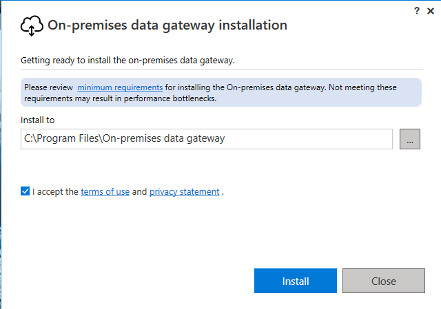

- Enter the email address associated with your Office 365 organizational account and select "Sign in."

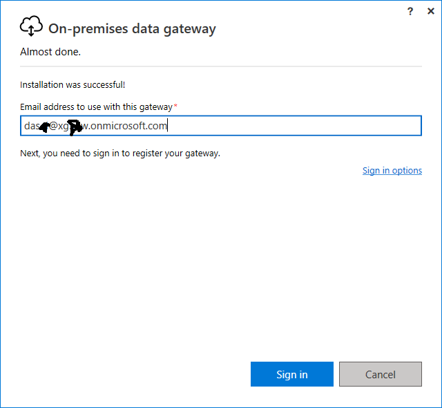

- Choose "Register a new gateway on this computer" and click "Next."

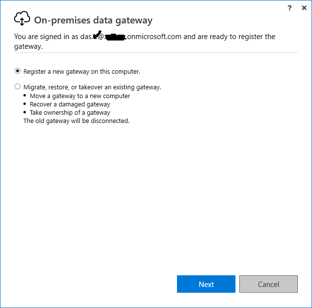

- Enter a unique name for the gateway and a recovery key. This key is crucial for recovering or relocating your gateway in the future. Click "Configure."

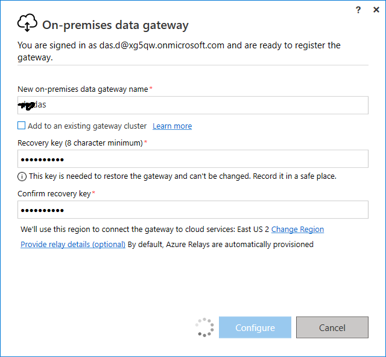

- Review the information in the final window. Since the same account is used for Power BI, Power Apps, and Power Automate, the gateway will be accessible for all three services. Select "Close."

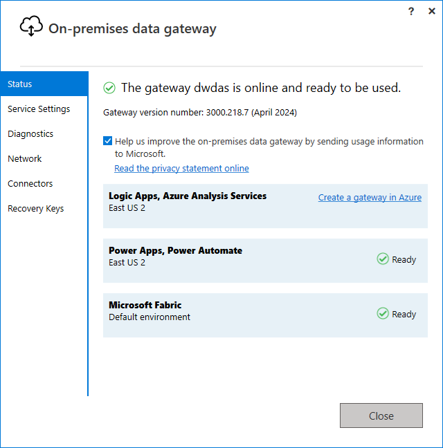

## Use Gateway - Import files from local folder

- Open PowerApps -> Dataflows -> New Dataflow -> Start from Blank -> Provide a name -> Click "Create."

- On the "Get Data" page, click **Folder**.

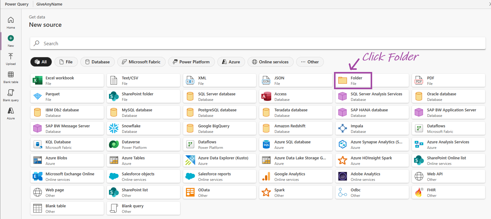

- Provide credentials and choose the source folder on the **Connect to Data Source** page.

- Ensure the account has read/write privileges by checking the folder's properties under the security tab.
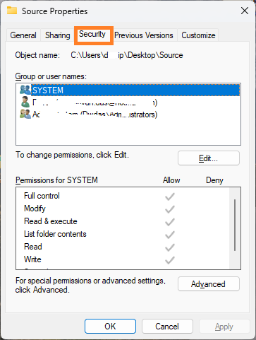

- If all settings are correct, files will be loaded and displayed on the preview page.

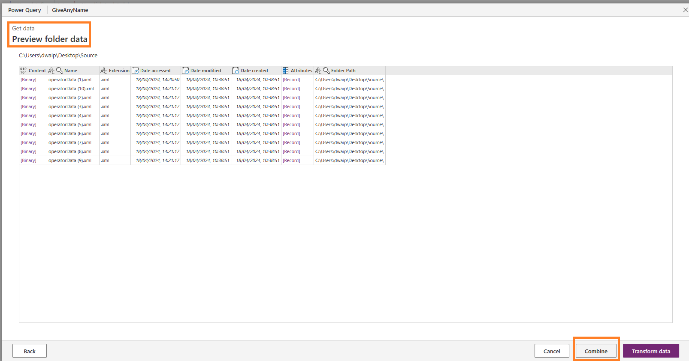

- Click **Combine** or **Transform Data**. In this example, I used **Combine**.

One common issue during XML conversion is that DataFlow assigns its own locale, which is often overlooked during testing but causes the flow to fail during actual execution. To resolve this, go to "Options," select "Regional Settings," choose the appropriate locale (e.g., English (United States)), and click **OK**

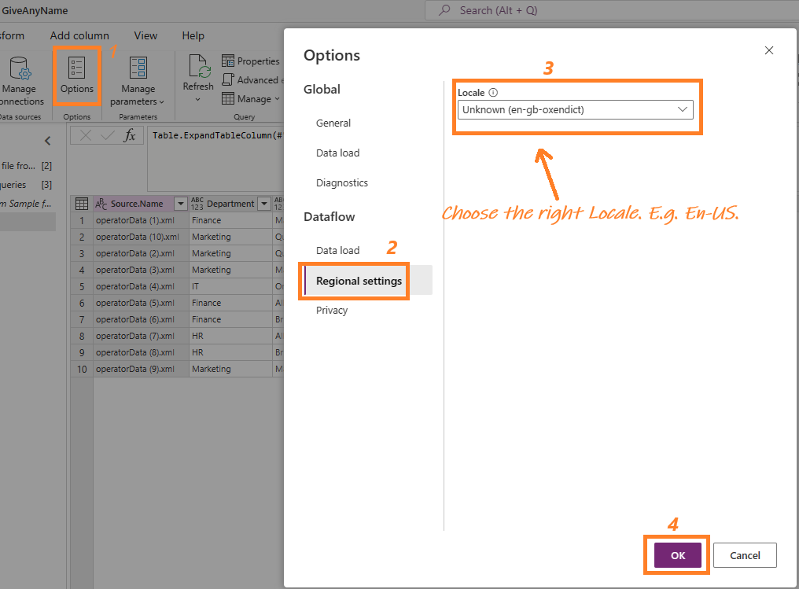

- Then click "Next." This will open the mapping page where you can load data into an existing table or create a new table with automatic mapping. Once you are finished, click "Next."

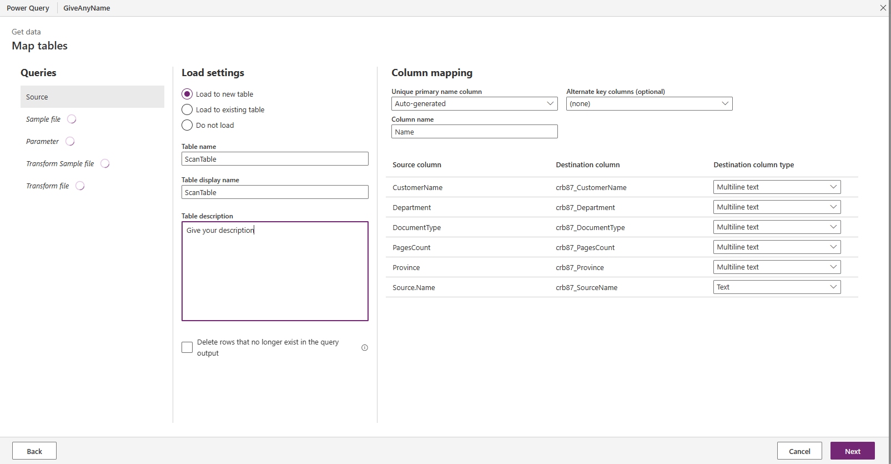

- Now, decide how to run the flow. You can run it ad hoc manually or at a predetermined interval. Once selected, click "Publish" to publish the flow.

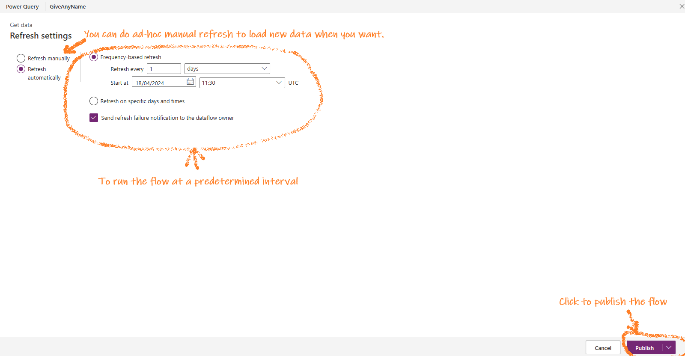

- Once published successfully, you can view your dataflow in the "My DataFlow" tab.

- Since the XML data was exported into Dataverse, you can view the table and its data from the "Tables" page.

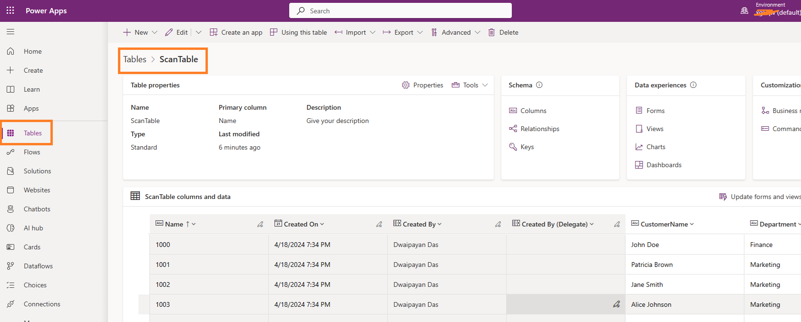

Voila! Your data is now in Dataverse and can be accessed using a wide range of M365 apps.

## Using the Gateway in Microsoft Fabric

You can reuse the gateway! For example, if you want to collaborate:

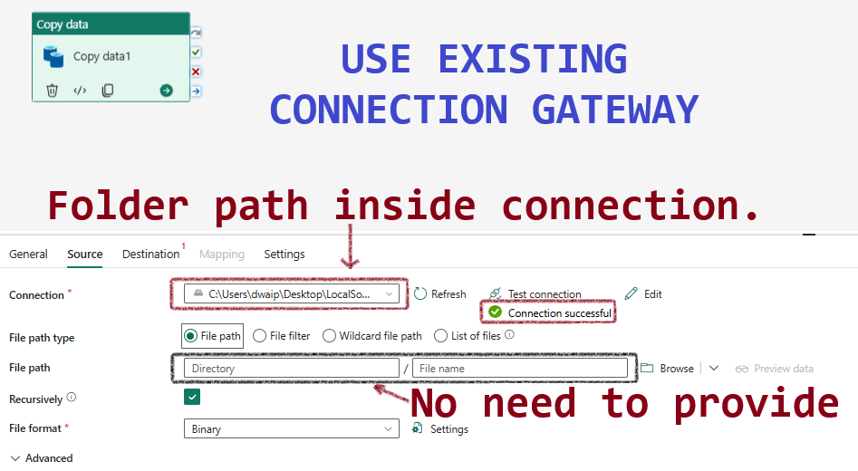

## Troubleshooting

If the connection fails, ensure that your user has the appropriate permissions for the folder:

