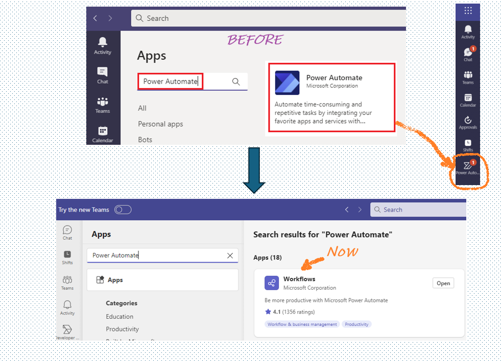
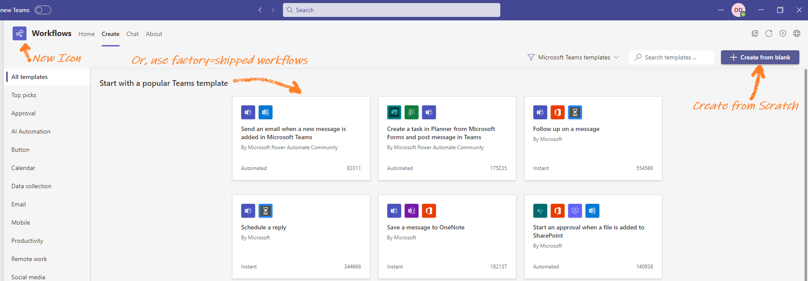
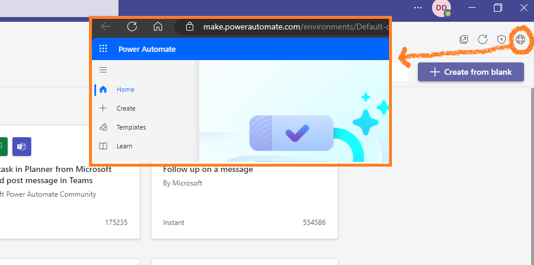
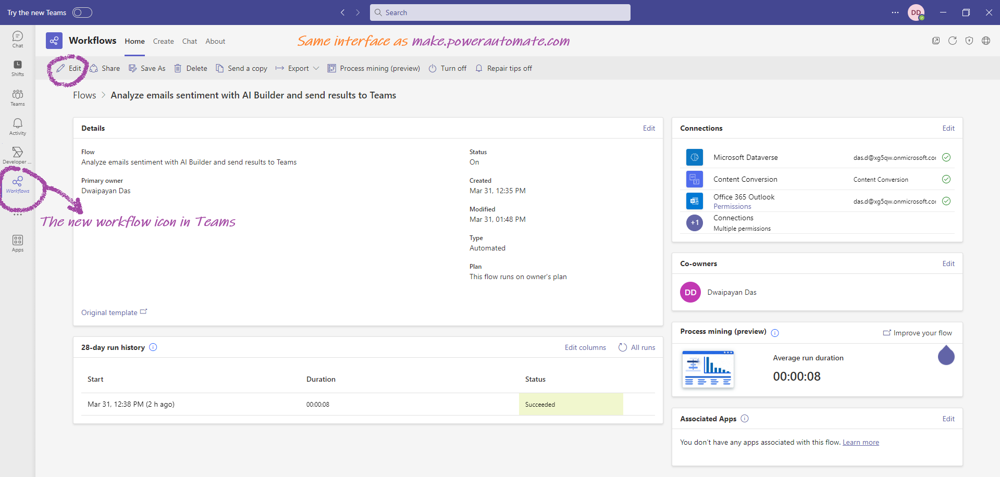

# Workflow = Power Automate(Teams) = make.powerautomate.com

The **Workflow app** within Microsoft Teams seamlessly integrates **Power Automate** directly into your Teams environment. It is the same old Power Automate app for Teams, but renamed as **Workflow**.

## Key Features and Benefits

- Previously known as "Power Automate," the app was rebranded as "Workflow" around November 2023.

- The Workflow app allows you to create Power Automate workflows from scratch or utilize pre-built templates.

- Access these templates directly within Teams, making it convenient to get started with automation.
- All workflows created within the Workflow app are powered by Power Automate.

- The app is completely identical to ***make.powerautomate.com***.

## Getting Started

1. **Install the Workflow App**:
   - Head to the Teams store and search for "Workflow." Install the app to get started.
   - Once installed, you'll find it in your Teams app bar.

2. **Create Your First Workflow**:
   - Click on the Workflow app icon in Teams.
   - Choose to create a new workflow from scratch or explore the available templates.
   - Customize your workflow by adding actions, conditions, and triggers.

## Conclusion

**Workflow = Power Automate(Teams) = *make.powerautomate.com***