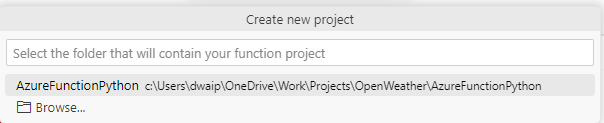
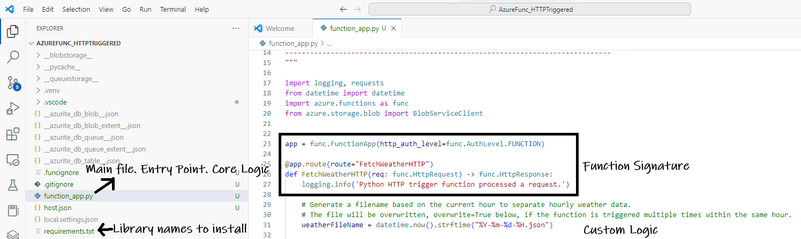
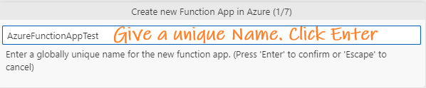
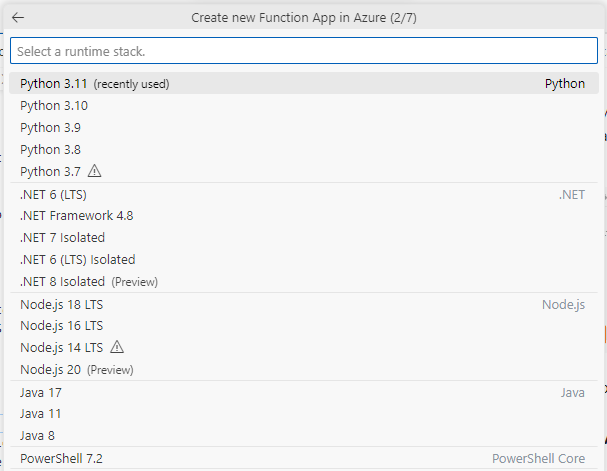
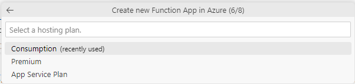
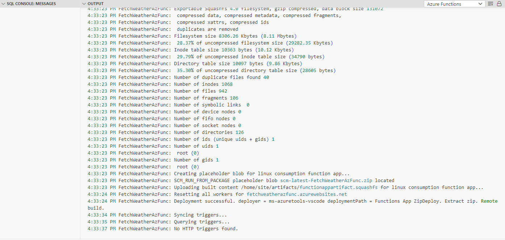
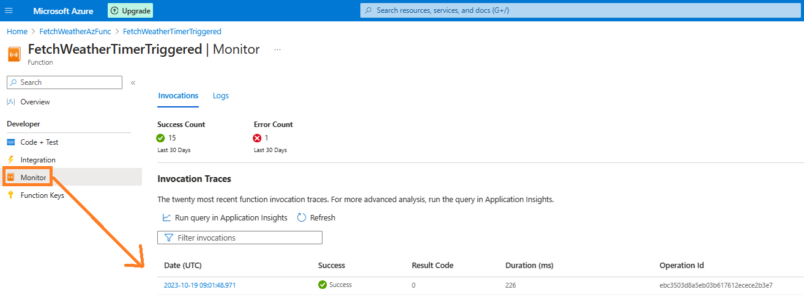

## Table of Contents
- [Project AzureSkyWeather. Part 1A: Using Azure HTTP-Triggered Function](#project-azureskyweather-part-1a-using-azure-http-triggered-function)
  - [Overview](#overview)
  - [Choice of Azure Services For Data Ingestion](#choice-of-azure-services-for-data-ingestion)
  - [Let's ready the prerequisites](#lets-ready-the-prerequisites)
    - [Get the Weather API](#get-the-weather-api)
    - [Set Up Azure Blob(ADLSG2) Storage](#set-up-azure-blobadlsg2-storage)
    - [Create the Azure Function App](#create-the-azure-function-app)
    - [Prepare VS Code and local enviroment for Azure Function Development and Testing](#prepare-vs-code-and-local-enviroment-for-azure-function-development-and-testing)
      - [Azure Functions Extension For Visual Studio Code](#azure-functions-extension-for-visual-studio-code)
      - [Python Extension for Visual Studio Code](#python-extension-for-visual-studio-code)
      - [Azurite](#azurite)
      - [azure-functions SDK](#azure-functions-sdk)
      - [`azure-storage-blob` library for local testing](#azure-storage-blob-library-for-local-testing)
  - [Development and Deploymment](#development-and-deploymment)
    - [Create the Python-based Azure Function](#create-the-python-based-azure-function)
    - [Write our custom logic in the Azure Function](#write-our-custom-logic-in-the-azure-function)
    - [Include  `azure-storage-blob` in requirements.txt](#include--azure-storage-blob-in-requirementstxt)
    - [Test Our Azure Function](#test-our-azure-function)
    - [Create Azure Function App](#create-azure-function-app)
    - [Deploy the Azure Function To The App](#deploy-the-azure-function-to-the-app)
    - [Schedule the Function using Azure Logic Apps](#schedule-the-function-using-azure-logic-apps)
    - [Post-deployment Monitoring](#post-deployment-monitoring)
  - [Common Errors](#common-errors)
    - ["AzureWebJobsStorage" app setting is not present](#azurewebjobsstorage-app-setting-is-not-present)
    - [Logic Apps while trying to add azure function - No resources of this type found under this subscription](#logic-apps-while-trying-to-add-azure-function---no-resources-of-this-type-found-under-this-subscription)
    - [Logic Apps Job shows Running status indefinately](#logic-apps-job-shows-running-status-indefinately)
  - [Appendix](#appendix)
    - [Detailed Project Summary](#detailed-project-summary)
    - [Choice of storage. Why Azure Data Lake?](#choice-of-storage-why-azure-data-lake)
    - [Creating an Azure Functions App Using Azure Portal](#creating-an-azure-functions-app-using-azure-portal)
    - [Azure Function VS-Code Project Folder Structure](#azure-function-vs-code-project-folder-structure)
    - [Structure of the function function\_app.py.](#structure-of-the-function-function_apppy)
    - [Some details of `azure-functions` library](#some-details-of-azure-functions-library)
    - [Azurite Extension](#azurite-extension)
    - [Calculate Azure Logic Apps Cost](#calculate-azure-logic-apps-cost)

---
# Project AzureSkyWeather. Part 1A: Using Azure HTTP-Triggered Function

## Overview

In this project we use an  **Azure HTTP Function** to get the current **weather data** from `weatherapi.com`. Developed in **Visual Studio Code** using the **Python V2 programming model**, it stores data as hourly-named **JSON files** in **Azure Data Lake**. It's **HTTP-triggered**, with **Azure Logic Apps** managing the periodic fetch schedule. The function logs activities and handles errors, and if provided a 'name' in a request, it sends a **personalized greeting**. For a detailed overview, please see the [Comprehensive Project Summary](#Comprehensive-Project-Summary) in the appendix.

## Choice of Azure Services For Data Ingestion

We developed the Azure Function in Visual Studio Code on Windows using the **Python V2 programming model**. The V2 model simplifies Azure Function app development by allowing scheduling, binding, and the entire logic to be written in a main Python file, contrasting with V1 which requires additional setup in a JSON file. We sourced our weather data from **weatherapi.com**, a cost-free option that doesn't require credit card and lets you call the api almost indefinately. HTTP-triggered functions need scheduling, unlike Timer-triggered ones. We managed this with Azure Logic Apps. In terms of cost, the Azure function with a Timer-trigger is the most economical, followed by the HTTP-Triggered Azure function paired with Azure Logic App-based scheduling. For a sample cost breakdown of the Logic App, please refer to the section [Calculate Azure Logic Apps Cost](#Calculate-Azure-Logic-Apps-Cost). Even so, for a simple hourly workflow, the expense remains minimal. It's worth noting that other options, especially Databricks, can be considerably pricier. Similarly, ADF and Synapse can also come at a higher cost. Here's a brief overview of the available options for creating an app like this:

- **Azure Functions (Python V2):** These are ideal for small to moderate workloads and straightforward data retrieval tasks. Most of the logic is self-contained within the main Python file[V2 model], making it a cost-effective, easy-to-build choice.

- **Azure Data Factory or Azure Databricks:** For more complex workflows and efficient handling of larger data volumes, Azure Data Factory and Azure Databricks offer powerful options. However, they may incur higher operational costs due to their capabilities and scalability.

- **Azure Logic Apps:** Positioned between the other options, Azure Logic Apps are suitable for uncomplicated workflows with moderate data volumes, offering a visual workflow designer for easy setup. Their cost varies based on the number of steps. While here we use Azure Functions for core logic and Logic Apps for scheduling, some opt for a single solution, like a timer-triggered Azure App or fully utilizing an Azure Logic App.

## Let's ready the prerequisites

### Get the Weather API

First, create an account at [weatherapi.com](https://www.weatherapi.com/). Then, navigate to [My Account](https://www.weatherapi.com/my/). Copy the API key and keep it handy for later use.


We chose [weatherapi.com](https://www.weatherapi.com/) because it doesn't require sign-ups, and it offers most of the features we needed.
    


### Set Up Azure Blob(ADLSG2) Storage

In the Azure portal, create a resource group, a storage account, and a blob container named `weather-http`. This is where the Azure Function will store the .json weather files. I've omitted the detailed steps here to focus on the main process. Remember: `Enable Hierarchical Namespace`. This will turn your storage into a Data Lake.

### Create the Azure Function App

Azure Function App is a container for Azure Functions. It can be set up before or during the function deployment. I recommend deploying during development and creating a distinct Function App for each function to prevent overwriting. I will share 'run-time' deployment steps later in this tutorial.


> Sneak Peek: Deploying a Function App via VS Code.

### Prepare VS Code and local enviroment for Azure Function Development and Testing

Install the following VS studio extensions:

#### Azure Functions Extension For Visual Studio Code


#### Python Extension for Visual Studio Code
Note: This is just the extension, not the actual Python interpreter. I assume you already have Python installed. For my work, I use the Conda distribution of Python.


#### Azurite


#### azure-functions SDK
When testing our Azure Function locally, the system will look for the `azure-functions` SDK/package/library in the local system. This package must be present in the Python environment you're using; otherwise, you might encounter errors like: 


As I use the Conda version of Python, I executed `pip install azure-functions` in the Anaconda prompt (with admin privileges).


#### `azure-storage-blob` library for local testing

As we are using Azure Blob Functions, we need to ensure that the Azure Blob Storage library/package/sdk is available during local testing . To install it locally using pip `install azure-storage-blob`.

## Development and Deploymment

### Create the Python-based Azure Function

To create an Azure Function in Visual Studio Code, follow these steps:

- Open Visual Studio Code and access the Azure icon in the Activity bar.
- In the Workspace (local) area, click the thunder button, and select **Create New Project**.


- Choose a local folder location for our project.



- Select **Python** as the programming language.


- Opt for **Model V2** as the programming model.


- Choose the Python environment that you intend to use. Make sure to select the correct environment with all the required dependencies and packages e.g. Azure Functions.

- Select **HTTP trigger**


- Provide a unique name for our function.


- VS Code will generate a complete project structure, including all the necessary components for developing our function.



### Write our custom logic in the Azure Function

Let's dive into our weather code! Replace `function_app.py` with the following. Remember to fill in `<your_connection_string>` and `<weather_api_endpoint>` with the actual details.

```python
# Import necessary libraries and modules
import logging, requests  # logging for log management, requests to make HTTP requests
from datetime import datetime  # datetime for handling date and time operations
import azure.functions as func  # Azure functions library
from azure.storage.blob import BlobServiceClient  # Azure blob storage client library

# Set the authentication level for the Azure function
app = func.FunctionApp(http_auth_level=func.AuthLevel.FUNCTION)

# Define the route for the Azure HTTP function
@app.route(route="FetchWeatherHTTP")
def FetchWeatherHTTP(req: func.HttpRequest) -> func.HttpResponse:
    # Log that the function is being processed
    logging.info('Python HTTP trigger function processed a request.')

    # Generate a filename for the weather data based on the current hour. This helps organize and retrieve data efficiently.
    weatherFileName = datetime.now().strftime("%Y-%m-%d-%H.json")

    # Create a connection to Azure Blob Storage using the connection string
    # You can obtain the connection string from the Azure Portal: Storage Account -> Access Keys -> key1 -> Connection String
    connection_string = "<your_connection_string>"
    blob_service_client = BlobServiceClient.from_connection_string(connection_string)
    blob_client = blob_service_client.get_blob_client(container="weather-http", blob=weatherFileName)
    
    # Fetch weather data using the WeatherAPI endpoint. Replace 'YOUR_API_KEY' with your actual API key and 'LOCATION' with your desired location.
    response = requests.get("<weather_api_endpoint>")
    # Check if the data fetch was successful. If not, log an error and return a failure response.
    if response.status_code != 200:
        logging.error('Failed to fetch weather data.')
        return func.HttpResponse("Failed to fetch weather data.", status_code=500)

    # Parse the response content into JSON format
    data = response.json()

    # Try to store the fetched weather data into Azure Blob Storage.
    # If there's an error (e.g., network issue, permission issue), it'll log the error and return a failure response.
    try:
        blob_client.upload_blob(str(data), overwrite=True)
    except Exception as e:
        logging.error(f"Error uploading data to Blob Storage: {e}")
        return func.HttpResponse("Error storing weather data.", status_code=500)

    # Check if there's a 'name' parameter in the request.
    # This is a feature that was initially scaffolded by VS Code to demonstrate how to handle request parameters.
    name = req.params.get('name')
    if not name:
        # If 'name' isn't in the request's parameters, check the request body.
        try:
            req_body = req.get_json()
        except ValueError:
            pass
        else:
            name = req_body.get('name')

    # If a name is provided, return a personalized greeting.
    # If not, return a generic success message.
    if name:
        return func.HttpResponse(f"Hello, {name}. Weather data fetched and stored successfully.")
    else:
        return func.HttpResponse(
             "Weather data fetched and stored successfully. Pass a name in the query string or in the request body for a personalized response.",
             status_code=200
        )
```

### Include  `azure-storage-blob` in requirements.txt

We've wrapped up the main coding. Now, just add `azure-storage-blob` to `requirements.txt` to instruct the deployment to install the library in Azure.


### Test Our Azure Function

- It's time to test our Azure Function. Follow these steps:

  - Open Visual Studio Code and press `Ctrl+Shift+P`. Select **Azurite: Start**.

     

    This action starts the Azurite Blob Service. You can check the status at the bottom right corner of VS Code, where you should see something like this:

     

  - Start debugging by pressing `F5`. Then, on the left, click the Azure icon. Navigate to the workspace and locate our function (refresh if needed). Right-click the function and select **Execute**.

     

  - If the execution is successful, you'll see an output similar to this:

     

    Additionally, a JSON file will be created in our container:

     

### Create Azure Function App

For Azure Functions, we need a Function App—a container for them. Instead of setting this up on the Azure Portal, I like using Visual Studio Code for its simplicity during initial deployment. Here's how to set it up with VS Code:

- **Launch Setup in Visual Studio**:
  - Click the Azure icon, then select the thunder icon in the workspace.
  - Choose `Create Function app in Azure..(Advanced)`.
  
  - **Comment**: The icon might not always be visible; ensure your project is 'loaded' properly.
  
- **Name Your Function App**:
  - Assign a unique name to your function app.
  

- **Select the Right Runtime**:
  - If you're working on an Azure Function in Python, ensure you set the runtime environment to Python.
  

- **Configure the resource group**:
  - Decide on using an existing resource group or create a new one. Ensure consistency in the chosen region.
  

- **Choose the hosting Plan**:
  - Carefully select the hosting plan. If you're budget-conscious, consider the Consumption-based plan. 
  
  - **Comment**: Based on my experience, running our current project, 24 executions for around seven days costed me few dollars. But, you case cuold be different. Overall, I found 
- **Choose Storage account**:
  - Allocate a storage account for the Azure Function App. Using separate storage accounts for each function app simplifies the structure.
  

- **Opt for Enhanced Monitoring**:
  - Incorporate an Application Insights resource for detailed insights and improved monitoring.

After these steps, your Azure Function App is set up. The next phase involves deploying your Azure Function to this newly created app.

### Deploy the Azure Function To The App

- The deployment process is straightforward. In the workspace, click the thunder icon and choose **Deploy to Function App**.

   

- Visual Studio Code will display the Function App where you can deploy our Azure Function. Select the Function App.

   

- Click **Deploy**

   

Note: This will overwrite ANY function present in the Azure Func app.

- After successful deployment, you will see output like the following in the console:

   

- And you can see the Function inside the Azure Function App:

   

### Schedule the Function using Azure Logic Apps

- **Create a Logic App in the Azure Portal** and name it `Anything-Meaningful-Haha`.
- **Go to the Logic App Designer** to design your workflow.
- Search for "Recurrence" and add this step.
- For the "Interval", enter "1". For "Frequency", select "Hour". Choose your time zone. Leave the "Start time" empty.
- **Next, add an action.** This step is crucial. We have two options: HTTP Action and HTTP Webhook Action. For this scenario, choose the **HTTP Action**. Here's why: 

   - **HTTP Action**:
     - Use this when you simply want to call an HTTP endpoint (in your case, the Azure Function) without waiting for a prolonged period or any kind of asynchronous processing.
     - The Logic App will receive the immediate response from the Azure Function and then proceed to the next action or finish the workflow.

   - **HTTP Webhook Action**:
     - Use this when there's a need to wait for an asynchronous process to complete before moving on in the Logic App workflow. The Logic App will pause until it receives a "callback" from the endpoint, signaling that the task is done.
     - More complex and often used in scenarios where there might be a long delay or wait time between triggering an action and its completion.


For our scenario, the **HTTP Action** is a simpler and more suitable choice. It will trigger the Azure Function, and once the Function responds (which it does after fetching and storing the weather data), the Logic App will consider the action completed. There is no need to wait for the Azure Function to complete its task and send a callback. Here is a real-world example of the output from choosing each scenario:


- **In the HTTP Action**, provide the **URI** and **Method** as GET. To obtain the URI from our Azure HTTP-Triggered Function, follow these steps:

   - **Open the Azure App** hosting the Azure Function. 
   - **Click the Azure Function**, navigate to **Overview**, then at the top, click **Get Function URL** and copy the URL.

**The workflow creation is complete**. Save the workflow and wait for the next hour.

In the **Overview section** of the Logic App, under **Runs history**, check the runs to see if the desired action (in our case, the creation of the weather JSON in the blob storage) is being performed.

### Post-deployment Monitoring

The purpose of this http-triggered logic-app scheduled Azure Function is to periodically fetch weather data and store it as a JSON file in an Azure Blob container. After deploying the function, you can monitor its performance and analyze invocations by following these steps:

- Open the Azure Function in the Azure portal.
   
   

- Go to the "Monitor" section to access detailed information about function invocations.

- Check the Azure Blob container to verify if the JSON files are being created as expected.


## Common Errors

### "AzureWebJobsStorage" app setting is not present


The "AzureWebJobsStorage" app setting error indicates that our Azure Functions app is missing a crucial configuration related to the storage account connection string. This could also be realted to the following deployment failure message

```bash
12:23:58 PM FetchWeatherAzFunc: Deployment Log file does not exist in /tmp/oryx-build.log
12:23:58 PM FetchWeatherAzFunc: The logfile at /tmp/oryx-build.log is empty. Unable to fetch the summary of build
12:23:58 PM FetchWeatherAzFunc: Deployment Failed. deployer = ms-azuretools-vscode deploymentPath = Functions App ZipDeploy. Extract zip. Remote build.
12:24:00 PM FetchWeatherAzFunc: Deployment failed.
12:35:57 PM FetchWeatherAzFunc: Starting deployment.
```

**To resolve this:**

- **Create or Identify a Storage Account**: If you don't already have an Azure Storage account, create one in the same region as our function app.

- **Get the Storage Account Connection String**: Navigate to the Azure Storage account in the Azure Portal. Under the "Settings" section, click on "Access keys." Here, you'll find two keys (key1 and key2) each with a connection string. You can use either of these connection strings for the next step.

- **Update Function App Settings**:
   - Navigate to our Azure Functions app in the Azure Portal.
   - Under the "Settings" section, click on "Configuration."
   - In the "Application settings" tab, locate or create the `AzureWebJobsStorage` setting.
   - Add the setting:
     - Name: `AzureWebJobsStorage`
     - Value: [our Azure Storage Account connection string from step 2]
   - Click "OK" or "Save" to add the setting and save our changes on the main configuration page.

- **Restart our Function App**: After adding the necessary setting, restart our function app for the changes to take effect.

Following these steps will resolve the error related to the "AzureWebJobsStorage" app setting.

### Logic Apps while trying to add azure function - No resources of this type found under this subscription

Ideally, if you want to add an Azure Function to a Logic App, it should appear like this:


However, sometimes you may encounter the main Azure App, but not the bespoke function you created. Instead, you might see an error message such as "No resources of this type found under this subscription." One of the reason for this could be realted to the storage account which the Azure Function uses. There could be other reason's too like the different regions. 

### Logic Apps Job shows Running status indefinately

If your Logic App consistently displays a "Running" status for a prolonged duration, several factors might be at play. A common cause is when an HTTP Webhook action is used; the Logic App waits for the webhook's response. It's crucial to verify that the webhook returns a response. Otherwise, the Logic App's status remains "Running" until a timeout or until a response is received.


A solution is to use a straightforward `HTTP action`. In this method, the step won't await any response; it marks itself as successful upon receiving an output.

## Appendix


### Detailed Project Summary

In the 'Overview' and 'Solutions Summary Approach' sections, I've sketched out a basic outline of our project. To dive deeper into the details, refer to the content below

**Objective**

The objective of the Azure function is to fetch current weather data periodically and store it efficiently for later use.

**Deployment and Environment:** 
   - The function is developed using Visual Studio Code on Windows.
   - It utilizes the Python V2 programming model for Azure Functions, simplifying the development process.

**Data Retrieval:** 
   - The function sources weather data from `weatherapi.com`.
   - It fetches current weather information without the need for credit card details, with data availability spanning up to 15 days.

**Data Storage:** 
   - Weather data is saved as JSON files in an Azure Blob Storage container.
   - Filenames are generated based on the current hour, ensuring organized and chronological storage of data. 

**Trigger Mechanism:**
   - This Azure Function is HTTP-triggered, requiring external scheduling.
   - The scheduling is managed through Azure Logic Apps, allowing for regular, automated data retrieval.

**Error Handling and Logging:** 
   - The function contains robust logging, capturing both successful data retrievals and potential issues.
   - It has mechanisms in place to handle errors, especially when fetching data from the API or while uploading to Blob Storage.

**Response Mechanism:**
   - Beyond its primary data retrieval and storage task, the function can provide a personalized greeting if a 'name' parameter is passed in the request.

### Choice of storage. Why Azure Data Lake?

We've selected Azure Data Lake Storage Gen2 (ADLS G2) for storing our weather data. This decision was largely driven by its seamless integration with Azure Functions, which streamlines our data collection process. Apart form this ADLS G2 also has many other advantages, like:

- **Hierarchical Organization**: ADLS G2 allows us to neatly structure our data, similar to a directory system. We can store our weather data grouped by year, month day etc.
  
- **Enhanced Security**: The Active Directory permission can be applied to the folders and files. This makes the storage as secure as it can get.

- **Analytics Performance**: ADLS G2 is optimized for heavy-duty data analytics, ensuring efficient query operations over vast datasets.

In the next stage, we decided to convert our JSON-formatted data into Parquet. Here's why:

- **Analytical Efficiency**: Parquet, with its columnar storage design, streamlines analytical queries, letting us access specific data without scanning the entire dataset.
  
- **Storage Efficiency**: Parquet compresses data effectively, optimizing storage use and potentially lowering costs.
  
- **Adaptable Structure**: Parquet inherently carries schema information, allowing for alterations in data structure without disrupting existing data.

A noteworthy advantage of Parquet is its compatibility with various storage systems, including NoSQL databases, data warehouses, and lakehouses. This ensures that we can migrate or integrate our data effortlessly if our analytical demands change.

To summarize, our storage strategy not only prepares our data for immediate analysis but we can also easily move it to other storage solution in future.

### Creating an Azure Functions App Using Azure Portal

An Azure Functions App acts as a host for one or more Azure Functions. In essence, while an individual Azure Function is a piece of code that runs in response to an event, the Function App serves as the hosting and management unit for that function (or multiple functions).

- To create an Azure Function, click "Create" under "Function App".

- Fill in the required details, including Subscription, Resource Group, Function App name, etc. For the runtime, choose Python. Click "Review + create" and then "Create".


### Azure Function VS-Code Project Folder Structure

Visual Studio Creates the following project structure for Azure Functions Project:


The main Project Folder **<project_root>** Contents:

- .venv/: (Optional) Python virtual environment for local development.
- .vscode/: (Optional) Visual Studio Code configuration.
- function_app.py: Main entry point. Default location for functions, triggers, and bindings.
- additional_functions.py: (Optional) Additional Python files for logical grouping and reference in function_app.py.
- tests/: (Optional) Test cases for our function app.
- .funcignore: (Optional) Declares files not to be published to Azure, often including .vscode/ for editor settings, .venv/ for local Python virtual environment, tests/ for test cases, and local.settings.json to prevent local app settings from being published.
- host.json: Contains configuration options affecting all functions in a function app. Gets published to Azure.
- local.settings.json: Stores app settings and connection strings for local development, not published to Azure.
- requirements.txt: Lists Python packages installed when publishing to Azure.
- Dockerfile: (Optional) Used for custom container publishing.

### Structure of the function function_app.py.

The `function_app.py` file is the key entry point. It resides at the root directory and serves as a Python script containing the definitions of the functions within the Function App.

Each function defined in `function_app.py` must specify several crucial elements:

- **Function Name**: It should have a unique and descriptive name.
- **Function Trigger**: This defines what activates the function. For example, it could be triggered by an HTTP request or based on a timer schedule.
- **Function Code**: This is where you place the actual logic for the function.


Note, that the structure of `function_app.py` varies a little bit based on the type of trigger used. E.g., when creating a Timer-triggered function, a specific template code is generated VS Code. 

### Some details of `azure-functions` library
The command `pip install azure-functions` adds the Azure Functions SDK to your Python environment. This SDK facilitates local development, testing, and execution of Azure Functions. It includes tools that allow functions to interact with Azure and other services, such as responding to an HTTP request or storing data in Azure Blob Storage. 

### Azurite Extension

Azurite is mainly used for local development and testing of applications that interact with Azure Storage services. It provides an emulation of Azure Storage services, including Blob, Queue, and Table services, in a local environment. 

(CTRL+SHIFT+P)"Azurite: Start" is a command that starts the Azurite server for local debugging etc. After that you typically use F5 to start debugging.

### Calculate Azure Logic Apps Cost

Azure Logic Apps pricing primarily hinges on the total executions and the combined action and connector executions. To illustrate, for an hourly-triggered Azure Function:

- The Logic App runs hourly, translating to 24 daily executions.
- Every execution typically involves at least two action/connector executions: one for the recurring hourly trigger and another for invoking the Azure Function.

Considering rates of approximately $0.000025 per execution and $0.000125 per action or connector execution (though rates can differ based on the region or Microsoft's adjustments):


`Estimated Monthly Cost = 24 x 30 x (0.000025 + 2 x 0.000125) ≈ $0.198`

So, running this Azure Logic App with an hourly trigger might cost about 20 cents monthly. Yet, it's crucial to:

- I wrote this article in 2022. So, confirm current prices on the [Azure Logic Apps pricing page](https://azure.microsoft.com/en-us/pricing/details/logic-apps/).
- Use Azure's monitoring tools to observe your actual costs.
- Remember Azure's Logic Apps free tier, which offers a set number of free runs and actions monthly, potentially lowering costs if you stay within these free tier boundaries.

Overall, for straightforward hourly triggers, Azure Logic Apps offer an affordable solution to schedule tasks without added coding.