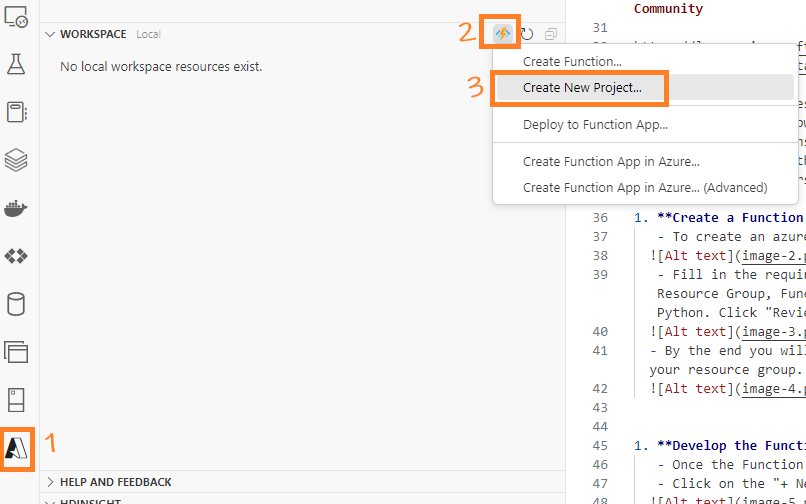
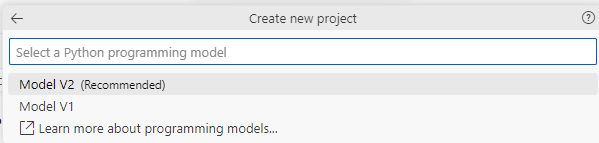
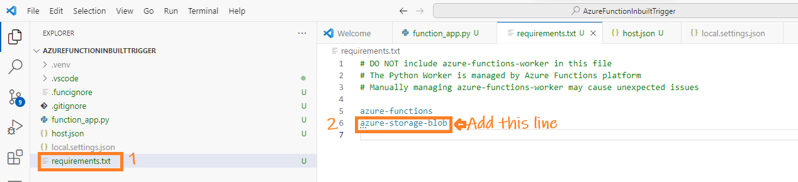
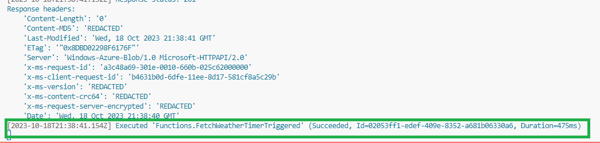

## Table of contents
- [Project AzureSkyWeather. Part 1B: Using Azure Timer-Triggered Function](#project-azureskyweather-part-1b-using-azure-timer-triggered-function)
  - [Overview](#overview)
    - [Setting the pre-requisites](#setting-the-pre-requisites)
    - [Create the Python-based Azure Function](#create-the-python-based-azure-function)
    - [Write our custom logic in the Azure Function](#write-our-custom-logic-in-the-azure-function)
    - [Include  `azure-storage-blob` in requirements.txt](#include--azure-storage-blob-in-requirementstxt)
    - [Test Our Azure Function](#test-our-azure-function)
    - [Deployment and rest of the steps](#deployment-and-rest-of-the-steps)

---
# Project AzureSkyWeather. Part 1B: Using Azure Timer-Triggered Function

## Overview

In Part 1A, we used **Azure HTTP Function** to get the weather from `weatherapi.com`. We also used **Azure Logic Apps** to set when to fetch this weather data. Now, I'll show a different way using just Azure Functions with a timer. This method is simpler because everything is in one place, and it might save some money compared to using both Azure Functions and Logic Apps.

### Setting the pre-requisites

In Part 1A, we explained how to set up the VS environment and other starting tasks. We'll skip those since they're the same. Now, we'll focus on coding. Both HTTP-Triggered and Timer-Triggered functions have the same project structure, but the content in the `function_app.py` file is different.

### Create the Python-based Azure Function

To create an Timer-Triggered Azure Function in Visual Studio Code, follow these steps:

- Open Visual Studio Code and access the Azure icon in the Activity bar.
- In the Workspace (local) area, click the thunder button, and select **Create New Project**.



- Choose a local folder location for our project.


- Select **Python** as the programming language.


- Opt for **Model V2** as the programming model.



- Choose the Python environment that you intend to use. Make sure to select the correct environment with all the required dependencies and packages e.g. Azure Functions.

- Select **Timer trigger**


- Provide a unique name for our function.


- VS Code will generate a complete project structure, including all the necessary components for developing our function.


### Write our custom logic in the Azure Function

Now, update `function_app.py` with the code below. Ensure you input `<your_connection_string_to_Azure_storage>` and `<weather_api_endpoint>` details.

```python
"""
-------------------------------------------------------------------------------
Author: Das
Date: Oct 2023
Description: This script contains an Azure Function designed to fetch the current 
weather data for London from the Weather API. The acquired data is subsequently stored 
in Azure Blob Storage, with each hour generating a distinct file based on the current 
weather conditions.

NOTES: 
- Do not adjust the import structure to:
    - Avoid "module 'azure.storage.blob' has no attribute 'from_connection_string'."
    - Ensure 'from datetime import datetime' remains, otherwise AttributeError: module 'datetime' has no attribute 'now' 
-------------------------------------------------------------------------------
"""

import logging, requests
from datetime import datetime
import azure.functions as func
from azure.storage.blob import BlobServiceClient

app = func.FunctionApp()

# schedule="0 */5 * * * *" triggers every five minutes. Tested and working.
# schedule="0 0 * * * *" triggers every hour.
# schedule="0 3 * * * *" triggers every day at 3 AM.

@app.schedule(schedule="0 0 * * * *", arg_name="myTimer", run_on_startup=True, use_monitor=False) 
def FetchWeatherTimerTriggered(myTimer: func.TimerRequest) -> None:
    if myTimer.past_due:
        logging.info('The timer is past due!')

    logging.info('Python timer trigger function executed.')

    # Custom code - Start
    
    # Generate a filename based on the current hour to separate hourly weather data.
    # The file will be overwritten, overwrite=True below, if the function is triggered multiple times within the same hour.
    weatherFileName = datetime.now().strftime("%Y-%m-%d-%H.json")

    # Initialize BlobServiceClient using the given connection string.
    # Storage Act, Access Keys, key1 -> Connection string(Copy)
    # Note, here we are using a different container, "weather-timer". Just to separate it from HTTP-Triggered code.

    connection_string = "<your_connection_string_to_Azure_storage>"
    blob_service_client = BlobServiceClient.from_connection_string(connection_string)
    blob_client = blob_service_client.get_blob_client(container="weather-timer", blob=weatherFileName)
    
    """
        As per the website. Their API Endpoint URL structure is like: http://api.weatherapi.com/v1/current.json?key=YOUR_API_KEY&q=LOCATION
    """
    # Use the requests library in Python to fetch data from the constructed endpoint:
    response = requests.get("<weather_api_endpoint>")
    if response.status_code != 200:
        logging.error('Failed to fetch weather data.')
        return func.HttpResponse("Failed to fetch weather data.", status_code=500)

    data = response.json()

    # Attempt to store the fetched weather data in Azure Blob Storage.
    try:
        blob_client.upload_blob(str(data), overwrite=True)
    except Exception as e:
        logging.error(f"Error uploading data to Blob Storage: {e}")
        return func.HttpResponse("Error storing weather data.", status_code=500)
    
    # Custom code - End
```

### Include  `azure-storage-blob` in requirements.txt

We've wrapped up the main coding. Now, just add `azure-storage-blob` to `requirements.txt` to instruct the deployment to install the library in Azure like we did in Part 1A.



### Test Our Azure Function

- It's time to test our Azure Function. Follow these steps:

  - Open Visual Studio Code and press `Ctrl+Shift+P`. Select **Azurite: Start**.

     

    This action starts the Azurite Blob Service. You can check the status at the bottom right corner of VS Code, where you should see something like this:

     

  - Start debugging by pressing `F5`. Then, on the left, click the Azure icon. Navigate to the workspace and locate our function (refresh if needed). Right-click the function and select **Execute**.

     

  - If the execution is successful, you'll see an output similar to this:

     

    Additionally, a JSON file will be created in our container:

     

### Deployment and rest of the steps

The next steps are like Part 1A. Check there for more details.

---
© D Das  
📧 [das.d@hotmail.com](mailto:das.d@hotmail.com) | [ddasdocs@gmail.com](mailto:ddasdocs@gmail.com)