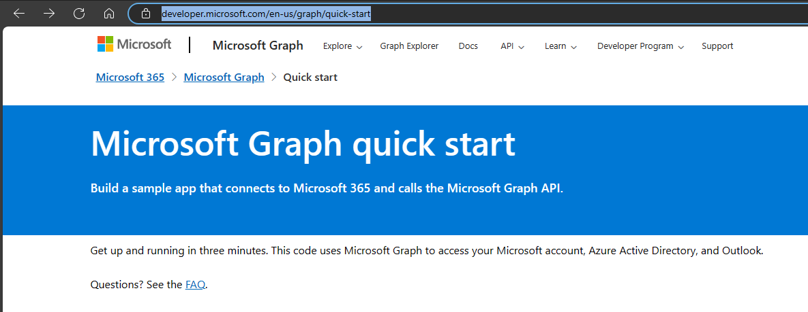

# Background
Here I will show you how to use the sample code provided by Microsoft in a jupyter notebook. Some people prefer the notebook due to familiarty and other factors. The code provided in microsoft is to be run from the terminal and needed a minior change to run from notebook.

Note: The objective is to show how the code can be run using juputer notebook and not delve deeper in the code.

# Let's get started

1. Go to https://developer.microsoft.com/en-us/graph/quick-start

2. Choose Python as the language

3. Click on Get a client ID

1. Login using your personal, work or school account(should have outlook)

2. After successful login you will get the client ID. Save it.

3. Click on Download the code sample

4. Save the zip file *msgraph-training-python.zip* and unzip the contents from where you can run python code. You will need permission from VS studio to this folder.

5. Open a jupyter notebook in VS code and cd to the graphtutorial folder e.g. %cd <Path to>\graphtutorial

6. Run the command pip install -r requirements.txt. Will tke about a minute to complete

7. Now, lets try to run the main.py directly from jupyter notebook and see what happens. Run the following in a cell:

%run main.py

8. You will see this error.  The reason? If you use jupyter notebooks, an event already runs to handle the notebook's asynchronous operations. This conflicts with  asyncio.run() to create another one. The original code was designed to run  run asynchronously using asyncio.run(main()).

1. Lets make a very minor change to the code to enable it to run from the notebook

2.  Install  nest_asyncio package. This will let you nesting of asyncio's event loop. This is reuiqred for running async code in a Jupyter Notebook. 

Run:
pip install nest_asyncio

12. Copy paste the entire code from main.py in a jupyter cell and add the following just before the main

import nest_asyncio
nest_asyncio.apply()

13. And just comment the last line

14. Run the cell. THere will be no output.
15. Then in a new cell run this await main(). You will see output like the shown below. 

16. CLick https://microsoft.com/devicelogin and enter the code shown. Perform login until you see a window like this. Then come back to the notebook.

17. Now you will see a box/pallete at teh top of VS code. Enter teh option there and simply press Enter. 

18. In my case I will put 2 and press enter to see my emails.

19. Once done, key in 0 in the top of the input box and press enter to close.
