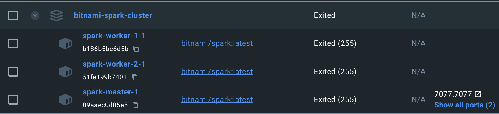
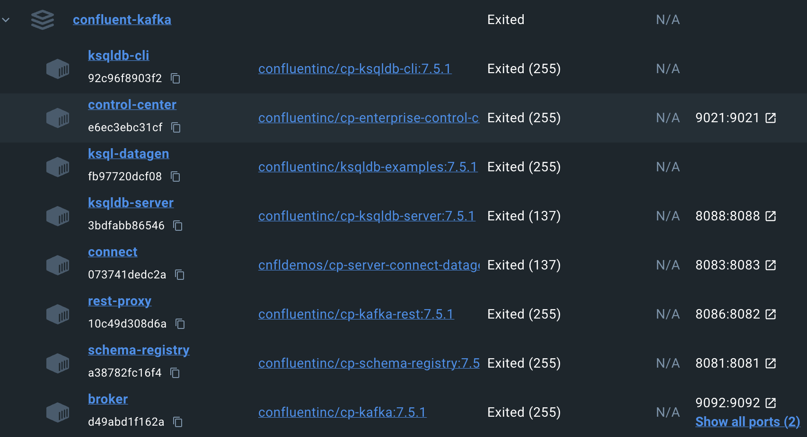

## Table of contents
- [Table of contents](#table-of-contents)
- [StreamKraft: Real-Time Music Data Pipeline. Kafka. SparkStreaming. MongoDB.](#streamkraft-real-time-music-data-pipeline-kafka-sparkstreaming-mongodb)
- [Project Setup](#project-setup)
  - [Step 1 - Dataset prepartion for Fake-streaming](#step-1---dataset-prepartion-for-fake-streaming)
  - [Step 2 - Fake-streaming to Kafka Topic](#step-2---fake-streaming-to-kafka-topic)
  - [Step3: Reading from Kafka with Spark Streaming and saving to MongoDB](#step3-reading-from-kafka-with-spark-streaming-and-saving-to-mongodb)
  - [Appendix](#appendix)

## <span style="color: Teal;">StreamKraft: Real-Time Music Data Pipeline. Kafka. SparkStreaming. MongoDB.</span>

In this project, we'll be building a real-time data processing pipeline using the million songs dataset. We'll use a Python script along with the dataset to create a fake streaming that will be sent to a Kafka topic. Then, we'll use Spark streaming to receive data from the topic and store it in MongoDB. The entire project will be run in a containerized environment.

Along the way, we'll learn how to connect the Spark cluster to the Kafka environment, how to stream data to and from a Kafka topic, and how to use Spark streaming to save data to MongoDB.

## Project Setup

Here is a list of some key components of the project

| Category                               | Software/Configuration                              |
|----------------------------------------|------------------------------------------------------|
| **Hardware**                           | Mac M1                                               |
| **RAM**                                | 16 GB                                                |
| **Operating System**                   | macOS 14.2                                           |
| **Containerization**                   | Docker                                               |
| **Spark Cluster**                      | Bitnami Spark 3.5 Cluster                             |
|                                       | - 1 Master                                            |
|                                       | - 2 Workers                                           |
| **Images**                             | 1. Bitnami Spark Cluster      |
|                                       | 2. Kafka Setup              |
| **Message Broker**                     | Apache Kafka KRaft(Kafka Without Zookeper) (Docker Image: confluentinc/cp-kafka 7.5.1)     |
| **Programming Language**               | Python 3.11                                           |
| **Integrated Development Environment** | Visual Studio Code                                   |


### Step 1 - Dataset prepartion for Fake-streaming

- Download the million dollar summary dataset [here](http://millionsongdataset.com/sites/default/files/AdditionalFiles/msd_summary_file.h5) 
- Place it in a folder accessible to the code snippet below and run the following script

```python

import json
import h5py
import numpy as np

def h5_to_json(h5_file_path, json_file_path):
    with h5py.File(h5_file_path, 'r') as h5_file:
        # Access the metadata group
        metadata = h5_file['metadata']
        # Access the songs dataset within metadata
        songs = metadata['songs']

        # Create a list to hold song data
        data_to_export = []

        # Iterate over each entry in the songs dataset
        for song in songs:
            # Convert fields to the correct Python type, e.g., decode bytes to string
            song_data = {
                'analyzer_version': song['analyzer_version'].decode('UTF-8') if song['analyzer_version'] else None,
                'artist_7digitalid': song['artist_7digitalid'].item(),
                'artist_familiarity': song['artist_familiarity'].item(),
                'artist_hotttnesss': song['artist_hotttnesss'].item(),
                'artist_id': song['artist_id'].decode('UTF-8'),
                'artist_latitude': song['artist_latitude'].item() if song['artist_latitude'] else None,
                'artist_location': song['artist_location'].decode('UTF-8') if song['artist_location'] else None,
                'artist_longitude': song['artist_longitude'].item() if song['artist_longitude'] else None,
                'artist_mbid': song['artist_mbid'].decode('UTF-8'),
                'artist_name': song['artist_name'].decode('UTF-8'),
                'artist_playmeid': song['artist_playmeid'].item(),
                'idx_artist_terms': song['idx_artist_terms'].item(),
                'idx_similar_artists': song['idx_similar_artists'].item(),
                'release': song['release'].decode('UTF-8'),
                'release_7digitalid': song['release_7digitalid'].item(),
                'song_hotttnesss': song['song_hotttnesss'].item(),
                'song_id': song['song_id'].decode('UTF-8'),
                'title': song['title'].decode('UTF-8'),
                'track_7digitalid': song['track_7digitalid'].item()
            }
            data_to_export.append(song_data)

        # Write the data to a JSON file
        with open(json_file_path, 'w') as json_file:
            json.dump(data_to_export, json_file, indent=4)

# Replace with your actual file paths
h5_to_json(r'C:\Users\dwaip\OneDrive\Work\Projects\AzureTuneStream\dataset\msd_summary_file.h5', r'C:\Users\dwaip\OneDrive\Work\Projects\AzureTuneStream\dataset\msd_summary_file.json')

```

### Step 2 - Fake-streaming to Kafka Topic

Execute the script provided to simulate real-world live streaming to a Kafka topic using data from the million dollar dataset.

**Note:**
- Ensure all **non-Kafka containers** are part of the `confluent-kafka_default` network, automatically assigned to Kafka Clusters upon creation with docker-compose.
- To add non-Kafka containers to the `confluent-kafka_default` network, use the following command:

```bash
docker network connect confluent-kafka_default [container_name]
```

If the other containres are not added, they will not be able to connect to the broker.

```python

"""
This code streams the 700 MB streamify content to kafka.
1. The container running this code should be part of "confluent-kafka_default" network. To add, run this command:
    connect confluent-kafka_default [external-container-name-or-id]
2. Only this broker address works "broker:29092".
3. Topics were populated in Kafka and checked at http://localhost:9021
4. Takes 36 seconds to execute
"""
"""
Frequently encountered error: 
    AnalysisException: Failed to find data source: kafka.
    This error happens and then goes away. Sometimes happens all of a sudden. Repeteadly doing it resolves the error.
    Solution: Sometimes just restart solves it. Probably a connection problem.

"""

from pyspark.sql import SparkSession
from pyspark.sql.functions import col, to_json, struct
import json

# Initialize a Spark session with enhanced memory settings
spark = SparkSession \
    .builder \
    .appName("FakeEventStreamerSparkCluster") \
    .master("spark://spark-master:7077") \
    .config("spark.driver.memory", "15g") \
    .config("spark.serializer", "org.apache.spark.serializer.KryoSerializer") \
    .config('spark.jars.packages', 'org.apache.spark:spark-sql-kafka-0-10_2.12:3.5.0')\
    .config("spark.streaming.stopGracefullyOnShutdown", True) \
    .getOrCreate()

# # AnalysisException: Failed to find data source: kafka.

# Set log level to monitor execution
spark.sparkContext.setLogLevel("INFO")
print("Spark session initialized.")

# Read the JSON file into a Spark DataFrame
spark_df = spark.read.json('/opt/shared-data/dataset.json', multiLine=True)

# Serialize the DataFrame into a JSON string
serialized_df = spark_df.select(to_json(struct([col(c) for c in spark_df.columns])).alias('value'))

# Kafka producer settings
kafka_servers = "broker:29092"
kafka_topic = "tunestream"

# Write the DataFrame to Kafka
serialized_df.write \
    .format("kafka") \
    .option("kafka.bootstrap.servers", kafka_servers) \
    .option("topic", kafka_topic) \
    .save()

print("Data sent to Kafka.")

spark.stop()

```

### Step3: Reading from Kafka with Spark Streaming and saving to MongoDB

Once the data is successfully streaming through the Kafka topic, we can use Spark Streaming to analyze and process the incoming information. This shows a real-time data analysis.

```python

from pyspark.sql import SparkSession
from pyspark.sql.functions import col, to_json, struct
import json

# Common errors: Caused by: java.lang.ClassNotFoundException: mongo.DefaultSource
# Solution: No proper solution. Goes away by itself

# https://mvnrepository.com/artifact/org.mongodb.spark/mongo-spark-connector
# Initialize a Spark session with enhanced memory settings
spark = SparkSession \
    .builder \
    .appName("FakeEventStreamerSparkCluster") \
    .master("spark://spark-master:7077") \
    .config("spark.driver.memory", "15g") \
    .config("spark.serializer", "org.apache.spark.serializer.KryoSerializer") \
    .config('spark.jars.packages', 'org.apache.spark:spark-sql-kafka-0-10_2.12:3.5.0,org.mongodb.spark:mongo-spark-connector_2.12:3.0.1') \
    .config("spark.streaming.stopGracefullyOnShutdown", True) \
    .getOrCreate()

spark.sparkContext.setLogLevel("INFO") # for verbose comments

# Read from Kafka
df = spark \
    .readStream \
    .format("kafka") \
    .option("kafka.bootstrap.servers", "broker:29092") \
    .option("subscribe", "tunestream") \
    .load()
df.selectExpr("CAST(key AS STRING)", "CAST(value AS STRING)")

# Common error: UnsupportedOperationException: Data source mongo does not support streamed writing.
# Write to MongoDB
mongodb_uri = "mongodb://my-mongodb:27017" # "mongodb://<mongoDBContainerNameOriPAddress>:27017"
database_name = "tuneStreamDB" # Spark will create, if not present
collection_name = "tuneStreamData" # Spark will create, if not present

# The snippet below gives rise to : UnsupportedOperationException: Data source mongo does not support streamed writing. Follow the workaround shown later.
# df.writeStream \
#     .format("mongo") \
#     .option("uri", mongodb_uri) \
#     .option("database", database_name) \
#     .option("collection", collection_name) \
#     .trigger(processingTime="10 seconds") \
#     .start() \
#     .awaitTermination()

'''
MongoDB Spark Connector does not currently support streamed writing. As a workaround, we write data to a batch DataFrame and then to MongoDB.
'''
# Use foreachBatch to write batch data to MongoDB
query = df.writeStream \
    .trigger(processingTime="10 seconds") \
    .foreachBatch(lambda df, epochId: df.write.format("mongo") \
    .option("uri", mongodb_uri) \
    .option("database", database_name) \
    .option("collection", collection_name) \
    .mode("append") \
    .save()) \
    .start() \

# Log the query execution plan
query.explain()
# Wait for the termination of the streaming query
query.awaitTermination()
spark.stop()

```


### Appendix

[Pyspark Structured Streaming](https://urlit.me/blog/pyspark-structured-streaming-read-from-files/).

[Streaming using a file-based dataset](https://subhamkharwal.medium.com/pyspark-structured-streaming-read-from-kafka-64c40767155f).

