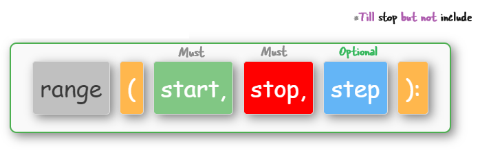

## <span style="font-family: 'Comic Sans MS', cursive, sans-serif; color: #2E75B6; font-size: 1.7em;">Python range() function</span>

The `range()` function gives you a **bunch of numbers**. _An ordered bunch of numbers_. Simple series like `1, 2, 3, 4`.

```python
# A typical use of range. This gives you 0, 1, 2
range(3)
```

Now, the output type of the `range()` function is a `range` object. Don't get confused, the output of range() is always a bunch of numbers. 

The `range()` function and `for` loops are like best buddies in Python. One creates a sequence of numbers, and the other loops through it.

### <span style="font-family: 'Comic Sans MS', cursive, sans-serif; color: #2E75B6; font-size: 1.5em;">range() syntax</span>





### <span style="font-family: 'Comic Sans MS', cursive, sans-serif; color: #2E75B6; font-size: 1.5em;">range() examples</span>

<div style="padding: 10px; border: 2px solid #00796b; box-shadow: 3px 3px 10px rgba(0, 0, 0, 0.3); border-radius: 10px; background-color: #64B5F6; margin: 10px auto; width: 60%; max-width: 800px; position: relative; font-family: 'Courier New', Courier, monospace; overflow-wrap: break-word;">
    <div style="margin-bottom: 10px;">
        <span style="font-size: 1.5em; font-weight: bold;">print(*(i for i in range(3)))</span>
    </div>
    <div style="display: flex; justify-content: center; align-items: center; margin-bottom: 10px;">
        <div style="padding: 5px; border: 2px solid #4CAF50; border-radius: 5px; background-color: #ffffff; margin: 3px;">
            <span style="font-size: 1em; color: #000;">0</span>
        </div>
        <div style="padding: 5px; border: 2px solid #4CAF50; border-radius: 5px; background-color: #ffffff; margin: 3px;">
            <span style="font-size: 1.2em; color: #000;">1</span>
        </div>
        <div style="padding: 5px; border: 2px solid #4CAF50; border-radius: 5px; background-color: #ffffff; margin: 3px;">
            <span style="font-size: 1.2em; color: #000;">2</span>
        </div>
    </div>
    <div style="display: flex; justify-content: center; align-items: center; margin: 5px;">
        <div style="padding: 5px; border: 1px solid #ddd; box-shadow: 3px 3px 10px rgba(0, 0, 0, 0.3); border-radius: 5px; background-color: #ffeb3b; margin: 3px;font-family: 'Comic Sans MS', sans-serif;">
            <span style="font-size: 1.2em; color: #000;">range(3) -> 0, 1, 2</span>
        </div>
    </div>
</div>

<br>

<div style="padding: 10px; border: 2px solid #00796b; box-shadow: 3px 3px 10px rgba(0, 0, 0, 0.3); border-radius: 10px; background-color: #64B5F6; margin: 10px auto; width: 60%; position: relative; font-family: 'Courier New', Courier, monospace;">
    <div style="margin-bottom: 10px;">
        <span style="font-size: 1.2em; font-weight: bold;">range(10)[-1]</span>
    </div>
    <div style="display: flex; justify-content: center; align-items: center;">
        <div style="padding: 5px; border: 2px solid #4CAF50; border-radius: 5px; background-color: #ffffff; margin: 3px;">
            <span style="font-size: 1.2em; color: #000;">9</span>
        </div>
    </div>
</div>


<br>

<div style="padding: 10px; border: 2px solid #00796b; box-shadow: 3px 3px 10px rgba(0, 0, 0, 0.3); border-radius: 10px; background-color: #FFB74D; margin: 10px auto; width: 60%; position: relative; font-family: 'Courier New', Courier, monospace;">
  <div style="margin-bottom: 10px;display: flex; justify-content: center; align-items: center;">
        <span style="font-size: 1.2em; font-weight: bold;">print(*(fruits[i] for i in range(len(fruits))))</span>
    </div>
    <div style="display: flex; justify-content: center; align-items: center;">
        <div style="padding: 5px; border: 2px solid #388e3c; border-radius: 5px; background-color: #ffffff; margin: 3px;">
            <span style="font-size: 1.2em; color: #000;">apple</span>
        </div>
        <div style="padding: 5px; border: 2px solid #388e3c; border-radius: 5px; background-color: #ffffff; margin: 3px;">
            <span style="font-size: 1.2em; color: #000;">banana</span>
        </div>
        <div style="padding: 5px; border: 2px solid #388e3c; border-radius: 5px; background-color: #ffffff; margin: 3px;">
            <span style="font-size: 1.2em; color: #000;">cherry</span>
        </div>
        <div style="padding: 5px; border: 2px solid #388e3c; border-radius: 5px; background-color: #ffffff; margin: 3px;">
            <span style="font-size: 1.2em; color: #000;">date</span>
        </div>
    </div>
    <div style="display: flex; justify-content: center; align-items: center; margin: 5px;">
        <div style="padding: 5px; border: 1px solid #ddd; box-shadow: 3px 3px 10px rgba(0, 0, 0, 0.3); border-radius: 5px; background-color: #ffeb3b; margin: 3px;font-family: 'Comic Sans MS', sans-serif;">
            <span style="font-size: 1.2em; color: #000;">* unpacks the items</span>
        </div>
    </div>
</div>

<br>


<div style="padding: 10px; border: 2px solid #00796b; box-shadow: 3px 3px 10px rgba(0, 0, 0, 0.3); border-radius: 10px; background-color: #81C784; margin: 10px auto; width: 60%; margin: 0 auto; position: relative; font-family: 'Courier New', Courier, monospace;">
    <div style="margin-bottom: 10px;display: flex; justify-content: center; align-items: center;"">
        <span style="font-size: 1.2em; font-weight: bold;">print(*(i for i in range(10, 0, -2)))</span>
    </div>
    <div style="display: flex; justify-content: center; align-items: center;">
        <div style="padding: 5px; border: 2px solid #00796b; border-radius: 5px; background-color: #ffffff; margin: 3px;">
            <span style="font-size: 1.2em; color: #000;">10</span>
        </div>
        <div style="padding: 5px; border: 2px solid #00796b; border-radius: 5px; background-color: #ffffff; margin: 3px;">
            <span style="font-size: 1.2em; color: #000;">8</span>
        </div>
        <div style="padding: 5px; border: 2px solid #00796b; border-radius: 5px; background-color: #ffffff; margin: 3px;">
            <span style="font-size: 1.2em; color: #000;">6</span>
        </div>
        <div style="padding: 5px; border: 2px solid #00796b; border-radius: 5px; background-color: #ffffff; margin: 3px;">
            <span style="font-size: 1.2em; color: #000;">4</span>
        </div>
        <div style="padding: 5px; border: 2px solid #00796b; border-radius: 5px; background-color: #ffffff; margin: 3px;">
            <span style="font-size: 1.2em; color: #000;">2</span>
        </div>
    </div>
<div style="display: flex; justify-content: center; align-items: center; margin: 5px;">
<div style="padding: 5px; border: 1px solid #ddd; box-shadow: 3px 3px 10px rgba(0, 0, 0, 0.3); border-radius: 5px; background-color: #ffeb3b; margin: 3px;font-family: 'Comic Sans MS', sans-serif;">
    <span style="font-size: 1.2em; color: #000;">Backwards using minus number</span>
</div>
</div>
</div>

<br>

<div style="padding: 10px; border: 2px solid #00796b; box-shadow: 3px 3px 10px rgba(0, 0, 0, 0.3); border-radius: 10px; background-color: #e8eaf6; margin: 10px auto; width: 60%; position: relative; font-family: 'Courier New', Courier, monospace;">
    <div style="margin-bottom: 10px; display: flex; justify-content: center; align-items: center;">
        <span style="font-size: 1.2em; font-weight: bold;">
            <span style="color: #569CD6;">list</span>(
            <span style="color: #4EC9B0;">range</span>(
            <span style="color: #B5CEA8;">5</span>))
        </span>
    </div>
    <div style="display: flex; justify-content: center; align-items: center; margin: 5px;">
    <div style="padding: 5px; border: 1px solid #ddd; box-shadow: 3px 3px 10px rgba(0, 0, 0, 0.3); border-radius: 5px; background-color: #ffeb3b; margin: 3px;font-family: 'Comic Sans MS', sans-serif;">
        <span style="font-size: 1.2em; color: #000;">[0,1,2,3,4]</span>
    </div>
</div>
</div>

<div style="display: flex; justify-content: center; align-items: center; margin: 5px;">
    <div style="padding: 5px; border: 1px solid #ddd; box-shadow: 3px 3px 10px rgba(0, 0, 0, 0.3); border-radius: 5px; background-color: #000000; margin: 3px;font-family: 'Comic Sans MS', sans-serif;">
        <span style="font-size: 1.2em;color: #fff; font-weight: bold;font-family: 'Courier New', Courier, monospace;">print(*(fruits[i] for i in range(len(fruits))))</span>
    </div>
</div>


