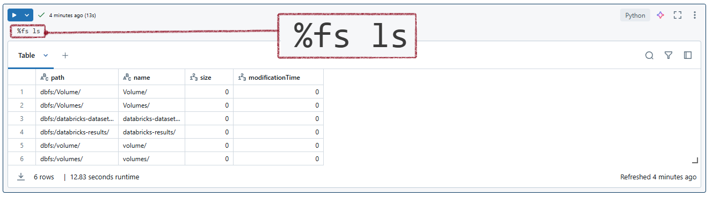

# Useful Databricks Magic Commands

<h2>Some frequently used magic commands in Databricks</h2>

| **Magic Command** | **Description**                             | **Example**                                          |
|-------------------------------|---------------------------------------------|-------------------------------------------------------------|
| **%run**          | Runs a Python file or a notebook.               | `%run ./path/to/notebook`                              |
| **%sh**           | Executes shell commands on the cluster nodes.   | `%sh ls /dbfs`                                        |
| **%fs**           | Interacts with the Databricks file system.      | `%fs ls /mnt/data`                                    |
| **%sql**          | Runs SQL queries.                              | `%sql SELECT * FROM table_name`                       |
| **%scala**        | Switches the notebook context to Scala.        | `%scala val x = 10`                                   |
| **%python**       | Switches the notebook context to Python.       | `%python print("Hello, Databricks!")`                 |
| **%md**           | Writes markdown text.                          | `%md # This is a Markdown Header`                     |
| **%r**            | Switches the notebook context to R.            | `%r summary(data_frame)`                              |
| **%lsmagic**      | Lists all the available magic commands.        | `%lsmagic`                                            |
| **%jobs**         | Lists all the running jobs.                    | `%jobs`                                               |
| **%config**       | Sets configuration options for the notebook.   | `%config notebook.display.max_rows=1000`              |
| **%reload**       | Reloads the contents of a module.              | `%reload module_name`                                 |
| **%pip**          | Installs Python packages.                      | `%pip install pandas`                                 |
| **%load**         | Loads the contents of a file into a cell.      | `%load ./path/to/file.py`                             |
| **%matplotlib**   | Sets up the matplotlib backend.                | `%matplotlib inline`                                  |
| **%who**          | Lists all the variables in the current scope.  | `%who`                                                |
| **%env**          | Sets environment variables.                    | `%env MY_VARIABLE=my_value`                            |